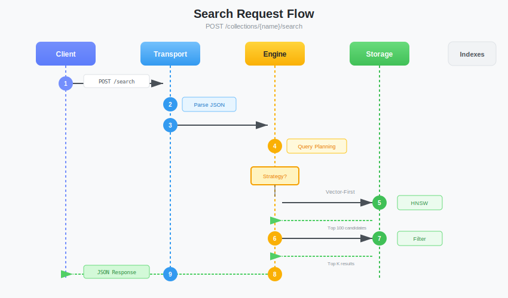
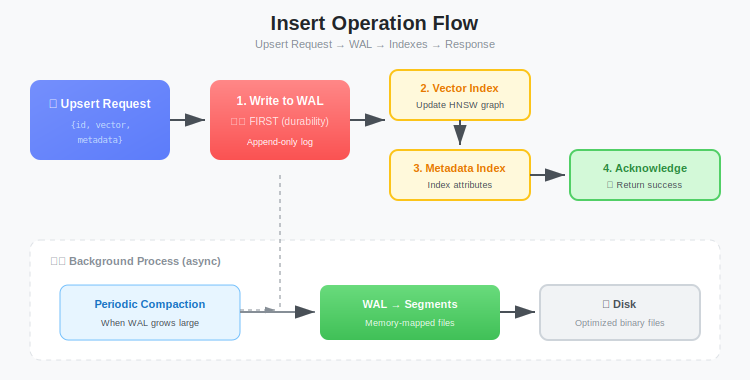
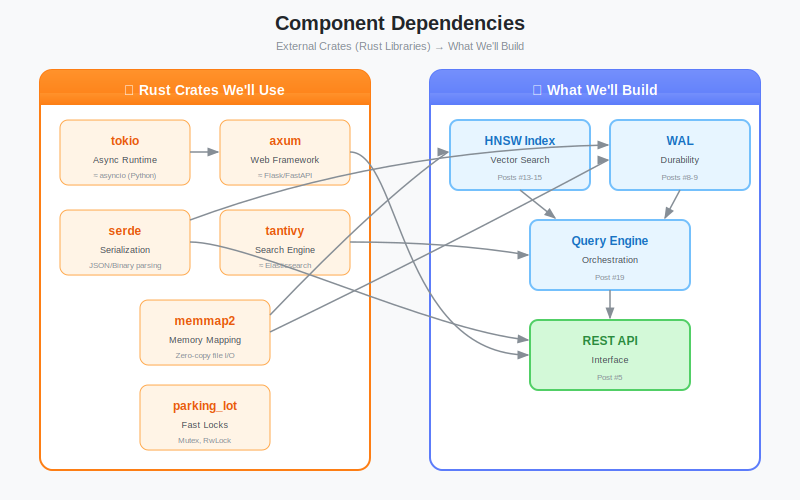

# The Blueprint: Designing a Production-Grade Vector Database from Scratch

**Series:** Building a Vector Database from Scratch in Rust  
**Post:** 1 of 20  
**Reading Time:** ~15 minutes

---

## 1. Introduction: The "Zero to Master" Promise

The AI revolution is here. ChatGPT, Claude, Gemini, they're everywhere. And powering the "memory" behind these systems? **Vector Databases**.

You've probably heard the buzzwords: *"RAG pipelines"*, *"semantic search"*, *"embeddings"*. Maybe you've even used Pinecone, Weaviate, or Qdrant. But here's the uncomfortable truth:

> **Everyone uses Vector DBs, but few know how they work under the hood.**

We are going change it.

### What You'll Build

By the end of this series, you won't just know *how* to use a Vector Database, **you will have built one from scratch in Rust**. A real, working system with:

- Memory-mapped file storage (like LMDB)
- Write-Ahead Logging for crash recovery (like PostgreSQL)
- HNSW graphs for sub-millisecond search (like Pinecone)
- Hybrid filtering with inverted indexes (like Elasticsearch)
- A fully async HTTP API (like any modern service)

You'll understand memory mapping, binary formats, HNSW graphs, and async runtimes, not because you read about them, but because you **built** them.

### Prerequisites

Here's the best part: **You don't need to know Rust yet.**

We'll learn Rust together, piece by piece, exactly when we need each concept. No "go read Chapter 4 of the Rust Book" links. When we hit our first borrow checker error, we'll explain it right there, in the context of our actual code.

All you need is:
- Basic programming experience (any language)
- A computer with an internet connection
- Curiosity about how things *really* work

---

## 2. The Core Concept: What Are We Actually Building?

Let's start from absolute zero. Forget everything you think you know about databases.

### 2.1 The Problem with Standard Databases

Imagine you have a database of 1 million research papers. A user searches:

> *"papers about feline behavior"*

In a traditional SQL database, you might write:

```sql
SELECT * FROM papers WHERE title LIKE '%feline%' OR abstract LIKE '%feline%';
```

This works... until it doesn't.

What about papers titled **"Understanding Cat Psychology"**? Or **"Kitten Development Stages"**? 

The word "feline" appears nowhere, yet these papers are *exactly* what the user wants.


**SQL databases search by *spelling*. Vector databases search by *meaning*.**

This is the fundamental insight. Let that sink in.

### 2.2 What is a "Vector" Anyway?

Here's the simplest possible definition:

> **A vector is just a list of numbers.**

That's it. No magic. Just numbers in a row:

```
[0.12, -0.45, 0.89, 0.03, -0.67, ...]
```

These numbers are called **dimensions**. A typical vector might have 768 or 1536 dimensions.

But where do these numbers come from? They come from **embedding models**, neural networks trained to convert text (or images, or audio) into these number lists.

The magic is in *how* these models are trained: they learn to place **similar things close together** in this number space.

### 2.3 Visualizing the Embedding Space

Imagine a 2D coordinate system (we'll use 2D for visualization, but real embeddings use 768+ dimensions).


Look at this famous example from Word2Vec research:

- **"King"** and **"Queen"** are close together (both are royalty)
- **"Man"** and **"Woman"** are close together (both are people)
- The vector from "Man" → "Woman" is *similar* to the vector from "King" → "Queen"

This means: `King - Man + Woman ≈ Queen`

This isn't magic, it's **learned geometry**. The embedding model discovered that gender relationships are consistent across different contexts.

### 2.4 The Grocery Store Analogy

If vectors still feel abstract, think of a grocery store:

| Item | Aisle | Shelf |
|------|-------|-------|
| Apples | 3 | 2 |
| Bananas | 3 | 3 |
| Milk | 7 | 1 |
| Cheese | 7 | 2 |
| Motor Oil | 12 | 5 |

If we plot these as coordinates `[Aisle, Shelf]`:
- Apples `[3, 2]` and Bananas `[3, 3]` are **close** (same aisle)
- Apples `[3, 2]` and Motor Oil `[12, 5]` are **far apart**

A vector database does exactly this, but in 768-dimensional space instead of 2D.

### 2.5 How Do We Measure "Closeness"?

We'll dive deep into the math in Post #11, but here's a preview.

The most common method is **Cosine Similarity**:

```
               A · B
cos(θ) = ─────────────────────
           ||A|| × ||B||
```

In plain English:
1. Multiply corresponding elements and sum them up (the dot product)
2. Divide by the "lengths" of both vectors

The result is a number between -1 and 1:
- **1** = Identical direction (most similar)
- **0** = Perpendicular (unrelated)
- **-1** = Opposite direction (most dissimilar)

Don't worry if this doesn't fully click yet. We'll implement this from scratch with detailed explanations in Phase 3.

**Try it yourself:** See [`code/cosine-similarity-preview.rs`](code/cosine-similarity-preview.rs) for a runnable example:

```bash
cd post-01-the-blueprint/code
cargo run --bin cosine-similarity-preview
```

This preview shows how cosine similarity works with simple 3D vectors. We'll build the full production version in Post #11.

---

## 3. High-Level Architecture

Now that you understand *what* vectors are, let's design the system that stores and searches them.

We're building a **Single-Node, Persistent Vector Database**. "Single-node" means it runs on one machine (no distributed systems complexity, that's a future series(hopefully)). "Persistent" means data survives restarts and crashes.

Our database has three layers:

<!-- Block diagram: HTTP Request → Transport Layer → Core Engine → Storage Layer (WAL + Segments) -->


**Role:** The front door of our database. It speaks HTTP and JSON.

When a client sends a request like:
```bash
curl -X POST http://localhost:8080/search -d '{"vector": [0.1, 0.2, ...]}'
```

The Transport Layer:
1. Parses the HTTP request
2. Validates the JSON
3. Authenticates the user (if configured)
4. Passes the request to the Core Engine
5. Formats the response back as JSON

**Tech Stack:**
- **Axum:** A modern, fast Rust web framework
- **Tokio:** The async runtime that powers everything

We'll build this in Post #5.

### Layer 2: The Core Engine (The Brain)

**Role:** The decision-maker. It orchestrates *how* to answer each query.

Consider this search request:
```json
{
  "vector": [0.12, 0.05, ...],
  "top_k": 5,
  "filter": { "year": { "$gt": 2020 } }
}
```

The Core Engine must decide:
1. **Vector-First:** Search all 1M vectors, then filter to year > 2020?
2. **Filter-First:** Find all papers from 2021+, then search only those vectors?

The right choice depends on how many papers match the filter. 90% match? Vector-first is better. 0.1% match? Filter-first wins.

**Components:**
- **Vector Index (HNSW):** A graph structure for ultra-fast approximate nearest neighbor search. We'll build this in Posts #18-19.
- **Metadata Index (Tantivy):** An inverted index for filtering by keywords, dates, and numbers. Posts #15-16.
- **Query Planner:** The optimizer that chooses the best execution strategy. Post #17.

### Layer 3: The Storage Layer (The Vault)

**Role:** Guarantees your data doesn't disappear.

Databases crash. Power goes out. Disks fail. The Storage Layer handles all of this.

**Components:**

**Write-Ahead Log (WAL):**
Before we modify any data, we write the operation to an append-only log file. If we crash mid-operation, we replay this log on startup to recover.

```
[2024-01-15 10:30:01] INSERT paper_001 vector=[0.1, ...] metadata={...}
[2024-01-15 10:30:02] INSERT paper_002 vector=[0.2, ...] metadata={...}
[2024-01-15 10:30:03] DELETE paper_001
```

**Segments:**
Periodically, we compact the WAL into read-optimized binary files called "segments." These are memory-mapped for blazing-fast reads.

We'll implement WAL in Post #8, crash recovery in Post #9, and memory mapping in Post #7.



---

## 4. The API Design (Our Contract)

Before writing code, good engineers define interfaces. Here's the complete API we'll build:

### 4.1 Create a Collection

A "collection" is like a SQL table, a named container for related vectors.

```http
POST /collections
Content-Type: application/json

{
  "name": "research_papers",
  "dimension": 768,
  "distance": "cosine"
}
```

**Response:**
```json
{
  "status": "created",
  "collection": {
    "name": "research_papers",
    "dimension": 768,
    "distance": "cosine",
    "count": 0
  }
}
```

**Parameters:**
- `name`: Unique identifier for this collection
- `dimension`: Vector size (must match your embedding model)
- `distance`: How to measure similarity (`cosine`, `euclidean`, or `dot`)

### 4.2 Insert/Update Data (Upsert)

"Upsert" = Update if exists, Insert if not.

```http
POST /collections/research_papers/upsert
Content-Type: application/json

{
  "points": [
    {
      "id": "paper_001",
      "vector": [0.12, 0.05, -0.33, ...],
      "metadata": {
        "title": "Attention Is All You Need",
        "year": 2017,
        "authors": ["Vaswani", "Shazeer", "Parmar"]
      }
    },
    {
      "id": "paper_002",
      "vector": [0.08, -0.12, 0.45, ...],
      "metadata": {
        "title": "BERT: Pre-training of Deep Bidirectional Transformers",
        "year": 2018,
        "authors": ["Devlin", "Chang", "Lee", "Toutanova"]
      }
    }
  ]
}
```

**Response:**
```json
{
  "status": "ok",
  "upserted": 2
}
```


### 4.3 Search

The core operation—find similar vectors.

```http
POST /collections/research_papers/search
Content-Type: application/json

{
  "vector": [0.10, 0.02, -0.28, ...],
  "top_k": 5,
  "filter": {
    "year": { "$gte": 2015 },
    "authors": { "$contains": "Vaswani" }
  },
  "include_metadata": true
}
```

**Response:**
```json
{
  "results": [
    {
      "id": "paper_001",
      "score": 0.95,
      "metadata": {
        "title": "Attention Is All You Need",
        "year": 2017,
        "authors": ["Vaswani", "Shazeer", "Parmar"]
      }
    },
    {
      "id": "paper_047",
      "score": 0.89,
      "metadata": { ... }
    }
  ],
  "took_ms": 12
}
```

**Parameters:**
- `vector`: The query vector (what are we searching for?)
- `top_k`: Return this many closest matches
- `filter`: Only consider points matching these conditions
- `include_metadata`: Whether to return metadata in results

### 4.4 Delete

Remove points by ID.

```http
POST /collections/research_papers/points/delete

{
  "ids": ["paper_001", "paper_002"]
}
```

> **Why POST instead of DELETE?** While `DELETE /points` with a JSON body is intuitive, the HTTP spec discourages request bodies on DELETE, and some proxies/firewalls strip them entirely. Using `POST .../delete` is the safer, more portable pattern for bulk deletions.

---

## 5. Why Rust? (The Right Tool for the Job)

You might wonder: Why not Python? Why not Go? Why not C++?

Let me show you why Rust is uniquely suited for building a database.

### 5.1 Performance: Beyond Just Math Speed

A vector search computes distance millions of times per query. Here's what the hot loop looks like:

```rust
// This runs millions of times per search
fn cosine_similarity(a: &[f32], b: &[f32]) -> f32 {
    // In production, we MUST verify a.len() == b.len()
    // Rust's zip() silently truncates to the shorter iterator!
    // We'll handle this properly with Result<T, E> in Post #11.
    
    let dot: f32 = a.iter().zip(b).map(|(x, y)| x * y).sum();
    let norm_a: f32 = a.iter().map(|x| x * x).sum::<f32>().sqrt();
    let norm_b: f32 = b.iter().map(|x| x * x).sum::<f32>().sqrt();
    
    // Note: This makes 3 passes over the data. In Phase 3, we'll
    // optimize to a single pass using SIMD intrinsics.
    dot / (norm_a * norm_b)
}
```

"But wait," you might say, "Python has NumPy! `numpy.dot()` calls optimized C code and is nearly as fast as Rust for pure math."

You're right. The advantage of Rust isn't just raw arithmetic speed, it's **everything else**:

1. **No GIL (Global Interpreter Lock):** Python's GIL prevents true multi-threaded parallelism. When 1000 clients hit your search server simultaneously, Python processes them one-by-one. Rust handles them in parallel across all CPU cores.

2. **Zero glue-code overhead:** In Python, every function call, object allocation, and type check has overhead. Rust compiles to bare-metal machine code, the math, the networking, and the query planning are *all* fast.

3. **Predictable latency:** Python's garbage collector can pause your server at the worst moment. Rust has no GC; memory is freed deterministically.

### 5.2 Safety: The Memory Danger Zone

Databases deal with:
- Raw memory pointers (memory mapping)
- Concurrent access (multiple threads reading/writing)
- Disk I/O (partial writes, crashes)

In C/C++, a single mistake causes:
- **Segmentation faults** (crash)
- **Buffer overflows** (security vulnerability)
- **Data corruption** (silent catastrophe)

Rust's **Borrow Checker** prevents these at compile time. If your Rust code compiles, it's memory-safe. Period.

We'll learn exactly what this means as we encounter compiler errors together.

### 5.3 Ecosystem: Standing on Giants' Shoulders

We won't build everything from scratch. We'll use battle-tested libraries:

| Library | Purpose | Equivalent |
|---------|---------|------------|
| **Tokio** | Async runtime | Python's asyncio, but faster |
| **Axum** | Web framework | Flask/FastAPI |
| **Tantivy** | Full-text search | Elasticsearch/Lucene |
| **memmap2** | Memory mapping | Low-level OS calls |
| **serde** | JSON parsing | Built into Python |

These libraries handle the 80% that's "already solved," so we can focus on the 20% that makes a vector database unique.



---

## 6. The Roadmap: Your Learning Path

Here's what the next posts will cover:

### Phase 1: The Rust & Systems Foundation (Posts 2-5)
*Goal: Go from "I don't know Rust" to "I can build a high-performance HTTP server."*

- **Post 2:** Setting up Rust, project structure, Cargo basics
- **Post 3:** Ownership, Borrowing, and Memory, the core of Rust
- **Post 4:** Structs, Enums, Error Handling with `Result` and `Option`
- **Post 5:** Async programming with Tokio, building our first Axum server

### Phase 2: The Storage Engine (Posts 6-10)
*Goal: Master file I/O and binary formats. How do databases actually persist data?*

- **Post 6:** Binary file formats, endianness, serialization
- **Post 7:** Memory mapping (`mmap`), reading files at RAM speed
- **Post 8:** Write-Ahead Logging for crash safety
- **Post 9:** Crash recovery, replaying logs on startup
- **Post 10:** Concurrency with `Arc`, `RwLock`, and `Mutex`

### Phase 3: The Search Engine (Posts 11-14)
*Goal: Master the "Vector" part of Vector DB.*

- **Post 11:** Linear algebra basics, dot product, cosine similarity, norms
- **Post 12:** Brute-force k-NN search (the naive approach)
- **Post 13:** Optimizing top-K retrieval with binary heaps
- **Post 14:** Building a benchmark suite for performance testing

### Phase 4: The Intelligent Database (Posts 15-17)
*Goal: Add metadata filtering like the pros.*

- **Post 15:** Inverted indexes explained, how text search works
- **Post 16:** Integrating Tantivy for hybrid search
- **Post 17:** Query planning, choosing optimal execution paths

### Phase 5: Scale & Production (Posts 18-20)
*Goal: HNSW graphs and deployment.*

- **Post 18:** Approximate nearest neighbors, the theory of ANN
- **Post 19:** Implementing HNSW for sub-millisecond search
- **Post 20:** Docker, CI/CD, and production deployment

---

## 7. What's Next?

You now understand:
- Why vector databases exist (semantic search > keyword search)
- What vectors and embeddings are (lists of numbers in geometric space)
- Our system architecture (Transport → Engine → Storage)
- The API we'll build
- Why Rust is the right tool

In **Post #2: Setting Up the Forge**, we'll:
1. Install Rust and configure our development environment
2. Create our project structure with Cargo
3. Write our first Rust program
4. Set up VS Code with the rust-analyzer extension

No more theory, it's time to write code.

---

## Summary

| Concept | Key Takeaway |
|---------|--------------|
| **Vector** | A list of floating-point numbers representing meaning |
| **Embedding** | The process of converting text/images to vectors |
| **Cosine Similarity** | The math to measure how "close" two vectors are |
| **Transport Layer** | HTTP + JSON frontend (Axum/Tokio) |
| **Core Engine** | Query planning + indexes (HNSW + Tantivy) |
| **Storage Layer** | WAL + Segments for durability |
| **Why Rust** | Performance + Safety + Ecosystem |

---

**Next Post:** [Post #2: Setting Up the Forge →](../post-02-setting-up-the-forge/blog.md)

---

*Found this helpful? Star the repo and follow along as we build something amazing together.*
