# Architecture Diagrams (Mermaid)

## System Architecture (Full)

## Simplified Request Flow

## Data Flow: Insert Operation

## Component Dependencies

## Embedding Space Visualization

## SQL vs Vector Search Comparison

```mermaid
flowchart LR
    subgraph Query["User Query: 'feline behavior'"]
        Q["🔍"]
    end

    subgraph SQL["Traditional SQL"]
        S1["SELECT * WHERE<br/>text LIKE '%feline%'"]
        S2["❌ 'Cat Psychology'"]
        S3["❌ 'Kitten Development'"]
        S4["✅ 'Feline Studies'"]
    end

    subgraph Vector["Vector Database"]
        V1["Convert query<br/>to embedding"]
        V2["✅ 'Cat Psychology'<br/>score: 0.92"]
        V3["✅ 'Kitten Development'<br/>score: 0.89"]
        V4["✅ 'Feline Studies'<br/>score: 0.95"]
    end

    Q --> S1
    Q --> V1
    S1 --> S2
    S1 --> S3
    S1 --> S4
    V1 --> V2
    V1 --> V3
    V1 --> V4

    style S2 fill:#ffcdd2
    style S3 fill:#ffcdd2
    style S4 fill:#c8e6c9
    style V2 fill:#c8e6c9
    style V3 fill:#c8e6c9
    style V4 fill:#c8e6c9
```

