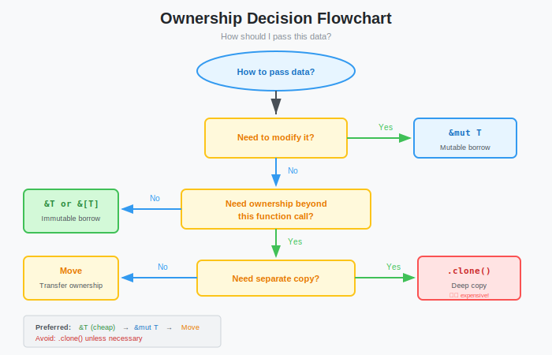
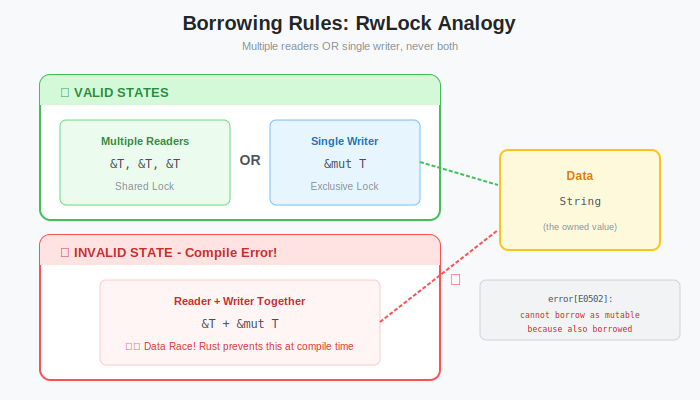
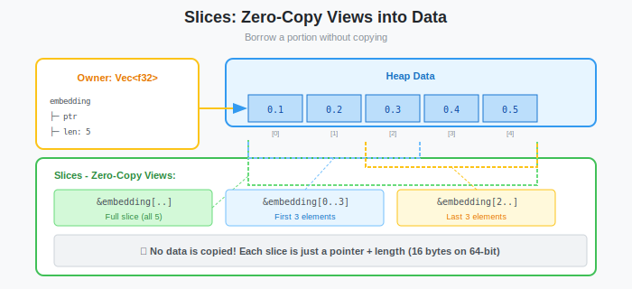

# Rust Crash Course Part 1: Ownership, Borrowing, and Memory Management

**Series:** Building a Vector Database from Scratch in Rust  
**Post:** 3 of 20  
**Reading Time:** ~15 minutes

---

## 1. Introduction: The "Boss Fight"

Welcome to the most infamous part of learning Rust: **The Borrow Checker**.

If you come from Python or Java, you're used to a **Garbage Collector (GC)** cleaning up after you. It's convenient, but it causes random pauses (latency spikes) when the GC runs, unacceptable for a database.

If you come from C or C++, you're used to **manual memory management** (`malloc`/`free`). It's fast, but one mistake leads to crashes (segfaults) or security vulnerabilities.

Rust chooses a third path: **Ownership**.


Ownership is a set of rules that the compiler checks *at compile time*. If you follow them, you get:

1. **Zero GC pauses** (predictable performance for our DB)
2. **Zero manual memory management** (no `free()` calls)
3. **Memory safety** (no dangling pointers, no double-frees)

In this post, we will master these rules. We aren't just learning syntax, we're learning how to manage the memory of the database we're building.

---

## 1.5 Quick Rust Syntax Primer

If you've never written Rust before, here's the essential syntax you need:

### Variables and Bindings

```rust
let x = 5;              // Immutable variable (inferred type: i32)
let y: i32 = 10;       // Explicit type annotation
let mut z = 15;        // Mutable variable (can be reassigned)

z = 20;                // OK - z is mutable
// x = 30;             // ERROR - x is immutable
```

**Compiler Error:**
```
error[E0384]: cannot assign twice to immutable variable `x`
   |
2  | let x = 5;
   |     - first assignment to `x`
3  | x = 10;
   |     ^^ cannot assign twice to immutable variable
```

**Key Point:** Rust defaults to immutability. You must explicitly declare `mut` to allow changes.

### Basic Types

```rust
let count: i32 = 42;              // Signed 32-bit integer
let distance: f32 = 3.14;         // 32-bit float (good for embeddings)
let is_valid: bool = true;        // Boolean
let name: String = String::from("VectorDB");  // Owned string
let s: &str = "hello";            // String slice (borrowed)
```

### Functions

```rust
fn add(a: i32, b: i32) -> i32 {   // Parameters have explicit types
    a + b                          // No semicolon = return value
}

fn main() {
    let result = add(5, 3);        // Call the function
    println!("Result: {}", result);
}
```

**Note:** In Rust, functions must declare parameter types and return types explicitly.

### Collections

```rust
let numbers: Vec<i32> = vec![1, 2, 3, 4, 5];  // Growable array (on heap)
let first = numbers[0];                        // Access element

let embedding: [f32; 3] = [0.1, 0.2, 0.3];    // Fixed-size array (on stack)
```

### The `println!` Macro

```rust
let x = 42;
println!("The answer is {}", x);      // {} = placeholder for value
println!("Debug: {:?}", x);           // {:?} = debug format

let v = vec![1, 2, 3];
println!("{:?}", v);                  // Prints: [1, 2, 3]
```

**Common Error:**
```
error[E0425]: cannot find value `name` in this scope
   |
5  | println!("Hello {}", name);
   |                      ^^^ not found in this scope
```

---

## 2. Systems 101: Stack vs. Heap

To understand Ownership, you must visualize where your data lives.


### The Stack

| Property | Description |
|----------|-------------|
| **What it is** | A scratchpad for function execution |
| **Behavior** | Last In, First Out (LIFO). Extremely fast. |
| **Limitations** | All data must have a **known, fixed size** at compile time |
| **Examples** | `i32`, `f64`, `bool`, `[f32; 768]` (fixed-size array) |

**Analogy:** A stack of plates. You grab the top one, use it, and put it back. No searching, no asking for permission just push and pop.

### The Heap

| Property | Description |
|----------|-------------|
| **What it is** | A giant warehouse for dynamically-sized data |
| **Behavior** | You ask the allocator for space; it returns a **pointer** |
| **Cost** | Slower allocation. Must follow the pointer to access data. |
| **Examples** | `String`, `Vec<f32>`, `HashMap`, our HNSW graphs |

**Analogy:** A warehouse with numbered storage units. You get a key (pointer) that tells you where your stuff is stored.

### In Our Vector DB Context

```rust
// This f32 lives on the STACK (fixed size: 4 bytes)
let single_value: f32 = 0.12345;

// This Vec lives on the HEAP (dynamic size: 768 × 4 = 3072 bytes)
// But the Vec "handle" (pointer + length + capacity) is on the STACK
let embedding: Vec<f32> = vec![0.1, 0.2, /* ... 768 values */];
```

```
STACK                          HEAP
┌─────────────────┐            ┌─────────────────────────────┐
│ single_value    │            │                             │
│ [0.12345]       │            │  [0.1, 0.2, 0.3, ... 768]   │
├─────────────────┤            │                             │
│ embedding       │            └─────────────────────────────┘
│ ┌─────────────┐ │                       ▲
│ │ ptr ────────┼─┼───────────────────────┘
│ │ len: 768    │ │
│ │ cap: 768    │ │
│ └─────────────┘ │
└─────────────────┘
```

---

## 3. The Three Rules of Ownership

Rust enforces these three rules strictly. Memorize them:

> **Rule 1:** Each value in Rust has a variable that's called its **owner**.
> 
> **Rule 2:** There can only be **one owner** at a time.
> 
> **Rule 3:** When the owner goes out of scope, the value will be **dropped** (memory freed).

### Rule 3 in Action: Automatic Cleanup

```rust
fn main() {
    {
        let s = String::from("hello"); // s is valid from here
        // ... use s ...
    } // s goes out of scope here. Rust calls drop(s) automatically.
    
    // Memory for "hello" has been freed. No garbage collector needed!
}
```

This is called **RAII** (Resource Acquisition Is Initialization), a pattern from C++ that Rust enforces by default.

### Rule 2 in Action: The "Move"

This is where beginners get stuck. Watch carefully:

```rust
fn main() {
    let s1 = String::from("hello"); // s1 owns the heap memory
    let s2 = s1;                    // Ownership MOVES to s2
    
    println!("{}", s1);  //  ERROR: borrow of moved value: `s1`
    println!("{}", s2);  //  s2 is the owner now
}
```

**Compiler Error:**
```
error[E0382]: borrow of moved value: `s1`
   |
2  | let s1 = String::from("hello");
   |     -- move occurs because `s1` has type `String`, 
   |        which does not implement the `Copy` trait
3  | let s2 = s1;
   |          -- value moved here
4  | println!("{}", s1);
   |                ^^ value borrowed after move
   |
help: consider cloning the value if the ownership is needed
   |
3  | let s2 = s1.clone();
```


**What happened?**

| Language | Behavior of `s2 = s1` |
|----------|----------------------|
| Python/Java | Both variables point to the same object (reference counting or GC tracks it) |
| C++ | Depends, might copy, might reference, might move |
| **Rust** | **Move**: s1's ownership transfers to s2. s1 becomes invalid. |

**Why does Rust do this?**

If both `s1` and `s2` owned the memory, what happens when they both go out of scope? Both would try to free the same memory → **Double Free Error** (a classic security vulnerability).

Rust prevents this by invalidating `s1` at compile time.

### When You Actually Want a Copy: `.clone()`

If you *really* need two independent copies:

```rust
let s1 = String::from("hello");
let s2 = s1.clone(); // Deep copy: new heap allocation!

println!("s1 = {}, s2 = {}", s1, s2); // Both valid
```


**System Engineer Warning:** Cloning is expensive. In our Vector DB, cloning a 768-dimensional embedding means copying 3KB of data. For a batch of 10,000 vectors, that's 30MB of unnecessary copying. We'll avoid this with **borrowing**.

### Copy Types (The Exception)

Simple types that live entirely on the stack implement the `Copy` trait. They're copied, not moved:

```rust
let x: i32 = 5;
let y = x; // x is COPIED, not moved

println!("x = {}, y = {}", x, y); // Both valid! No error.
```



Copy types include: `i32`, `f32`, `bool`, `char`, `&T` (immutable references), tuples of Copy types, and fixed-size arrays of Copy types.

---

## 4. Borrowing (References)

Moving ownership everywhere is cumbersome. What if we just want to *look* at data without taking responsibility for it?

That's **borrowing**.

### Immutable References (`&T`)

An immutable reference is a "read-only view" of data.

```rust
fn main() {
    let s1 = String::from("hello");
    
    let len = calculate_length(&s1); // Pass a REFERENCE (borrow)
    
    println!("The length of '{}' is {}.", s1, len); // s1 still valid!
}

fn calculate_length(s: &String) -> usize {
    s.len()
} // s goes out of scope, but it doesn't own the data, so nothing is freed.
```

The `&` creates a reference. Think of it as: "I'm lending you my book to read, but I still own it."

### Mutable References (`&mut T`)

A mutable reference allows modification.

```rust
fn main() {
    let mut s = String::from("hello"); // Note: must be `mut`
    
    append_world(&mut s); // Pass a MUTABLE reference
    
    println!("{}", s); // Prints: "hello world"
}

fn append_world(some_string: &mut String) {
    some_string.push_str(" world");
}
```

### The Golden Rule of Borrowing

This is the most important rule for concurrency safety:

> **At any given time, you can have EITHER:**
> - **One mutable reference** (`&mut T`)
> - **OR any number of immutable references** (`&T`)
> 
> **But NOT both simultaneously.**

> **Systems Programmer Note:**
> If you've used `RwLock` in C++ or Java, this rule is identical.
> - **Immutable References (`&T`)** = **Readers** (Shared Lock)
> - **Mutable Reference (`&mut T`)** = **Writer** (Exclusive Lock)
>
> Rust just enforces this "locking" at compile time with zero runtime cost.



This prevents **data races** at compile time. A data race occurs when:

1. Two or more pointers access the same data
2. At least one is writing
3. There's no synchronization

**Example of the compiler catching a data race:**

```rust
let mut s = String::from("hello");

let r1 = &s;     // immutable borrow #1
let r2 = &s;     // immutable borrow #2
let r3 = &mut s; // ❌ ERROR: cannot borrow `s` as mutable

println!("{}, {}, {}", r1, r2, r3);
```

**Compiler Error:**
```
error[E0502]: cannot borrow `s` as mutable because it is also borrowed as immutable
   |
3  | let r1 = &s;
   |          -- immutable borrow occurs here
4  | let r2 = &s;
   |          -- immutable borrow occurs here
5  | let r3 = &mut s;
   |          ^^^^^^ mutable borrow occurs here
7  | println!("{}, {}, {}", r1, r2, r3);
   |          -- immutable borrows later used here
```

**Why the error?** `r1` and `r2` expect the data to remain unchanged while they hold their references. `r3` wants to modify it. Rust says: "No. Pick one."

### Non-Lexical Lifetimes (NLL)

Modern Rust is smart about when borrows *actually* end:

```rust
let mut s = String::from("hello");

let r1 = &s;
let r2 = &s;
println!("{} and {}", r1, r2);
// r1 and r2 are no longer used after this point

let r3 = &mut s; //  This is fine! r1 and r2's borrows have ended.
println!("{}", r3);
```

The borrow ends when the reference is last *used*, not when it goes out of scope.

---

## 5. Slices: Zero-Cost Views into Memory

In our Vector DB, we'll work with massive arrays of floats. We don't want to copy them. We don't want to transfer ownership just to read them.

We use **slices**, lightweight views into contiguous memory.

### String Slices (`&str`)

```rust
let s = String::from("hello world");

let hello: &str = &s[0..5];  // View of bytes 0-4
let world: &str = &s[6..11]; // View of bytes 6-10

println!("{} {}", hello, world); // "hello world"
```

A `&str` is just a pointer + length. It doesn't own any data.

### Vector Slices (`&[T]`)




```rust
fn main() {
    let embedding: Vec<f32> = vec![0.1, 0.2, 0.3, 0.4, 0.5];
    
    // Pass a slice - zero-cost, no copying
    let sum = sum_slice(&embedding);
    
    // We can also pass a sub-slice
    let partial_sum = sum_slice(&embedding[0..3]); // Just first 3 elements
    
    println!("Full sum: {}, Partial: {}", sum, partial_sum);
}

fn sum_slice(values: &[f32]) -> f32 {
    let mut total = 0.0;
    for &val in values {
        total += val;
    }
    total
}
```

**Try This:** What happens if you try to modify the data through an immutable slice?

```rust
fn main() {
    let embedding: Vec<f32> = vec![0.1, 0.2, 0.3];
    modify_slice(&embedding);  // ERROR
}

fn modify_slice(values: &[f32]) {
    values[0] = 0.5;  // Trying to modify through immutable slice
}
```

**Compiler Error:**
```
error[E0596]: cannot borrow `*values` as mutable, as it is behind a shared reference
   |
8  | fn modify_slice(values: &[f32]) {
   |                          ------ this parameter is an immutable shared reference
9  |     values[0] = 0.5;
   |     ^^^^^^^^^ cannot assign through an immutable slice
```

**Solution:** Use a mutable slice:

```rust
fn main() {
    let mut embedding: Vec<f32> = vec![0.1, 0.2, 0.3];
    modify_slice(&mut embedding);  // Pass mutable slice
    println!("{:?}", embedding);   // [0.5, 0.2, 0.3]
}

fn modify_slice(values: &mut [f32]) {
    values[0] = 0.5;  // Now it works
}

fn sum_slice(values: &[f32]) -> f32 {
    values.iter().sum()
}
```

### Why Slices Matter for Our Database

Remember our cosine similarity function from Post #1?

```rust
// Takes slices, not owned Vecs!
fn cosine_similarity(a: &[f32], b: &[f32]) -> f32 {
    assert_eq!(a.len(), b.len(), "Vectors must have same dimension");
    
    let dot: f32 = a.iter().zip(b).map(|(x, y)| x * y).sum();
    let norm_a: f32 = a.iter().map(|x| x * x).sum::<f32>().sqrt();
    let norm_b: f32 = b.iter().map(|x| x * x).sum::<f32>().sqrt();
    
    dot / (norm_a * norm_b)
}

fn main() {
    // Vectors live on the heap
    let query: Vec<f32> = vec![0.1, 0.2, 0.3];
    let doc: Vec<f32> = vec![0.4, 0.5, 0.6];
    
    // We pass slices - main() keeps ownership
    let score = cosine_similarity(&query, &doc);
    
    // query and doc are still valid here!
    println!("Query: {:?}, Score: {}", query, score);
}
```

By using `&[f32]` instead of `Vec<f32>`:

1. **No ownership transfer** — caller keeps their vectors
2. **No cloning** — zero-copy access
3. **Flexibility** — works with `Vec`, arrays, or sub-slices

---

## 6. Lifetimes (A Taste)

You might wonder: "How does Rust know that a reference is still valid?"

The answer is **lifetimes**, annotations that tell the compiler how long references are valid. Most of the time, Rust infers them automatically.

We won't go deep into lifetimes yet (that's a topic for when we build the storage layer), but here's a preview:

```rust
// Rust infers: the returned &str lives as long as the input &str
fn first_word(s: &str) -> &str {
    match s.find(' ') {
        Some(i) => &s[0..i],
        None => s,
    }
}
```

If you ever see an error like `missing lifetime specifier`, we'll tackle it when we need it.

---

## 7. Summary: The Systems Programmer's Mental Model

| Concept | Mental Model |
|---------|--------------|
| **Owner** | The single manager responsible for freeing memory |
| **Move** | "Here, you take responsibility for this data now" |
| **Clone** | "Make a full copy—expensive but both are independent" |
| **Borrow (`&T`)** | "I'm just looking. You still own it." |
| **Mut Borrow (`&mut T`)** | "I need to modify this. Exclusive access, please." |
| **Slice (`&[T]`)** | "A lightweight window into contiguous memory" |

### The Ownership Flowchart


```
Do you need to modify the data?
│
├─ NO ──→ Do you need ownership to persist beyond this function?
│         │
│         ├─ NO ──→ Use &T (immutable borrow)
│         │
│         └─ YES ─→ Do you need a separate copy?
│                   │
│                   ├─ NO ──→ Move ownership
│                   └─ YES ─→ Clone
│
└─ YES ─→ Use &mut T (mutable borrow)
          Make sure no other references exist!
```

---

## 8. What's Next?

You've survived the borrow checker conceptually, at least. Now we need to put this knowledge into practice.

In **Post #4**, we'll design the core data structures for our database:

- **Structs** — How to define `Vector`, `Collection`, `SearchResult`
- **Enums** — How to represent `DistanceMetric::Cosine | Euclidean | Dot`
- **Error Handling** — Replace `.unwrap()` with proper `Result<T, E>` handling

We'll write real code for our database, and the borrow checker will guide us.

---

**Next Post:** [Post #4: Structs, Enums, and Error Handling Patterns →](../post-04-structs-enums-error-handling/blog.md)

---

*The borrow checker isn't your enemy, it's a senior engineer reviewing your memory management at compile time. Learn to listen to it.*
                                                                                                                                                                                                                                                                                                                                                                                                                                                                                                                                                                                                                                                                                                                                                                                                                                                                                                                                                                                                                                                                                                                                                                                                                                                                                                                                                                                                                                                                                                                                                                                                                                                                                                                                                                                                                                                                                                                                                                                                                                                                                                                                                                                                                                                                                                                                                                                                                                                                                                                                                                                                                                                                                                                                                                                                                                                                                                                                                                                                                                                                                                                                                                                                                                                 