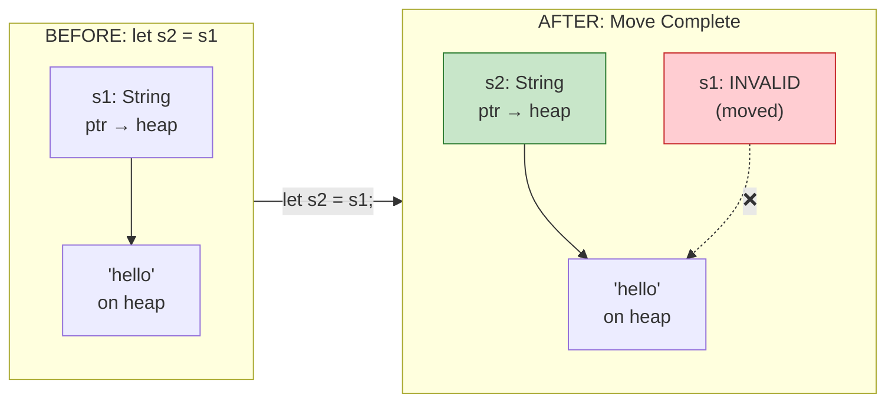
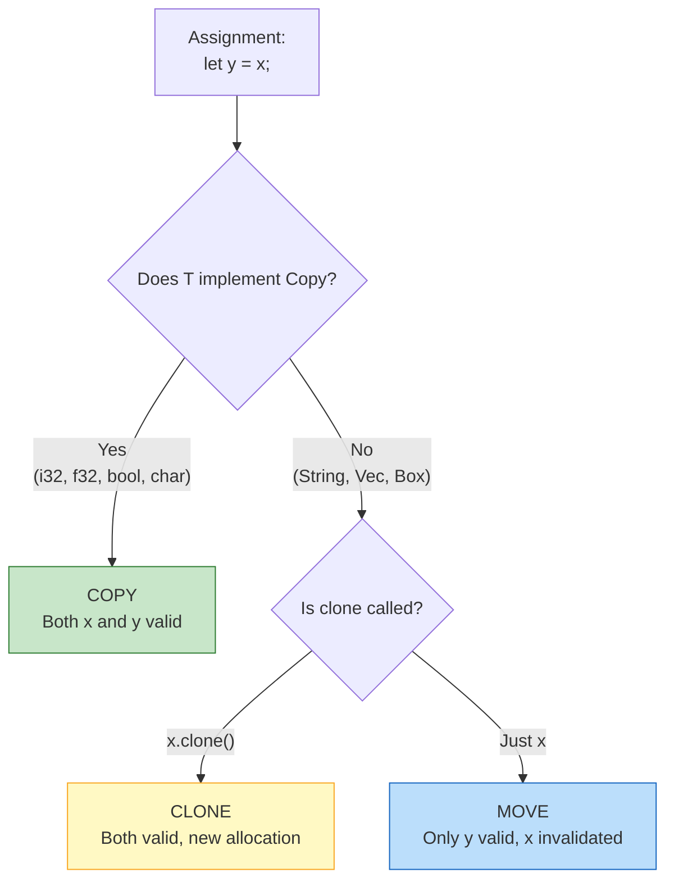

# Ownership and Move Semantics Diagram

Visual representations of how ownership transfers work in Rust.

## Move Semantics - Transfer of Ownership

```
    OWNERSHIP TRANSFER (MOVE)
    ═════════════════════════
    
    let s1 = String::from("hello");
    
    BEFORE:
    ┌─────────────────┐                    ┌──────────────────────┐
    │ s1              │                    │ Heap                 │
    │ ┌─────────────┐ │                    │ ┌──────────────────┐ │
    │ │ ptr ────────┼─┼────────────────────┼─▶│ "hello"         │ │
    │ │ len: 5      │ │                    │ │ (5 bytes)        │ │
    │ │ cap: 5      │ │                    │ └──────────────────┘ │
    │ └─────────────┘ │                    └──────────────────────┘
    └─────────────────┘
           │
           │ let s2 = s1;  // MOVE happens here
           ▼
    
    AFTER:
    ┌─────────────────┐                    ┌──────────────────────┐
    │ s1              │                    │ Heap                 │
    │ ┌─────────────┐ │                    │ ┌──────────────────┐ │
    │ │ INVALID     │ │    ╳ ╳ ╳ ╳ ╳ ╳    │ │ "hello"         │ │
    │ │ (moved)     │ │                    │ │ (5 bytes)        │ │
    │ └─────────────┘ │                    │ └──────────────────┘ │
    └─────────────────┘                    │         ▲            │
                                           └─────────┼────────────┘
    ┌─────────────────┐                              │
    │ s2              │                              │
    │ ┌─────────────┐ │                              │
    │ │ ptr ────────┼─┼──────────────────────────────┘
    │ │ len: 5      │ │
    │ │ cap: 5      │ │
    │ └─────────────┘ │
    └─────────────────┘
    
    → s1 is NO LONGER VALID after the move
    → s2 now OWNS the heap data
    → Only ONE owner at a time!
```

## Copy vs Move - The Difference

```
    COPY TYPES (i32, f32, bool, etc.)
    ═════════════════════════════════
    
    let x = 42;
    let y = x;   // COPY - both valid!
    
    ┌─────────────┐   Copy   ┌─────────────┐
    │ x           │   ───▶   │ y           │
    │ ┌─────────┐ │          │ ┌─────────┐ │
    │ │ 42      │ │          │ │ 42      │ │
    │ └─────────┘ │          │ └─────────┘ │
    └─────────────┘          └─────────────┘
          │                        │
          ▼                        ▼
       VALID                    VALID
    
    Stack-only data is cheap to copy bit-for-bit.
    

    MOVE TYPES (String, Vec, etc.)
    ══════════════════════════════
    
    let s1 = String::from("hi");
    let s2 = s1;  // MOVE - only s2 valid!
    
    ┌─────────────┐   Move   ┌─────────────┐
    │ s1          │   ───▶   │ s2          │
    │ ┌─────────┐ │          │ ┌─────────┐ │
    │ │ ptr ─╳──│ │          │ │ ptr ────┼─┼──▶ Heap data
    │ │ len: 2  │ │          │ │ len: 2  │ │
    │ └─────────┘ │          │ └─────────┘ │
    └─────────────┘          └─────────────┘
          │                        │
          ▼                        ▼
       INVALID                  VALID
    
    Heap data would be expensive (and dangerous) to copy.
    Rust MOVES ownership instead.
```

## Clone - Explicit Deep Copy

```
    EXPLICIT CLONE
    ══════════════
    
    let s1 = String::from("hello");
    let s2 = s1.clone();  // Explicit deep copy
    
    ┌─────────────────┐              ┌──────────────────────┐
    │ s1              │              │ Heap                 │
    │ ┌─────────────┐ │              │ ┌──────────────────┐ │
    │ │ ptr ────────┼─┼──────────────┼─▶│ "hello"         │ │
    │ │ len: 5      │ │              │ │ (original)       │ │
    │ └─────────────┘ │              │ └──────────────────┘ │
    └─────────────────┘              │                      │
          │                          │ ┌──────────────────┐ │
       VALID                         │ │ "hello"         │ │
                                     │ │ (clone)         │ │
    ┌─────────────────┐              │ └──────────────────┘ │
    │ s2              │              │         ▲            │
    │ ┌─────────────┐ │              └─────────┼────────────┘
    │ │ ptr ────────┼─┼────────────────────────┘
    │ │ len: 5      │ │
    │ └─────────────┘ │
    └─────────────────┘
          │
       VALID
    
    → Both s1 and s2 are VALID
    → Each owns SEPARATE heap allocations
    → Clone allocates new memory - use sparingly!
```

## Mermaid Diagrams

### Ownership Flow



### Copy vs Move Decision Tree



## Borrowing vs Moving - Side by Side

```
    MOVING INTO A FUNCTION
    ══════════════════════
    
    fn take_ownership(s: String) { ... }
    
    let name = String::from("alice");
    take_ownership(name);
    // println!("{}", name);  // ❌ ERROR: name was moved!
    
    ┌────────────┐     Move     ┌─────────────────┐
    │ name       │ ──────────▶  │ s (in function) │
    │ "alice"    │              │ "alice"         │
    └────────────┘              └─────────────────┘
         ↓                             ↓
      INVALID                    VALID (owns it)
                                       ↓
                               Function ends,
                               s dropped,
                               memory freed
    

    BORROWING INTO A FUNCTION  
    ═════════════════════════
    
    fn borrow(s: &String) { ... }
    
    let name = String::from("alice");
    borrow(&name);
    println!("{}", name);  // ✓ OK: name was only borrowed!
    
    ┌────────────┐    Borrow    ┌─────────────────┐
    │ name       │ ◀──────────  │ s (in function) │
    │ "alice"    │   reference  │ &String         │
    └────────────┘              └─────────────────┘
         ↓                             ↓
       VALID                    Points to name
         ↓                             ↓
    Still owns it             Function ends,
                              reference gone,
                              name still valid!
```

## Vector Database Context

```
    IN OUR VECTOR DATABASE
    ══════════════════════
    
    // BAD: This would MOVE the vector into the function
    fn search_bad(query: Vec<f32>, index: Index) -> Results {
        // query is MOVED in, caller loses access
        // index is MOVED in, can't reuse it!
    }
    
    // GOOD: Borrow the query, borrow the index
    fn search_good(query: &[f32], index: &Index) -> Results {
        // query: borrowed slice, caller keeps ownership
        // index: borrowed reference, can search many times
    }
    
    // Usage:
    let my_query: Vec<f32> = vec![0.1, 0.2, 0.3];
    let my_index = Index::new();
    
    // Can call search multiple times!
    let results1 = search_good(&my_query, &my_index);
    let results2 = search_good(&my_query, &my_index);  // Still works!
    
    → Borrowing is the KEY to efficient, reusable APIs
```
