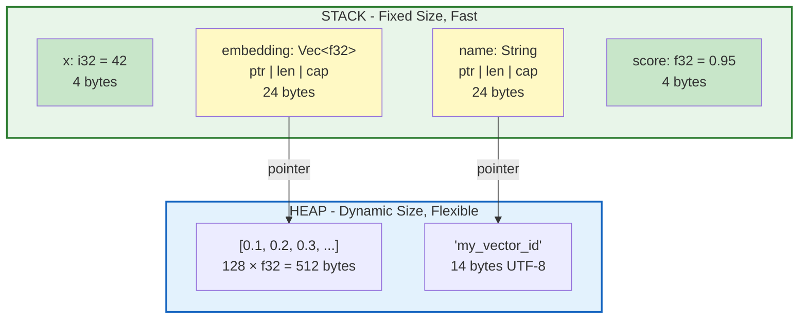

# Stack vs Heap Memory Layout

This diagram shows how Rust manages memory on the stack and heap.

## ASCII Diagram

```
┌─────────────────────────────────────────────────────────────────────────────┐
│                              MEMORY LAYOUT                                   │
├─────────────────────────────────────┬───────────────────────────────────────┤
│            STACK                    │              HEAP                      │
│     (fast, fixed-size)              │      (flexible, slower)                │
│                                     │                                        │
│  ┌───────────────────────────────┐  │                                        │
│  │ main() frame                  │  │                                        │
│  │ ┌─────────────────────────────┤  │                                        │
│  │ │ x: i32 = 42                 │◀─┼── Lives entirely on stack              │
│  │ ├─────────────────────────────┤  │                                        │
│  │ │ embedding: Vec<f32>         │  │   ┌───────────────────────────────┐   │
│  │ │  ├─ ptr ─────────────────────┼──┼──▶│ [0.1, 0.2, 0.3, 0.4, ...]   │   │
│  │ │  ├─ len: 128                │  │   │ (128 × 4 bytes = 512 bytes)  │   │
│  │ │  └─ cap: 128                │  │   └───────────────────────────────┘   │
│  │ ├─────────────────────────────┤  │                                        │
│  │ │ name: String                │  │   ┌───────────────────────────────┐   │
│  │ │  ├─ ptr ─────────────────────┼──┼──▶│ "my_vector_id"              │   │
│  │ │  ├─ len: 14                 │  │   │ (14 bytes UTF-8)             │   │
│  │ │  └─ cap: 14                 │  │   └───────────────────────────────┘   │
│  │ ├─────────────────────────────┤  │                                        │
│  │ │ score: f32 = 0.95           │◀─┼── Lives entirely on stack              │
│  │ └─────────────────────────────┘  │                                        │
│  └───────────────────────────────┘  │                                        │
│                                     │                                        │
│            ▲                        │              ▲                         │
│            │                        │              │                         │
│    Grows downward                   │      Grows as needed                   │
│    Auto-cleanup                     │      Manual cleanup (Drop)             │
│    Known size at compile            │      Dynamic size                      │
└─────────────────────────────────────┴───────────────────────────────────────┘

                    WHAT GOES WHERE?

    ┌────────────────────────┬────────────────────────────────────┐
    │      STACK             │             HEAP                   │
    ├────────────────────────┼────────────────────────────────────┤
    │ • i32, u64, f32, etc.  │ • String contents                  │
    │ • bool, char           │ • Vec<T> elements                  │
    │ • Fixed arrays [T; N]  │ • Box<T> contents                  │
    │ • Tuples (i32, f32)    │ • HashMap entries                  │
    │ • Struct metadata*     │ • Any dynamically-sized data       │
    │ • References &T        │ • Data shared via Rc/Arc           │
    └────────────────────────┴────────────────────────────────────┘
    
    * Structs containing heap data store their metadata (ptr/len/cap) 
      on stack, but the actual data lives on heap.
```

## Vec<f32> Internal Structure

This is especially relevant for our vector database embeddings:

```
    Stack                              Heap
    ┌─────────────┐                    ┌─────────────────────────────────────┐
    │ Vec<f32>    │                    │                                     │
    │ ┌─────────┐ │                    │  Index:  0     1     2     3        │
    │ │ ptr     │─┼───────────────────▶│       ┌─────┬─────┬─────┬─────┬───  │
    │ ├─────────┤ │                    │       │0.12 │0.45 │0.78 │0.33 │...  │
    │ │ len: 4  │ │ ◀── 4 elements     │       └─────┴─────┴─────┴─────┴───  │
    │ ├─────────┤ │     currently      │        4 bytes each (f32)           │
    │ │ cap: 8  │ │ ◀── room for 8     │                                     │
    │ └─────────┘ │                    │  Total: 32 bytes allocated          │
    └─────────────┘                    │  Used:  16 bytes (4 × 4)            │
                                       └─────────────────────────────────────┘
    
    The Vec<f32> on stack is always 24 bytes:
    • ptr:  8 bytes (pointer to heap)
    • len:  8 bytes (usize, current count)
    • cap:  8 bytes (usize, total capacity)
```

## Mermaid Diagram



## Why This Matters for Vector Databases

```
    VECTOR DATABASE MEMORY PATTERNS:

    1. EMBEDDING STORAGE
       ┌──────────────────────────────────────────────────────────────┐
       │  Query Vector (on stack):       768 dimensions × 4 bytes    │
       │  │                              = 3 KB per query            │
       │  ▼                                                          │
       │  Memory-Mapped File (mmap):                                 │
       │  ┌──────────────────────────────────────────────────────┐   │
       │  │ 1M vectors × 768 dims × 4 bytes = 3 GB               │   │
       │  │ Accessed as &[f32] slice - ZERO COPY!                │   │
       │  └──────────────────────────────────────────────────────┘   │
       └──────────────────────────────────────────────────────────────┘

    2. WHY RUST EXCELS HERE
       • Stack: Query processing, temporary calculations
       • Heap: Results buffer, intermediate scores
       • Mmap: Vector data - OS handles paging, we get &[f32]
       
       No garbage collector pause during similarity search!
       Predictable latency for real-time applications.
```
