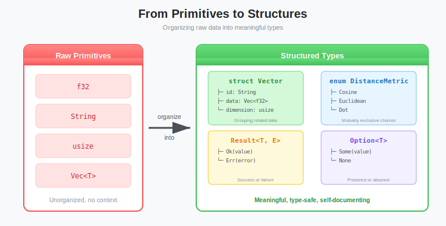
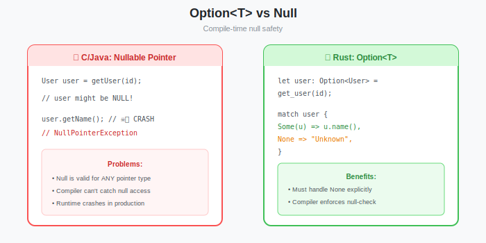
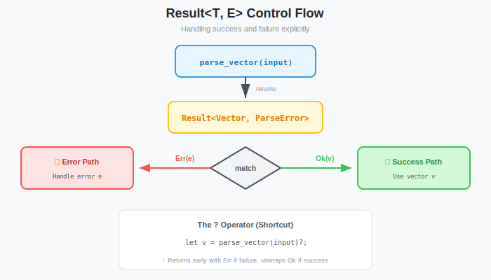

# Rust Crash Course Part 2: Structs, Enums, and Error Handling

**Series:** Building a Vector Database from Scratch in Rust  
**Post:** 4 of 20  
**Reading Time:** ~12 minutes

---

## 1. Introduction: Modeling the World

In the previous post, we mastered memory. We know how to own it, borrow it, and move it. But so far, we've only dealt with primitives like `f32` and `String`.

A database isn't built of raw floats. It's built of **Structures**.

We need to represent concepts like:

* A `Vector` (which has dimensions and data).
* A `DistanceMetric` (Cosine, Dot Product, or Euclidean).
* A `QueryResult` (which might succeed or fail).



In many languages (like Java or Python), you'd use a **Class** for everything. In Rust, we split this into two powerful concepts: **Structs** (data layout) and **Enums** (state possibilities).

And most importantly, we will learn how to handle errors. In C, you check integer return codes (`-1`). In Java, you catch Exceptions. In Rust, you handle **Results**.

---

## 2. Structs: Shaping Your Data

A `struct` (structure) lets you bundle related data into a single, named type. If you know Python, it's like a `class` but in Rust, you build it in two separate steps:

1. **`struct`** — defines *what data* the type holds (the fields)
2. **`impl`** — defines *what the type can do* (methods and constructors)

This split is intentional. Rust separates data from behavior, and `impl` is how you reconnect them.

<!-- See code/structs-examples.rs for runnable examples -->

### 2.1 Step 1: Define the Data Layout (`struct`)

Let's define the core atom of our database: the `Vector`.

```rust
// #[derive(Debug)] allows us to print the struct using {:?}
#[derive(Debug)]
struct Vector {
    id: String,         // unique identifier
    data: Vec<f32>,     // the actual embedding values
    dimension: usize,   // number of dimensions
}
```

This is *just* a data container, like a blueprint. It has no behavior yet. We can create one by filling in every field:

```rust
let v = Vector {
    id: String::from("vec_001"),
    data: vec![0.1, 0.2, 0.3],
    dimension: 3,
};

println!("Vector ID: {}", v.id);       // Access fields with dot notation
println!("Data: {:?}", v.data);
```

But notice the problem: we had to manually set `dimension: 3` even though the data has 3 elements. What if someone writes `dimension: 5` with only 3 values? We need a smarter way to construct this.

### 2.2 Step 2: Add Behavior (`impl`)

To add methods and constructors to a struct, you write an **`impl` block** with the **same name** as the struct:

```rust
impl Vector {
    //  ^^^^^^ — must match the struct name exactly
    
    // ... methods go here ...
}
```

**Key rule:** `impl Vector` means "I'm adding behavior to the `Vector` struct." The name must match. This is how Rust knows which struct the methods belong to.

Let's add a constructor and two methods:

```rust
impl Vector {
    // ── Constructor ──────────────────────────────────────
    // This is an "associated function" — no `self` parameter.
    // Called with Vector::new(...), not v.new(...)
    fn new(id: String, data: Vec<f32>) -> Self {
        let dim = data.len();   // compute dimension automatically!
        // Self = the type "Vector" (shorthand so you don't repeat the name)
        // This is identical to writing: Vector { id, data, dimension: dim }
        Self {
            id,
            data,
            dimension: dim,
        }
    }

    // ── Read-only method ─────────────────────────────────
    // &self = "borrow the struct, read-only"
    fn magnitude(&self) -> f32 {
        self.data.iter().map(|x| x * x).sum::<f32>().sqrt()
    }
    
    // ── Mutating method ──────────────────────────────────
    // &mut self = "borrow the struct, allow changes"
    fn normalize(&mut self) {
        let mag = self.magnitude();
        if mag > 0.0 {
            for x in &mut self.data {
                *x /= mag;
            }
        }
    }
}
```

**Two kinds of functions inside `impl`:**

| Kind | Signature | How you call it | Example |
|------|-----------|----------------|---------|
| **Associated function** (constructor) | `fn new(...) -> Self` (no `self`) | `Vector::new(...)` | `Vector::new("id".into(), vec![1.0])` |
| **Method** | `fn magnitude(&self)` (has `self`) | `v.magnitude()` | Called on an existing instance |

**The `self` parameter — what does it mean?**
- `&self` — immutable borrow (read-only access, like we learned in Post #3)
- `&mut self` — mutable borrow (can modify fields)
- `self` — takes ownership (rare, consumes the struct)

### 2.3 The Complete Picture

Here's how `struct` + `impl` work together as a single, usable type:

```rust
#[derive(Debug)]
struct Vector {
    id: String,
    data: Vec<f32>,
    dimension: usize,
}

impl Vector {
    fn new(id: String, data: Vec<f32>) -> Self {
        let dim = data.len();
        Self { id, data, dimension: dim }
    }

    fn magnitude(&self) -> f32 {
        self.data.iter().map(|x| x * x).sum::<f32>().sqrt()
    }

    fn normalize(&mut self) {
        let mag = self.magnitude();
        if mag > 0.0 {
            for x in &mut self.data {
                *x /= mag;
            }
        }
    }
}

fn main() {
    // Create using our constructor — dimension is computed automatically
    let mut v = Vector::new("vec_001".into(), vec![3.0, 4.0]);
    
    println!("{:?}", v);                         // Vector { id: "vec_001", data: [3.0, 4.0], dimension: 2 }
    println!("Magnitude: {}", v.magnitude());    // 5.0
    
    v.normalize();                               // Requires &mut self
    println!("After normalize: {:?}", v.data);   // [0.6, 0.8]
    println!("New magnitude: {}", v.magnitude()); // 1.0 (unit vector)
}
```

> **The pattern to remember:**
> ```
> struct MyType { ... }   ← defines the DATA
> impl MyType { ... }     ← defines the BEHAVIOR (same name!)
> ```
> Together, they form a complete custom type, like a `class` in other languages, but split in two.

### 2.4 The Tuple Struct (The "Newtype" Pattern)

Sometimes you just want to wrap a primitive to give it a distinct type. This prevents logic errors (like accidentally adding `Temperature` to `Money`).

```rust
struct VectorId(usize);  // Wrapper around a number
struct Dimension(usize);

let id = VectorId(42);
let dim = Dimension(768);

// This would be a compile error - different types!
// let x = id + dim; // ERROR!

// Access the inner value with .0
println!("ID is {}", id.0);
```

---

## 3. Enums: Rust's Superpower

In C or Java, an `enum` is usually just a set of named integers (`RED = 0`, `BLUE = 1`).

In Rust, Enums are **Algebraic Data Types**. This means an Enum variant can **contain data**. 

<!-- See code/enums-examples.rs for runnable examples -->

### 3.1 Defining Distance Metrics

Our database needs to support different ways of calculating similarity.

```rust
enum DistanceMetric {
    Cosine,
    DotProduct,
    Euclidean,
    // Enums can hold data!
    // Minkowski requires a 'p' parameter
    Minkowski(f32), 
}
```


### 3.2 The `match` Control Flow

To use an Enum, we use `match`. It forces us to handle **every possible variant**. If you add a new metric later, the compiler will force you to update your code.

```rust
fn calculate(metric: DistanceMetric, a: &[f32], b: &[f32]) -> f32 {
    match metric {
        DistanceMetric::Cosine => cosine_similarity(a, b),
        DistanceMetric::DotProduct => dot_product(a, b),
        DistanceMetric::Euclidean => euclidean_distance(a, b),
        // Destructuring the data inside the variant
        DistanceMetric::Minkowski(p) => minkowski_distance(a, b, p),
    }
}
```

**Systems Note:** Under the hood, Rust implements this as a **tagged union**. It stores a small integer (the tag) + enough bytes to hold the largest variant. It is extremely memory efficient.


---

## 4. The `Option` Enum: Killing the Null Pointer

Tony Hoare, the inventor of `null`, calls it his "billion-dollar mistake." Null causes crashes because you assume a value exists when it doesn't.

Rust **does not have null**.

Instead, it has `Option<T>`, which is just a standard enum!

```rust
enum Option<T> {
    Some(T), // Contains a value
    None,    // Contains nothing
}
```



### Usage in Our DB

Let's say fetching a Vector by ID might fail if the ID doesn't exist.

```rust
fn get_vector(id: &str) -> Option<&Vector> {
    // logic to find vector...
    if found {
        Some(vector_ref)
    } else {
        None
    }
}
```

To use the value, you **must** unwrap the box. You cannot accidentally use `None` as a valid Vector.

```rust
match get_vector("missing_id") {
    Some(v) => println!("Found: {:?}", v),
    None => println!("Vector not found!"),
}

// Or use if-let for single-arm matching
if let Some(v) = get_vector("vec_001") {
    println!("Found vector with {} dimensions", v.dimension);
}
```

---

## 5. The `Result` Enum: Robust Error Handling

In systems programming, things fail. Disk is full. Network is down. File doesn't exist.

Rust encodes failure in the type system using `Result<T, E>`.

```rust
enum Result<T, E> {
    Ok(T),  // Success! Contains the value.
    Err(E), // Failure! Contains the error.
}
```

<!-- See code/error-handling.rs for runnable examples -->

### 5.1 Handling Errors

Let's look at `File::open`, which returns a `Result`.

```rust
use std::fs::File;

let f = File::open("database.wal");

match f {
    Ok(file) => println!("File opened successfully."),
    Err(error) => println!("Failed to open file: {:?}", error),
}
```



### 5.2 The `?` Operator (Propagation)

Writing `match` for every error is tedious. Often, we just want to say: *"If this fails, return the error to my caller. If it succeeds, give me the value."*

That is what `?` does.

```rust
use std::fs::File;
use std::io::{self, Read};

// Function returns a Result
fn read_wal_header() -> Result<String, io::Error> {
    // If open fails, return Err immediately.
    // If success, unwrap file and continue.
    let mut f = File::open("database.wal")?; 
    
    let mut buffer = String::new();
    // Same here. Propagate error if read fails.
    f.read_to_string(&mut buffer)?; 
    
    Ok(buffer) // Return Success
}
```


**Rule of Thumb:**

| Context | Approach |
|---------|----------|
| Tests, prototypes, examples | `unwrap()` / `expect("message")` |
| Production code | `?` and `Result<T, E>` |
| Absolutely cannot fail | `unwrap()` with comment explaining why |

### 5.3 The `?` Trap: Custom Error Types

**Warning:** The `?` operator only works if Rust knows how to convert the error type. This code **will not compile**:

```rust
enum MyError {
    IoError(std::io::Error),
}

fn load() -> Result<(), MyError> {
    let f = File::open("data.bin")?; //  COMPILE ERROR!
    Ok(())
}
```

Why? `File::open` returns `io::Error`, but `?` doesn't know how to convert it to `MyError`.

**The Fix:** Use `map_err` to explicitly wrap the error:

```rust
fn load() -> Result<(), MyError> {
    let f = File::open("data.bin")
        .map_err(|e| MyError::IoError(e))?; //  Works!
    Ok(())
}
```

> **Systems Note:** For production code, you can implement the `From` trait to make `?` work automatically, or use the `thiserror` crate. We'll do exactly that in the next section.

---

## 6. Traits: Contracts Your Types Can Fulfill

You've seen the word "trait" a few times now, `Display`, `Debug`, `From`. Before we build our vectordb types, let's understand what traits actually are, because we'll need them immediately.

### 6.1 What Is a Trait?

A **trait** defines a set of methods that a type promises to implement. If you come from other languages:

| Language | Closest Equivalent |
|----------|--------------------|
| Java / C# | Interface |
| Go | Interface (implicit) |
| Python | Abstract Base Class (ABC) |
| TypeScript | Interface |

Here's the simplest possible trait:

```rust
trait Describable {
    fn describe(&self) -> String;
}
```

Any type that implements `Describable` must provide a `describe` method. Let's implement it:

```rust
struct Sensor {
    name: String,
    value: f64,
}

impl Describable for Sensor {
    fn describe(&self) -> String {
        format!("{}: {:.2}", self.name, self.value)
    }
}
```

The syntax is `impl TraitName for TypeName`. The compiler enforces that you implement every required method.

### 6.2 Traits You'll Use Constantly

Rust's standard library defines dozens of traits. These four matter most for us:

| Trait | What It Does | How You Get It |
|-------|-------------|----------------|
| `Debug` | Enables `{:?}` formatting for printing | `#[derive(Debug)]` |
| `Clone` | Enables `.clone()` to duplicate a value | `#[derive(Clone)]` |
| `Display` | Enables `{}` formatting (human-readable) | Must implement manually |
| `From<T>` | Enables automatic type conversion | Must implement manually |

**`derive` vs manual:** Simple traits like `Debug` and `Clone` can be auto-generated with `#[derive(...)]`. Traits that need custom logic, like how to display an error message, must be written by hand.

### 6.3 `Display` — Human-Readable Output

The `Display` trait controls what `println!("{}", value)` prints. Let's implement it for an error type:

```rust
use std::fmt;

enum DbError {
    NotFound(String),
    Corrupted(String),
}

impl fmt::Display for DbError {
    fn fmt(&self, f: &mut fmt::Formatter<'_>) -> fmt::Result {
        match self {
            DbError::NotFound(id) => write!(f, "not found: {}", id),
            DbError::Corrupted(msg) => write!(f, "data corrupted: {}", msg),
        }
    }
}
```

Now `println!("{}", DbError::NotFound("vec_42".into()))` prints `not found: vec_42` instead of a debug dump.

### 6.4 `From` — Making `?` Work Automatically

Remember the `?` trap from Section 5.3? We used `map_err` as a workaround. The real solution is the `From` trait:

```rust
impl From<std::io::Error> for DbError {
    fn from(e: std::io::Error) -> Self {
        DbError::Corrupted(e.to_string())
    }
}
```

Now this **just works** — no `map_err` needed:

```rust
fn load() -> Result<(), DbError> {
    let f = std::fs::File::open("data.bin")?; //  auto-converts io::Error → DbError
    Ok(())
}
```

When Rust sees `?`, it checks: *"Is there an `impl From<io::Error> for DbError`?"* If yes, it calls `.into()` automatically.

> **Systems Insight:** This pattern  `enum` for error variants + `Display` for messages + `From` for each source error, is the standard Rust error-handling recipe. You'll see it in every serious Rust project.

---

## 7. Application: Designing `vectordb` Types

Now, let's write the actual code for our database. We'll define the core types we'll use for the rest of the series.

<!-- See code/models.rs for complete implementation -->

Create a new file `src/models.rs` (and add `mod models;` to `main.rs`).

```rust
// src/models.rs
use std::collections::HashMap;

/// A vector embedding with metadata
#[derive(Debug, Clone)]
pub struct Vector {
    pub data: Vec<f32>,
    // Using HashMap for metadata: "title" -> "AI Paper"
    pub metadata: HashMap<String, String>, 
}

impl Vector {
    /// Constructor - enforces invariants
    pub fn new(data: Vec<f32>) -> Self {
        Self {
            data,
            metadata: HashMap::new(),
        }
    }
    
    /// Constructor with metadata
    pub fn with_metadata(data: Vec<f32>, metadata: HashMap<String, String>) -> Self {
        Self { data, metadata }
    }
    
    /// Get dimensionality
    pub fn dimension(&self) -> usize {
        self.data.len()
    }
}

/// Supported distance metrics for similarity search
#[derive(Debug, Clone, Copy)]
pub enum DistanceMetric {
    Cosine,
    Euclidean,
    Dot,
}

/// A single search result with ID and similarity score
#[derive(Debug)]
pub struct SearchResult {
    pub id: String,
    pub score: f32,
}

/// Custom error type for our database
#[derive(Debug)]
pub enum VectorDbError {
    EmptyVector,
    DimensionMismatch { expected: usize, got: usize },
    NotFound(String),
    IoError(std::io::Error),
}

/// Type alias to avoid typing Result<T, VectorDbError> everywhere
pub type Result<T> = std::result::Result<T, VectorDbError>;
```

> **Pro Tip:** The type alias `pub type Result<T> = std::result::Result<T, VectorDbError>;` lets you write `Result<Vec<SearchResult>>` instead of `Result<Vec<SearchResult>, VectorDbError>`. This is a common pattern in Rust libraries (see `std::io::Result`).

And update `main.rs` to simulate a search that returns a `Result`:

> **Note:** In Post #2, we set up an async `main` with `#[tokio::main]`. For this example, we're using a simple synchronous `main` for clarity. In your real project, keep the Tokio attribute, it won't affect synchronous code.

```rust
mod models;
use models::{Vector, DistanceMetric, SearchResult, VectorDbError, Result};
use std::fs::File;

// Using our type alias - cleaner than Result<Vec<SearchResult>, VectorDbError>
fn search(query: &Vector, top_k: usize) -> Result<Vec<SearchResult>> {
    if query.data.is_empty() {
        return Err(VectorDbError::EmptyVector);
    }

    // (Simulated logic...)
    Ok(vec![
        SearchResult { id: "vec_1".to_string(), score: 0.95 }
    ])
}

// Example of using map_err with our custom error type
fn load_vectors(path: &str) -> Result<()> {
    let _f = File::open(path)
        .map_err(|e| VectorDbError::IoError(e))?; // Explicit conversion!
    Ok(())
}

fn main() {
    // Use the constructor we defined
    let q = Vector::new(vec![0.1, 0.2]);
    
    println!("Query dimension: {}", q.dimension());

    match search(&q, 10) {
        Ok(results) => println!("Found {} results", results.len()),
        Err(e) => eprintln!("Search failed: {:?}", e),
    }
    
    // Demonstrate error handling with map_err
    if let Err(e) = load_vectors("nonexistent.bin") {
        eprintln!("Load failed: {:?}", e);
    }
}
```


---

## 8. Integrating Into the VectorDB Project

Everything so far has been conceptual examples. Now let's actually wire these types into our `vectordb` project from Post #2. This is the step that makes Phase 2 possible.

### 7.1 Create the Models Module

Create a new file `vectordb/src/models.rs`. This is where all our core types live:

```rust
// src/models.rs
use serde::{Deserialize, Serialize};
use std::collections::HashMap;
use std::fmt;

// ── Core Data Types ─────────────────────────────────────────

/// A vector embedding with metadata.
#[derive(Debug, Clone, Serialize, Deserialize)]
pub struct Vector {
    pub data: Vec<f32>,
    #[serde(default)]
    pub metadata: HashMap<String, String>,
}

impl Vector {
    pub fn new(data: Vec<f32>) -> Self {
        Self { data, metadata: HashMap::new() }
    }

    pub fn with_metadata(data: Vec<f32>, metadata: HashMap<String, String>) -> Self {
        Self { data, metadata }
    }

    pub fn dimension(&self) -> usize {
        self.data.len()
    }

    pub fn magnitude(&self) -> f32 {
        self.data.iter().map(|x| x * x).sum::<f32>().sqrt()
    }

    pub fn normalize(&mut self) {
        let mag = self.magnitude();
        if mag > 0.0 {
            for x in &mut self.data {
                *x /= mag;
            }
        }
    }
}

// ── Distance Metrics ────────────────────────────────────────

#[derive(Debug, Clone, Copy, PartialEq, Serialize, Deserialize)]
#[serde(rename_all = "lowercase")]
pub enum DistanceMetric {
    Cosine,
    Euclidean,
    Dot,
}

impl Default for DistanceMetric {
    fn default() -> Self { DistanceMetric::Cosine }
}

impl DistanceMetric {
    pub fn calculate(&self, a: &[f32], b: &[f32]) -> f32 {
        match self {
            DistanceMetric::Cosine => {
                let dot: f32 = a.iter().zip(b).map(|(x, y)| x * y).sum();
                let norm_a: f32 = a.iter().map(|x| x * x).sum::<f32>().sqrt();
                let norm_b: f32 = b.iter().map(|x| x * x).sum::<f32>().sqrt();
                if norm_a == 0.0 || norm_b == 0.0 { 0.0 }
                else { dot / (norm_a * norm_b) }
            }
            DistanceMetric::Euclidean => {
                a.iter().zip(b).map(|(x, y)| (x - y).powi(2)).sum::<f32>().sqrt()
            }
            DistanceMetric::Dot => a.iter().zip(b).map(|(x, y)| x * y).sum(),
        }
    }
}

// ── Search Types ────────────────────────────────────────────

#[derive(Debug, Clone, Serialize, Deserialize)]
pub struct SearchResult {
    pub id: String,
    pub score: f32,
}

#[derive(Debug, Clone, Serialize, Deserialize)]
pub struct SearchRequest {
    pub vector: Vec<f32>,
    #[serde(default = "default_top_k")]
    pub top_k: usize,
    #[serde(default)]
    pub metric: DistanceMetric,
}

fn default_top_k() -> usize { 10 }

// ── Collection Types ────────────────────────────────────────

#[derive(Debug, Clone, Serialize, Deserialize)]
pub struct CollectionInfo {
    pub name: String,
    pub dimension: usize,
    pub distance: DistanceMetric,
    pub count: usize,
}

// ── Error Types ─────────────────────────────────────────────

#[derive(Debug)]
pub enum VectorDbError {
    EmptyVector,
    DimensionMismatch { expected: usize, got: usize },
    NotFound(String),
    AlreadyExists(String),
    InvalidParameter(String),
    IoError(std::io::Error),
    SerializationError(String),
}

impl fmt::Display for VectorDbError {
    fn fmt(&self, f: &mut fmt::Formatter<'_>) -> fmt::Result {
        match self {
            VectorDbError::EmptyVector => write!(f, "Vector cannot be empty"),
            VectorDbError::DimensionMismatch { expected, got } =>
                write!(f, "Dimension mismatch: expected {}, got {}", expected, got),
            VectorDbError::NotFound(id) => write!(f, "Not found: {}", id),
            VectorDbError::AlreadyExists(name) => write!(f, "Already exists: {}", name),
            VectorDbError::InvalidParameter(msg) => write!(f, "Invalid parameter: {}", msg),
            VectorDbError::IoError(e) => write!(f, "I/O error: {}", e),
            VectorDbError::SerializationError(msg) => write!(f, "Serialization error: {}", msg),
        }
    }
}

impl std::error::Error for VectorDbError {}

impl From<std::io::Error> for VectorDbError {
    fn from(err: std::io::Error) -> Self { VectorDbError::IoError(err) }
}

impl From<serde_json::Error> for VectorDbError {
    fn from(err: serde_json::Error) -> Self {
        VectorDbError::SerializationError(err.to_string())
    }
}

/// Type alias: saves typing Result<T, VectorDbError> everywhere
pub type Result<T> = std::result::Result<T, VectorDbError>;
```

> **Why `Serialize`/`Deserialize` already?** Post #5 will use `Json<Vector>` in Axum handlers. Adding Serde derives now means we won't have to touch these types again later.

### 7.2 Create the Library Root

Create `vectordb/src/lib.rs`:

```rust
// src/lib.rs — library root
// Re-exports all modules. Grows as we add phases:
//   Phase 2: pub mod storage;
//   Phase 3: pub mod engine;

pub mod models;
```

### 7.3 Update main.rs

Replace the Post #2 "hello async" demo in `vectordb/src/main.rs` with a real integration test of our types:

```rust
mod models;
use models::{
    CollectionInfo, DistanceMetric, SearchRequest, SearchResult,
    Vector, VectorDbError,
};
use std::collections::HashMap;

#[tokio::main]
async fn main() {
    println!("VectorDB — Phase 1 Complete\n");

    // Create a vector with metadata
    let mut meta = HashMap::new();
    meta.insert("title".to_string(), "Attention Is All You Need".to_string());
    let v1 = Vector::with_metadata(vec![0.1, 0.8, 0.3], meta);

    println!("Vector: {} dims, magnitude={:.4}", v1.dimension(), v1.magnitude());

    // Test distance metrics
    let v2 = Vector::new(vec![0.9, 0.1, 0.2]);
    println!("Cosine:    {:.4}", DistanceMetric::Cosine.calculate(&v1.data, &v2.data));
    println!("Euclidean: {:.4}", DistanceMetric::Euclidean.calculate(&v1.data, &v2.data));

    // Test JSON round-trip
    let json = serde_json::to_string_pretty(&v1).unwrap();
    println!("\nAs JSON:\n{}", json);
    let parsed: Vector = serde_json::from_str(&json).unwrap();
    println!("Deserialized: {} dims ✓", parsed.dimension());

    // Test error handling
    let bad = SearchRequest { vector: vec![], top_k: 5, metric: DistanceMetric::Cosine };
    if bad.vector.is_empty() {
        let err = VectorDbError::EmptyVector;
        println!("\nError handling: {}", err);
    }

    println!("\nPhase 1 complete! Next: Post #5 (Axum HTTP server)");
}
```

### 7.4 Verify Everything Works

```bash
cd vectordb
cargo test    # All 9 tests should pass
cargo run     # Demonstrates types, metrics, JSON, errors
```

Your project structure should now look like:

```text
vectordb/
├── Cargo.toml          # tokio + serde + serde_json
├── Cargo.lock
└── src/
    ├── main.rs         # Phase 1 demo (replaced Post #2 hello-async)
    ├── lib.rs          # Library root: pub mod models;
    └── models.rs       # Vector, DistanceMetric, SearchResult, VectorDbError
```

This is the foundation for everything ahead. Post #5 will import `mod models` and plug these types directly into Axum handlers.

---

## 9. Exercises: Prove You Own These Concepts

Before moving on, try these challenges. Each one tests a concept you'll need in Phase 2.

### Exercise 1: Add a Variant

Add a `DotProduct` variant to this enum and handle it in the `describe` method:

```rust
enum Metric {
    Cosine,
    Euclidean,
}

impl Metric {
    fn describe(&self) -> &str {
        match self {
            Metric::Cosine => "cosine similarity",
            Metric::Euclidean => "euclidean distance",
        }
    }
}
```

<details>
<summary>Solution</summary>

```rust
enum Metric {
    Cosine,
    Euclidean,
    DotProduct, // new variant
}

impl Metric {
    fn describe(&self) -> &str {
        match self {
            Metric::Cosine => "cosine similarity",
            Metric::Euclidean => "euclidean distance",
            Metric::DotProduct => "dot product",  // new arm
        }
    }
}
```

If you forget the new arm, the compiler will refuse to build. That's the power of exhaustive matching.

</details>

### Exercise 2: Implement `Display` for a Struct

Make this struct printable with `println!("{}", point)` so it outputs something like `Point[vec_42](3 dims)`:

```rust
use std::fmt;

struct Point {
    id: String,
    dimensions: usize,
}

// TODO: implement fmt::Display for Point
```

<details>
<summary>Solution</summary>

```rust
impl fmt::Display for Point {
    fn fmt(&self, f: &mut fmt::Formatter<'_>) -> fmt::Result {
        write!(f, "Point[{}]({} dims)", self.id, self.dimensions)
    }
}

fn main() {
    let p = Point { id: "vec_42".to_string(), dimensions: 3 };
    println!("{}", p); // Point[vec_42](3 dims)
}
```

</details>

### Exercise 3: Chain `?` with `From`

This code won't compile. Fix it by implementing the `From` trait so `?` works:

```rust
use std::fs;

enum AppError {
    Io(String),
    Parse(String),
}

fn read_config() -> Result<u32, AppError> {
    let text = fs::read_to_string("config.txt")?;  //  io::Error
    let num: u32 = text.trim().parse()?;             //  ParseIntError
    Ok(num)
}
```

<details>
<summary>Solution</summary>

```rust
use std::fs;
use std::num::ParseIntError;

enum AppError {
    Io(String),
    Parse(String),
}

impl From<std::io::Error> for AppError {
    fn from(e: std::io::Error) -> Self {
        AppError::Io(e.to_string())
    }
}

impl From<ParseIntError> for AppError {
    fn from(e: ParseIntError) -> Self {
        AppError::Parse(e.to_string())
    }
}

fn read_config() -> Result<u32, AppError> {
    let text = fs::read_to_string("config.txt")?;  //  auto-converts
    let num: u32 = text.trim().parse()?;             //  auto-converts
    Ok(num)
}
```

Each `impl From<SourceError> for AppError` teaches `?` how to convert that specific error type. This is exactly the pattern our `VectorDbError` uses.

</details>

---

## 10. Summary

You have just graduated from "Scripting" to "Systems Modeling".

| Concept | Purpose |
|---------|---------|
| **Struct** | Organize related data with named fields |
| **impl** | Add methods and associated functions |
| **Enum** | Model mutually exclusive states with optional data |
| **Option<T>** | Safe null replacement — forces you to check |
| **Result<T, E>** | Explicit error handling — no hidden exceptions |
| **?** | Propagate errors cleanly up the call stack |

### The Rust Type Design Flowchart

```
What are you modeling?
│
├─ A "thing" with properties? ──→ Use a Struct
│   └─ Does it need behavior? ──→ Add impl block
│
├─ One of several possibilities? ──→ Use an Enum
│   └─ Do variants carry data? ──→ Add fields to variants
│
└─ Something that might not exist?
    ├─ Absence is normal ──→ Option<T>
    └─ Absence is an error ──→ Result<T, E>
```

---

## 11. What's Next?

### End-of-Post Checkpoint

Before moving on, verify your project is solid:

```bash
cd vectordb
cargo test
```

You should see **9 tests passing**:

```text
running 9 tests
test models::tests::test_vector_creation ... ok
test models::tests::test_vector_normalize ... ok
test models::tests::test_cosine_similarity ... ok
test models::tests::test_euclidean_distance ... ok
test models::tests::test_dot_product ... ok
test models::tests::test_distance_metric_calculate ... ok
test models::tests::test_search_request_defaults ... ok
test models::tests::test_vector_db_error_display ... ok
test models::tests::test_error_from_io ... ok
```

Then run the demo:

```bash
cargo run
```

You should see output demonstrating vectors, distance metrics, JSON serialization, and error handling.

**Self-check, can you answer these?**
1. Why does `VectorDbError` need both `Display` and `From<io::Error>`?
2. What happens if you add a new variant to `DistanceMetric` but forget to update the `match`?
3. Why do we use `#[serde(default = "...")]` on `SearchRequest` fields?

If all tests pass and you can answer those questions, **Phase 1 is complete.** You have a typed, tested foundation ready for real infrastructure.

---

In the next post, we will stop simulating and start building the real thing. We will build the **Transport Layer**, an async HTTP server using `Axum` that accepts JSON and returns Vectors.

**Next Post:** [Post #5: The Async Runtime & HTTP Layer →](../post-05-async-axum/blog.md)

---

*Structs shape your data. Enums encode your possibilities. Traits enforce your contracts. Results force you to face reality. This is systems programming done right.*
