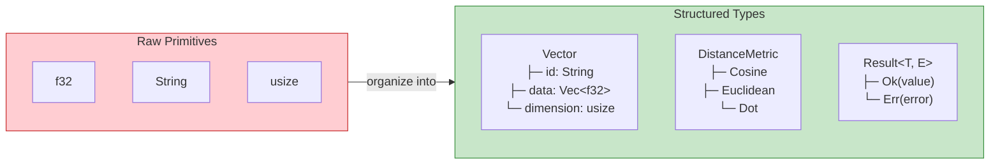
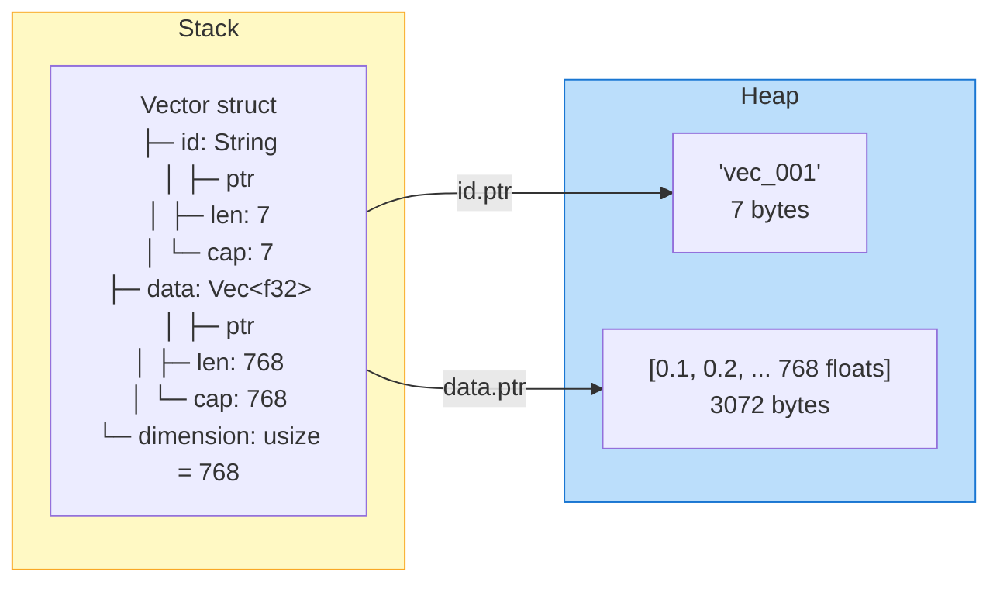
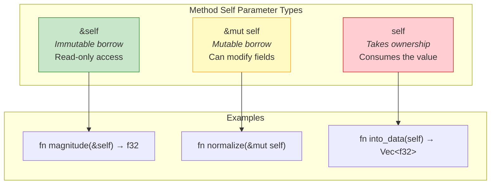
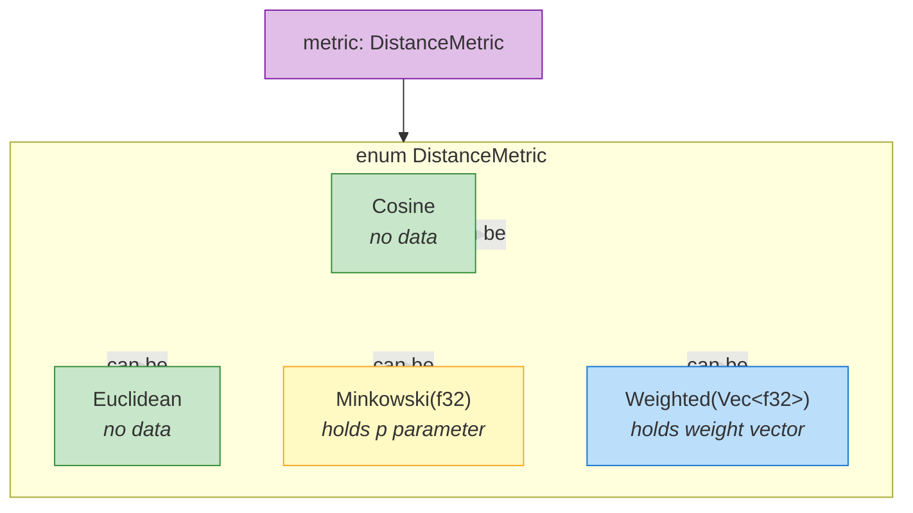
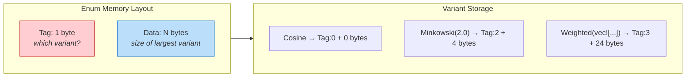
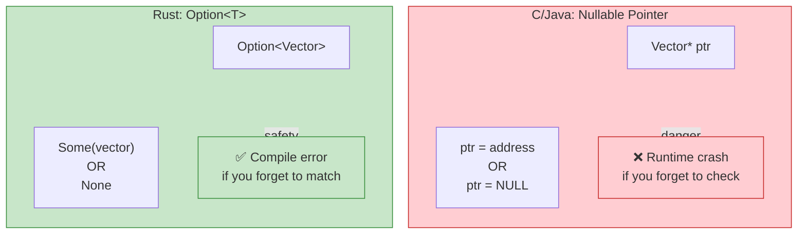
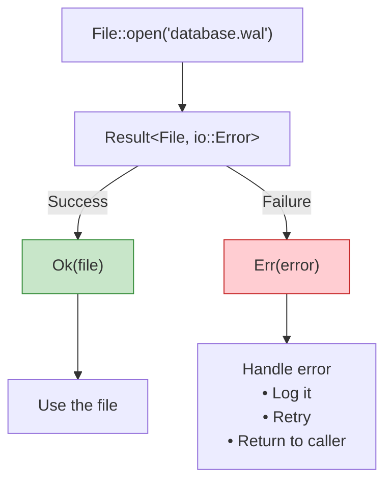
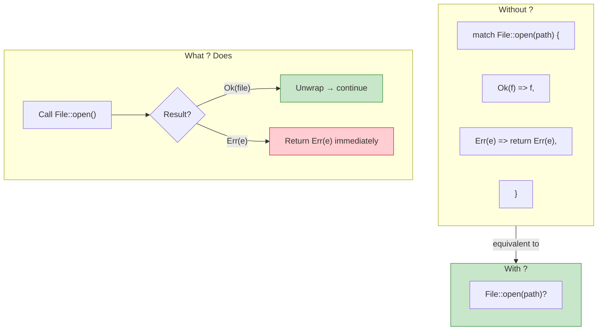
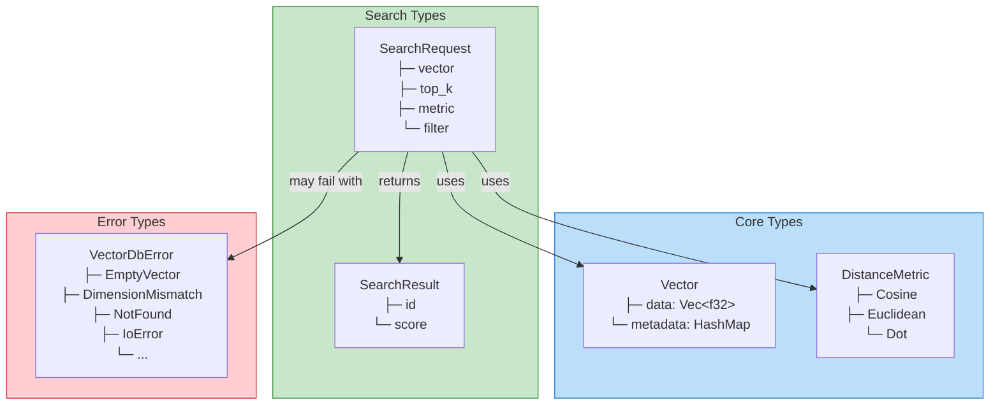
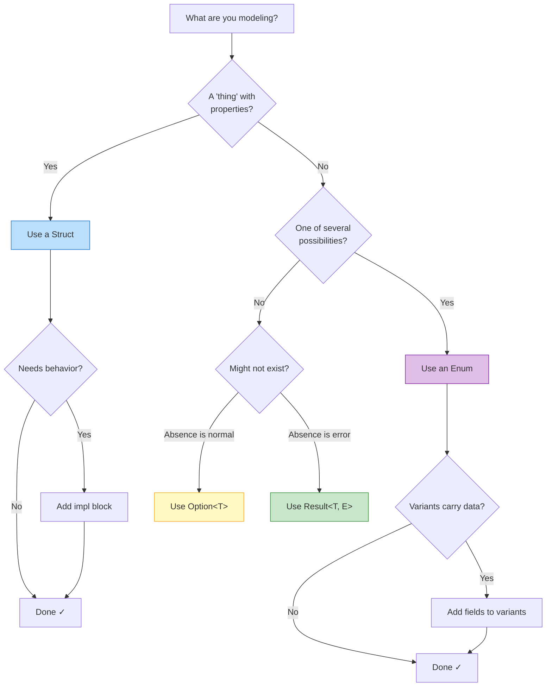

# Mermaid Diagrams for Post #4

All Mermaid diagrams for "Structs, Enums, and Error Handling" blog post.

---

## Diagram 1: From Primitives to Structures

Use in: Section 1 (Introduction: Modeling the World)

---

## Diagram 2: Struct Memory Layout

Use in: Section 2.1 (The Named Struct)

---

## Diagram 3: Self Reference Types

Use in: Section 2.2 (Adding Behavior)

---

## Diagram 4: Enum Variants

Use in: Section 3.1 (Defining Distance Metrics)

---

## Diagram 5: Tagged Union Memory

Use in: Section 3.2 (Systems Note about tagged unions)

---

## Diagram 6: Option vs Null

Use in: Section 4 (The Option Enum: Killing the Null Pointer)

---

## Diagram 7: Result Flow

Use in: Section 5.1 (Handling Errors)

---

## Diagram 8: The ? Operator

Use in: Section 5.2 (The ? Operator)

---

## Diagram 9: VectorDB Type Hierarchy

Use in: Section 6 (Application: Designing vectordb Types)

---

## Diagram 10: Type Design Decision Tree

Use in: Section 7 (Summary)

