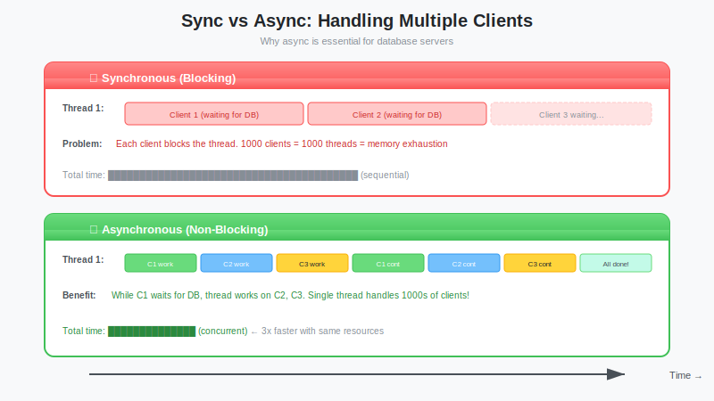
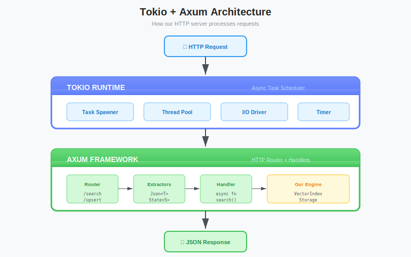

# The Async Runtime: Understanding Tokio, Futures, and Building a Real HTTP Server with Axum

**Series:** Building a Vector Database from Scratch in Rust  
**Post:** 5 of 20  
**Reading Time:** ~20 minutes

---

## 1. Introduction: The "Waiter" Problem

In the last post, we defined our data structures. We have a `Vector`, we have `DistanceMetric`, and we have error handling. But right now, our database is just a library that runs on your laptop.

To make it a **Server**, it needs to listen for requests over the network.

If you come from Python (Flask/Django) or Ruby (Rails), you might be used to a "Thread-per-Request" model. When a request comes in, the server spins up a thread (or uses one from a pool) and blocks that thread until the response is ready.

**For a database, this is fatal.**

Imagine your database is writing to disk (a slow operation). In a blocking model, if 100 users try to write at once, you need 100 threads waiting on the disk. Threads are heavy (they eat RAM and CPU for context switching).

Rust uses **Async I/O**.



**The Analogy:**

* **Blocking (Sync):** You order coffee. The cashier stands there, staring at the barista making your coffee, ignoring the line behind you. Only when you get your coffee does the cashier take the next order.
* **Non-Blocking (Async):** You order coffee. The cashier gives you a ticket (a **Future**) and immediately takes the next order. When your coffee is ready, they call your number.

In this post, we will build the **Transport Layer** of our database using **Tokio** (the cashier) and **Axum** (the menu). By the end, you'll have a real HTTP server that can insert, retrieve, and search vectors.

---

## 2. Understanding Async/Await

Before we touch any frameworks, let's understand the core concept. This section is the foundation for everything else in this post.

### 2.1 What is a Future?

A `Future` is a value that *might not exist yet*. When you call an async function, it doesn't run immediately, it returns a Future.

```rust
async fn fetch_data() -> String {
    // This doesn't run until someone .await's it
    "data".to_string()
}

let future = fetch_data();  // Nothing happens yet!
let data = future.await;    // NOW it runs
```

### 2.2 Why `.await`?

The `.await` keyword tells Tokio: *"I'm going to wait for this. While waiting, feel free to run other tasks."*

```rust
async fn handle_request() {
    let db_result = query_database().await;  // Yields to other tasks
    let file = read_file().await;            // Yields again
    process(db_result, file);                // Runs when both are ready
}
```

> **Systems Note:** Unlike threads, yielding a Future has near-zero cost. There's no context switch, no kernel involvement. Tokio just moves to the next ready task in its queue.

### 2.3 The State Machine (What the Compiler Does)

Here's what most tutorials skip. When you write an `async fn`, the Rust compiler transforms it into a **state machine**. Each `.await` point becomes a state:

```rust
// What YOU write:
async fn do_work() -> String {
    let a = step_one().await;    // ← pause point 1
    let b = step_two(a).await;   // ← pause point 2
    format!("{}{}", a, b)
}
```

```text
The compiler generates (conceptually):

  ┌─────────────┐
  │  State 0    │  "Haven't started yet"
  │  Start      │
  └──────┬──────┘
         │ poll()
  ┌──────▼──────┐
  │  State 1    │  "Waiting for step_one"
  │  Holds: -   │
  └──────┬──────┘
         │ step_one completes
  ┌──────▼──────┐
  │  State 2    │  "Waiting for step_two"
  │  Holds: a   │  ← stores 'a' across the pause
  └──────┬──────┘
         │ step_two completes
  ┌──────▼──────┐
  │  Complete   │  Returns format!("{}{}", a, b)
  └─────────────┘
```

This is why async Rust has no runtime overhead, there's no heap allocation for each task, no garbage collector. It's just a `match` on an integer state tag.

### 2.4 `Pin` — A Quick Mention

You'll occasionally see `Pin<Box<dyn Future>>` in error messages. Here's the explanation:

Because the state machine stores local variables (like `a` above) inside itself, moving the Future in memory would invalidate those internal references. `Pin` is Rust's way of saying *"this value will not be moved."*

You rarely need to think about `Pin` directly, `async fn` handles it. But when you see it in a compiler error, now you know what it means.

---

## 3. The Engine: What is Tokio?

Rust's standard library does *not* include an async runtime. It provides the *concept* of a Future (a promise that a value will exist later), but it doesn't have the engine to execute them.

Enter **Tokio**.



Tokio is an asynchronous runtime that provides:

1. **A Multi-threaded Scheduler:** It runs thousands of lightweight "tasks" (green threads) on a small number of OS threads.
2. **Non-blocking I/O:** Drivers for network (TCP/UDP) and file systems.
3. **Timers:** `sleep`, `timeout`, etc.

When you annotate `main` with `#[tokio::main]`, you are essentially saying: *"Before my code runs, start the engine."*

```rust
#[tokio::main]  // Macro that sets up the runtime
async fn main() {
    // Your async code runs here
    // Tokio's scheduler is active
}
```

> **Systems Note:** Under the hood, `#[tokio::main]` expands to roughly:
> ```rust
> fn main() {
>     tokio::runtime::Runtime::new()
>         .unwrap()
>         .block_on(async { /* your code */ })
> }
> ```

### 3.1 Spawning Tasks with `tokio::spawn`

So far, `.await` runs things sequentially. But what if you want two tasks to run **concurrently**?

```rust
#[tokio::main]
async fn main() {
    // Spawn a background task — runs independently
    let handle = tokio::spawn(async {
        // This runs on the Tokio scheduler
        expensive_computation().await
    });

    // Meanwhile, do other work...
    do_something_else().await;

    // Wait for the background task to finish
    let result = handle.await.unwrap();
}
```

`tokio::spawn` is like handing a task to a coworker. You don't wait for them, you keep working. You can check on them later with `.await`.

**Key difference:**
- `.await` — Sequential. "Do this, then continue."
- `tokio::spawn` — Concurrent. "Someone handle this, I'll keep going."

### 3.2 The Blocking Trap 

This is the #1 mistake people make in async Rust:

```rust
// WRONG — blocks the entire Tokio thread!
async fn bad_handler() {
    std::thread::sleep(Duration::from_secs(5));  // Freezes the scheduler
}

// CORRECT — yields to other tasks while sleeping
async fn good_handler() {
    tokio::time::sleep(Duration::from_secs(5)).await;  // Scheduler stays free
}
```

**The Rule:** Never call blocking functions (`std::thread::sleep`, CPU-heavy loops, synchronous file I/O) inside an async function. If you must do blocking work, use `tokio::task::spawn_blocking`:

```rust
let result = tokio::task::spawn_blocking(|| {
    // This runs on a dedicated thread pool, not the async scheduler
    heavy_cpu_work()
}).await.unwrap();
```

---

## 4. The Framework: Why Axum?

We need a way to route HTTP requests (`POST /search`) to our Rust functions. We will use **Axum**.

Axum is built by the Tokio team and is currently the gold standard for Rust web services because:

| Feature | Benefit |
|---------|---------|
| **Macro-Free** | Unlike Rocket, it uses standard Rust traits. Easier debugging. |
| **Type-Safe Extraction** | If your function expects `Json<Vector>`, Axum validates automatically |
| **Built on Hyper** | Same HTTP engine used by Curl's Rust bindings. Battle-tested. |
| **Tower Middleware** | Composable layers for logging, auth, rate-limiting |

---

## 5. Hands-On: Building the Server

Let's turn our `vectordb` into a running web server.

<!-- See code/main-server.rs for complete implementation -->
<!-- See code/Cargo.toml for dependencies -->

### 5.1 Adding Dependencies

Open `Cargo.toml`. We need to add `axum`, `tracing` (for logging), and `tower-http` (for middleware).

```toml
[dependencies]
# Serialization (from Post #4)
serde = { version = "1", features = ["derive"] }
serde_json = "1"

# Web Framework
axum = "0.7"

# Async Runtime (ensure 'full' features)
tokio = { version = "1", features = ["full"] }

# Logging
tracing = "0.1"
tracing-subscriber = "0.3"

# Middleware (request tracing)
tower-http = { version = "0.5", features = ["trace"] }
```

### 5.2 The Hello World Endpoint

Let's modify `src/main.rs`. We will initialize the standard "Boilerplate" for a production Axum app.

```rust
use axum::{
    routing::{get, post},
    Router,
    response::Html,
};
use std::net::SocketAddr;

#[tokio::main]
async fn main() {
    // 1. Initialize Logging
    tracing_subscriber::fmt::init();

    // 2. Define Routes
    let app = Router::new()
        .route("/", get(handler_home))
        .route("/health", get(handler_health));

    // 3. Bind to Address
    let addr = SocketAddr::from(([127, 0, 0, 1], 3000));
    println!("Listening on http://{}", addr);

    // 4. Start Server (Axum 0.7 syntax)
    let listener = tokio::net::TcpListener::bind(addr).await.unwrap();
    axum::serve(listener, app).await.unwrap();
}

// Handler: Basic HTML response
async fn handler_home() -> Html<&'static str> {
    Html("<h1>Welcome to VectorDB</h1>")
}

// Handler: Health check (for load balancers, k8s probes)
async fn handler_health() -> &'static str {
    "OK"
}
```


Run it with `cargo run`.
Open `http://localhost:3000` in your browser. You should see the welcome message.

---

## 6. Connecting Data: JSON and Structs

Now for the real work. We want to accept a JSON payload, parse it into our `Vector` struct (from Post #4), and return a result.

### 6.1 The Setup

We need to make sure our structs in `src/models.rs` derive `Deserialize` (to read JSON) and `Serialize` (to write JSON).

<!-- See code/models-serde.rs for complete implementation -->

**Update `src/models.rs`:**

```rust
use serde::{Deserialize, Serialize};
use std::collections::HashMap;

#[derive(Debug, Clone, Serialize, Deserialize)] // Added Serde macros!
pub struct Vector {
    pub data: Vec<f32>,
    #[serde(default)]  // If missing in JSON, use Default::default()
    pub metadata: HashMap<String, String>,
}

impl Vector {
    pub fn new(data: Vec<f32>) -> Self {
        Self { data, metadata: HashMap::new() }
    }
    
    pub fn dimension(&self) -> usize {
        self.data.len()
    }
}

#[derive(Debug, Serialize)]  // Only Serialize - we return this, never receive it
pub struct SearchResult {
    pub id: String,
    pub score: f32,
}
```

> **Serde Tip:** Use `#[serde(default)]` for optional fields. This lets clients omit `metadata` entirely, and Serde will use an empty HashMap.

### 6.2 A Basic Search Endpoint

Add this handler to `src/main.rs`. Notice how the argument is `Json<Vector>`. Axum does the heavy lifting.

```rust
use axum::Json;
mod models;
use models::{Vector, SearchResult};

// POST /search
// Axum automatically parses request body as JSON into 'Vector'.
// If JSON is invalid or missing fields, Axum returns 422 before your code runs.
async fn handler_search(Json(payload): Json<Vector>) -> Json<Vec<SearchResult>> {
    tracing::info!(
        "Search request: {} dimensions", 
        payload.dimension()
    );

    // TODO: Connect to real search engine later.
    // For now, return dummy data.
    let results = vec![
        SearchResult { id: "doc_1".into(), score: 0.99 },
        SearchResult { id: "doc_2".into(), score: 0.85 },
    ];

    Json(results)
}
```

But there's a problem, this handler has **no access to stored data**. Each request is stateless. Let's fix that.

---

## 7. Shared State: Giving Handlers Memory

This is the **most important section** in this post. Without shared state, our server is just a JSON echo chamber.

### 7.1 The Problem

In Axum, each handler is a standalone function. There's no `self`, no class instance, no global variable. So how do multiple handlers share access to the same dataset?

### 7.2 The Solution: `Arc<RwLock<T>>`

We need two things:
1. **Shared ownership** — Multiple handlers need to hold a reference to the same data. That's `Arc` (Atomic Reference Count).
2. **Interior mutability** — Some handlers read data, others write it. That's `RwLock` (Read-Write Lock: many readers OR one writer).

```rust
use std::sync::Arc;
use tokio::sync::RwLock;  // ← Tokio's async-aware RwLock, NOT std!

/// Our application's shared state
#[derive(Default)]
struct AppState {
    vectors: HashMap<String, Vector>,
    request_count: u64,
}

// Type alias for readability
type SharedState = Arc<RwLock<AppState>>;
```

> **Critical:** Use `tokio::sync::RwLock`, NOT `std::sync::RwLock`. The std version blocks the OS thread while waiting for the lock. Tokio's version `.await`s, letting other tasks run.

### 7.3 Wiring It into Axum

Create the state, then pass it to the router:

```rust
#[tokio::main]
async fn main() {
    tracing_subscriber::fmt::init();

    // Create shared state
    let state: SharedState = Arc::new(RwLock::new(AppState::default()));

    // Build router — .with_state() makes it available to all handlers
    let app = Router::new()
        .route("/", get(handler_home))
        .route("/health", get(handler_health))
        .route("/vectors", post(handler_insert))
        .route("/vectors/{id}", get(handler_get_vector))
        .route("/search", post(handler_search))
        .route("/stats", get(handler_stats))
        .with_state(state);  // ← Attach state here!

    let addr = SocketAddr::from(([127, 0, 0, 1], 3000));
    tracing::info!("Listening on http://{}", addr);

    let listener = tokio::net::TcpListener::bind(addr).await.unwrap();
    axum::serve(listener, app).await.unwrap();
}
```

### 7.4 Reading State in a Handler

Use the `State(...)` extractor. Axum injects the state automatically:

```rust
use axum::extract::State;

async fn handler_stats(
    State(state): State<SharedState>,   // Axum injects this
) -> Json<serde_json::Value> {
    // .read() — shared lock, many handlers can read simultaneously
    let state = state.read().await;

    Json(serde_json::json!({
        "vector_count": state.vectors.len(),
        "request_count": state.request_count,
        "status": "running"
    }))
}
```

### 7.5 Writing State in a Handler

```rust
// .write() — exclusive lock, blocks other readers/writers until done
let mut state = state.write().await;
state.vectors.insert(id, vector);
state.request_count += 1;
// Lock is released when `state` goes out of scope (RAII!)
```

> **Systems Note:** `read()` vs `write()` is the classic **Readers-Writer Lock** pattern from database theory. Many concurrent reads are safe. Writes require exclusive access. This is why it's called `RwLock`, not just `Mutex`.

---

## 8. CRUD Endpoints: Insert, Get, Search

Now let's build real endpoints that use shared state.

### 8.1 Insert a Vector (`POST /vectors`)

```rust
use serde::Deserialize;

/// Request payload for inserting a vector
#[derive(Debug, Deserialize)]
struct InsertRequest {
    id: String,
    vector: Vector,
}

async fn handler_insert(
    State(state): State<SharedState>,
    Json(req): Json<InsertRequest>,
) -> Result<Json<serde_json::Value>, (StatusCode, String)> {
    // Validate
    if req.id.is_empty() {
        return Err((StatusCode::BAD_REQUEST, "ID cannot be empty".into()));
    }
    if req.vector.data.is_empty() {
        return Err((StatusCode::BAD_REQUEST, "Vector data cannot be empty".into()));
    }

    let dimension = req.vector.dimension();

    // Write to shared state
    {
        let mut state = state.write().await;
        state.vectors.insert(req.id.clone(), req.vector);
        state.request_count += 1;
    }  // ← Lock released here

    tracing::info!("Inserted '{}' ({} dims)", req.id, dimension);

    Ok(Json(serde_json::json!({
        "status": "inserted",
        "id": req.id,
        "dimension": dimension
    })))
}
```

> **Lock Scope Tip:** Notice the extra `{ ... }` braces around the write block. This ensures the lock is released *before* we log and build the response. Holding locks for too long kills concurrency.

### 8.2 Get a Vector by ID (`GET /vectors/{id}`)

```rust
use axum::extract::Path;

async fn handler_get_vector(
    State(state): State<SharedState>,
    Path(id): Path<String>,          // Axum extracts "{id}" from the URL
) -> Result<Json<Vector>, (StatusCode, String)> {
    let state = state.read().await;

    match state.vectors.get(&id) {
        Some(vector) => Ok(Json(vector.clone())),
        None => Err((
            StatusCode::NOT_FOUND,
            format!("Vector '{}' not found", id),
        )),
    }
}
```

### 8.3 Search with State (`POST /search`)

Now our search handler can actually access stored vectors:

```rust
async fn handler_search(
    State(state): State<SharedState>,
    Json(query): Json<Vector>,
) -> Result<Json<Vec<SearchResult>>, (StatusCode, String)> {
    if query.data.is_empty() {
        return Err((
            StatusCode::BAD_REQUEST,
            "Vector data cannot be empty".into(),
        ));
    }

    let state = state.read().await;

    tracing::info!(
        "Search: {} dims across {} stored vectors",
        query.dimension(),
        state.vectors.len()
    );

    // TODO: Real similarity search (Post #12).
    // For now, return dummy results.
    let results = vec![
        SearchResult { id: "doc_1".into(), score: 0.99 },
        SearchResult { id: "doc_2".into(), score: 0.85 },
    ];

    Ok(Json(results))
}
```

---

## 9. Proper Error Handling: JSON All the Way

Our handlers currently return `(StatusCode, String)` for errors, that's a plain text body. A proper API should return **JSON errors**.

### 9.1 Define an API Error Type

```rust
use axum::response::{IntoResponse, Response};
use axum::http::StatusCode;

/// API-level error that always returns JSON
struct ApiError {
    status: StatusCode,
    message: String,
}

impl ApiError {
    fn bad_request(msg: impl Into<String>) -> Self {
        Self { status: StatusCode::BAD_REQUEST, message: msg.into() }
    }

    fn not_found(msg: impl Into<String>) -> Self {
        Self { status: StatusCode::NOT_FOUND, message: msg.into() }
    }

    fn internal(msg: impl Into<String>) -> Self {
        Self { status: StatusCode::INTERNAL_SERVER_ERROR, message: msg.into() }
    }
}
```

### 9.2 Implement `IntoResponse`

This trait tells Axum how to convert our error into an HTTP response:

```rust
impl IntoResponse for ApiError {
    fn into_response(self) -> Response {
        let body = serde_json::json!({
            "error": true,
            "message": self.message,
        });

        (self.status, Json(body)).into_response()
    }
}
```

### 9.3 Cleaner Handlers

Now handlers return `Result<Json<T>, ApiError>`:

```rust
async fn handler_insert(
    State(state): State<SharedState>,
    Json(req): Json<InsertRequest>,
) -> Result<Json<serde_json::Value>, ApiError> {
    if req.id.is_empty() {
        return Err(ApiError::bad_request("ID cannot be empty"));
    }

    // ... rest of handler
    Ok(Json(serde_json::json!({ "status": "inserted" })))
}
```

Clients now always get consistent JSON:

```json
{
  "error": true,
  "message": "Vector data cannot be empty"
}
```

> **Systems Note:** You can also implement `From<VectorDbError> for ApiError` to convert our domain errors directly. We built the `From` pattern in Post #4, same idea here.

---

## 10. Testing with Curl

Let's prove it all works.

**Run the server:**

```bash
cargo run
```

**Test health endpoint:**

```bash
curl http://localhost:3000/health
# Output: OK
```

**Insert a vector:**

```bash
curl -X POST http://localhost:3000/vectors \
  -H "Content-Type: application/json" \
  -d '{
    "id": "doc_001",
    "vector": {
      "data": [0.1, 0.2, 0.3],
      "metadata": {"title": "Test Document"}
    }
  }'
```

*Expected Output:*
```json
{"status":"inserted","id":"doc_001","dimension":3}
```

**Retrieve the vector:**

```bash
curl http://localhost:3000/vectors/doc_001
```

*Expected Output:*
```json
{"data":[0.1,0.2,0.3],"metadata":{"title":"Test Document"}}
```

**Search:**

```bash
curl -X POST http://localhost:3000/search \
  -H "Content-Type: application/json" \
  -d '{"data": [0.1, 0.2, 0.3]}'
```

*Expected Output:*
```json
[{"id":"doc_1","score":0.99},{"id":"doc_2","score":0.85}]
```

**Get stats:**

```bash
curl http://localhost:3000/stats
```

*Expected Output:*
```json
{"vector_count":1,"request_count":1,"status":"running"}
```

**Test error handling:**

```bash
# Missing vector data (our validation)
curl -X POST http://localhost:3000/search \
  -H "Content-Type: application/json" \
  -d '{"data": []}'
# → 400: {"error":true,"message":"Vector data cannot be empty"}

# Invalid JSON (Axum catches this)
curl -X POST http://localhost:3000/search \
  -H "Content-Type: application/json" \
  -d '{ invalid }'
# → 422 Unprocessable Entity

# Vector not found
curl http://localhost:3000/vectors/nonexistent
# → 404: {"error":true,"message":"Vector 'nonexistent' not found"}
```

---

## 11. Middleware: Request Logging with Tower

Remember the "Tower Middleware" row in the Why Axum table? Let's use it.

Middleware sits between the client and your handlers, it can inspect, modify, or log every request without touching handler code.

```rust
use tower_http::trace::TraceLayer;

let app = Router::new()
    .route("/health", get(handler_health))
    .route("/vectors", post(handler_insert))
    // ... other routes
    .with_state(state)
    .layer(TraceLayer::new_for_http());  // ← One line!
```

Now every request is automatically logged:

```text
2026-02-11T16:00:00  INFO request{method=POST uri=/vectors} started
2026-02-11T16:00:00  INFO request{method=POST uri=/vectors} completed status=200 latency=1ms
```

This is the **Tower** architecture in action, middleware is a "Layer" that wraps your service. You can stack them:

```rust
.layer(TraceLayer::new_for_http())
.layer(TimeoutLayer::new(Duration::from_secs(30)))
.layer(CorsLayer::permissive())
```

Each layer wraps the previous one.

---

## 12. Graceful Shutdown

Our current server runs forever. If you `Ctrl+C` while a request is in-flight, it gets killed mid-response. For a **database**, this is dangerous, what if we were mid-write?

```rust
use tokio::signal;

#[tokio::main]
async fn main() {
    // ... setup ...

    let listener = tokio::net::TcpListener::bind(addr).await.unwrap();

    // Serve with graceful shutdown
    axum::serve(listener, app)
        .with_graceful_shutdown(shutdown_signal())
        .await
        .unwrap();

    tracing::info!("Server shut down gracefully");
}

/// Wait for Ctrl+C signal
async fn shutdown_signal() {
    signal::ctrl_c()
        .await
        .expect("Failed to install Ctrl+C handler");
    tracing::info!("Shutdown signal received, finishing in-flight requests...");
}
```

With this, pressing `Ctrl+C` will:
1. Stop accepting **new** connections
2. Wait for **in-flight** requests to complete
3. Then shut down cleanly

---

## 13. Common Pitfalls

Before you start building on top of this, here are the landmines:

### 13.1 `Send + 'static` Bounds

`tokio::spawn` requires the future to be `Send + 'static`. This means:
- `Send` — The future can be moved between threads.
- `'static` — The future doesn't borrow any local data.

**This will NOT compile:**

```rust
let data = String::from("hello");

tokio::spawn(async {
    println!("{}", data);  // ERROR: `data` is not 'static (borrowed from outer scope)
});
```

**Fix:** Move ownership into the task:

```rust
let data = String::from("hello");

tokio::spawn(async move {  // ← 'move' transfers ownership
    println!("{}", data);  // OK!
});
// `data` is no longer accessible here — it was moved
```

### 13.2 Holding Locks Across `.await`

**This is a deadlock waiting to happen:**

```rust
// BAD — lock held across an .await point
let mut state = state.write().await;
let result = expensive_db_call().await;  // Other tasks can't access state!
state.data = result;
```

**Fix:** Minimize lock scope:

```rust
// GOOD — lock released before the .await
let input = {
    let state = state.read().await;
    state.get_input().clone()   // Clone what you need
};  // Lock released here!

let result = expensive_db_call(input).await;  // Lock is FREE

{
    let mut state = state.write().await;
    state.data = result;   // Quick write, then release
}
```

### 13.3 `std::sync::Mutex` vs `tokio::sync::Mutex`

| Type | When to Use |
|------|-------------|
| `std::sync::Mutex` | Lock is held briefly, **no** `.await` inside |
| `tokio::sync::Mutex` | Lock is held across `.await` points |
| `tokio::sync::RwLock` | Many readers, few writers (our case!) |

---

## 14. Summary

We now have the **Transport Layer** (Layer 1 from our architecture diagram) working, and it's a *real* server, not a stub.

| Component | Role |
|-----------|------|
| **Tokio** | Async runtime, manages thousands of concurrent connections |
| **Axum** | Routes requests, extracts JSON, validates input |
| **Serde** | Converts JSON ↔ Rust structs |
| **Tower** | Middleware layers (logging, timeouts, CORS) |
| **Tracing** | Structured logging for debugging |
| **Arc\<RwLock\>** | Thread-safe shared state across handlers |

### What We Built

```
Client                     VectorDB Server
  │                              │
  │  POST /vectors {json}        │
  │ ───────────────────────────► │  Axum extracts Json<InsertRequest>
  │  {"status": "inserted"}      │  Handler writes to Arc<RwLock<AppState>>
  │ ◄─────────────────────────── │
  │                              │
  │  GET /vectors/doc_001        │
  │ ───────────────────────────► │  Handler reads from shared state
  │  {"data": [...]}             │
  │ ◄─────────────────────────── │
  │                              │
  │  POST /search {json}         │
  │ ───────────────────────────► │  Handler queries stored vectors
  │  [SearchResult, ...]         │
  │ ◄─────────────────────────── │
```

But our database has no memory. If you restart the server, everything vanishes. It stores nothing to disk.

---

## 15. What's Next?

In the next post, we start building **Layer 3: The Storage Engine**. We will leave the high-level world of JSON and dive into the low-level world of **Binary File Formats** and **Byte Serialization**.

We'll learn:
- Why JSON is too slow for disk storage
- How to design a binary segment format
- Reading and writing raw bytes efficiently

**Next Post:** [Post #6: Binary File Formats: Designing a Custom Segment Layout →](../post-06-binary-file-formats/blog.md)

---

*Async isn't just about speed—it's about doing more with less. One thread, thousands of connections. That's the power of Tokio.*
