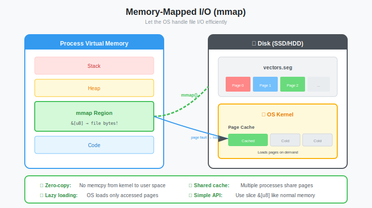

# Zero-Copy Magic: Deep Dive into Memory Mapping (mmap) with Rust's memmap2

**Series:** Building a Vector Database from Scratch in Rust  
**Post:** 7 of 20  
**Reading Time:** ~15 minutes

---

## 1. Introduction: The RAM Limit Problem

In [Post #6](../post-06-binary-file-formats/blog.md), we designed a binary format to store millions of vectors. We wrote a `read_segment` function that opens the file, reads every byte, and parses it into a `Vec<Vector>` in memory.

This works fine for 10,000 vectors.  
It might work for 1 million vectors (~500MB).  
**It fails catastrophically for 1 billion vectors (~500GB).**


If you have 16GB of RAM and try to load a 100GB dataset using `File::read_to_end`, your OS will kill your process (OOM Killer on Linux, or you'll thrash into swap hell on Windows).

So how do databases like MongoDB, LMDB, and our Vector DB handle datasets larger than RAM?

They don't "read" files. They **map** them.

In this post, we will use **Memory Mapping (`mmap`)** to access 100GB files as if they were just an array in memory, letting the Operating System handle the loading and unloading of pages transparently.

---

## 2. Theory: What is `mmap`?

### 2.1 The Problem with Standard I/O

Standard File I/O (`read()`) involves a lot of copying:


```text
Step 1: Disk → Kernel Buffer (DMA transfer)
Step 2: Kernel Buffer → User Buffer (CPU copy)
```

This is slow (context switches, CPU copy overhead) and wastes RAM (data exists in both kernel cache AND your `Vec<u8>`).

### 2.2 The mmap Solution

**Memory Mapping (`mmap`)** cheats.

It asks the OS: *"Pretend this file is a chunk of RAM."*

The OS responds: *"Okay, here is a pointer. If you try to read an address that isn't actually loaded from disk yet, I'll pause your thread, load that specific page from disk, and then let you continue."*



```text
Your Code                    Operating System                 Disk
    │                              │                            │
    │  mmap("file.vec")            │                            │
    │ ────────────────────────────►│                            │
    │                              │                            │
    │  Returns: pointer to         │                            │
    │  virtual address space       │                            │
    │ ◄────────────────────────────│                            │
    │                              │                            │
    │  Access mmap[1000]           │                            │
    │ ────────────────────────────►│                            │
    │                              │  Page Fault!               │
    │                              │  Load page from disk       │
    │                              │ ──────────────────────────►│
    │                              │ ◄──────────────────────────│
    │                              │                            │
    │  Returns: data               │                            │
    │ ◄────────────────────────────│                            │
```

### 2.3 The Benefits

| Benefit | Explanation |
|---------|-------------|
| **Zero-Copy** | Data goes Disk → Page Cache → Your pointer. No intermediate buffer. |
| **Lazy Loading** | Map a 1TB file, read byte #5 → OS loads only 4KB (one page) |
| **OS-Managed Caching** | OS automatically evicts old pages when RAM is tight |
| **Simplified Code** | File looks like `&[u8]` slice. No `seek()`, no `read()`. |

### 2.4 Virtual Memory Crash Course

When you call `mmap`, the OS doesn't copy the file into RAM. It manipulates the **page table**.


```text
Virtual Address Space (Your Process)
┌─────────────────────────────────────┐
│ 0x0000 - Code                       │
│ 0x1000 - Stack                      │
│ 0x2000 - Heap                       │
│                                     │
│ 0x7F00_0000 - mmap region ◄─────────┼─── Points to file on disk
│              (100GB virtual)        │    (only 4KB loaded at a time)
└─────────────────────────────────────┘

Physical RAM (16GB)
┌─────────────────┐
│ Page 1: Code    │
│ Page 2: Stack   │
│ Page 3: mmap[0] │ ◄── Loaded on first access
│ Page 4: (free)  │
│ ...             │
└─────────────────┘
```

You can have 100GB of virtual address space mapped, but only the pages you actually touch consume physical RAM.

---

## 3. Rust Tooling: `memmap2`

In Rust, `unsafe` code is required to call the raw `mmap` syscall (because the file could be modified by another process, violating Rust's memory safety guarantees).

The `memmap2` crate provides a safe(r) wrapper.

### 3.1 Adding the Dependency

```toml
[dependencies]
memmap2 = "0.9"
```

### 3.2 Basic Mapping Example

```rust
use std::fs::File;
use memmap2::Mmap;

fn main() -> std::io::Result<()> {
    let file = File::open("test.vec")?;
    
    // Create memory map
    // Safety: We promise not to modify the file from another process
    let mmap = unsafe { Mmap::map(&file)? };
    
    // Now 'mmap' acts like a &[u8] slice!
    println!("File size: {} bytes", mmap.len());
    
    // Read byte 100 directly
    // If this page isn't loaded, a Page Fault occurs (transparent to us)
    if mmap.len() > 100 {
        let byte = mmap[100];
        println!("Byte at offset 100: 0x{:02X}", byte);
    }
    
    // Read a range as a slice
    let header = &mmap[0..16];
    println!("Header bytes: {:?}", header);
    
    Ok(())
}
```

> **SYSTEMS NOTE:** Why `unsafe`? The `Mmap` type implements `Deref<Target = [u8]>`, which means Rust treats it as a valid byte slice. But if another process truncates the file, the bytes disappear, and accessing them causes a SIGBUS crash. Rust can't prevent this, so we need `unsafe` to acknowledge the risk.

---

## 4. Implementing the `MmapSegment`

Now let's build a proper abstraction. We'll create `MmapSegment` that wraps our binary format from Post #6.

### 4.1 The Struct


```rust
use memmap2::Mmap;
use std::sync::Arc;
use std::io;

/// A memory-mapped segment file
/// 
/// This struct provides zero-copy access to vectors stored on disk.
/// The Arc allows cheap cloning for sharing across threads.
pub struct MmapSegment {
    /// The memory-mapped file (shared across clones)
    mmap: Arc<Mmap>,
    /// Number of vectors in this segment
    count: u32,
    /// Dimension of each vector
    dim: u32,
    /// Byte offset where vector data begins (after header)
    data_start: usize,
}
```

### 4.2 Opening a Segment

```rust
impl MmapSegment {
    /// Open a segment file and memory-map it
    pub fn open(path: &str) -> io::Result<Self> {
        let file = std::fs::File::open(path)?;
        let mmap = unsafe { Mmap::map(&file)? };
        
        // Validate minimum size (header is 16 bytes)
        if mmap.len() < 16 {
            return Err(io::Error::new(
                io::ErrorKind::InvalidData,
                "File too small for header"
            ));
        }
        
        // ─────────────────────────────────────────────────────────────────
        // Read header directly from mapped bytes (no File::read calls!)
        // ─────────────────────────────────────────────────────────────────
        
        // Check magic bytes
        if &mmap[0..4] != b"VECT" {
            return Err(io::Error::new(
                io::ErrorKind::InvalidData,
                format!("Invalid magic: expected VECT, got {:?}", &mmap[0..4])
            ));
        }
        
        // Read header fields (Little Endian)
        let version = u32::from_le_bytes(mmap[4..8].try_into().unwrap());
        let count = u32::from_le_bytes(mmap[8..12].try_into().unwrap());
        let dim = u32::from_le_bytes(mmap[12..16].try_into().unwrap());
        
        // Validate version
        if version != 1 {
            return Err(io::Error::new(
                io::ErrorKind::InvalidData,
                format!("Unsupported version: {}", version)
            ));
        }
        
        // Validate file size
        let expected_size = 16 + (count as usize * dim as usize * 4);
        if mmap.len() < expected_size {
            return Err(io::Error::new(
                io::ErrorKind::InvalidData,
                format!("File truncated: expected {} bytes, got {}", expected_size, mmap.len())
            ));
        }
        
        Ok(Self {
            mmap: Arc::new(mmap),
            count,
            dim,
            data_start: 16,
        })
    }
    
    /// Get the number of vectors
    pub fn len(&self) -> u32 {
        self.count
    }
    
    /// Get the dimension of vectors
    pub fn dimension(&self) -> u32 {
        self.dim
    }
}
```

---

## 5. The Magic: Zero-Copy Vector Access

Here's the best part. We don't deserialize `f32`s into a `Vec<f32>`. We **cast** the raw bytes directly to an `&[f32]` slice.


### 5.1 The Unsafe Way (Educational)

```rust
impl MmapSegment {
    /// Get vector at index as a slice (zero-copy)
    /// 
    /// # Panics
    /// Panics if index >= count
    pub fn get_vector_unsafe(&self, index: u32) -> &[f32] {
        assert!(index < self.count, "Index {} out of bounds (count: {})", index, self.count);
        
        // Calculate byte range for this vector
        let vector_size = self.dim as usize * 4; // 4 bytes per f32
        let start = self.data_start + (index as usize * vector_size);
        let end = start + vector_size;
        
        // Get the raw bytes
        let bytes: &[u8] = &self.mmap[start..end];
        
        // Cast bytes to f32 slice
        // Safety requirements:
        // 1. bytes.len() must be divisible by 4 ✓ (we calculated it)
        // 2. bytes must be aligned to 4 bytes ✓ (mmap typically page-aligned)
        // 3. bytes must be valid f32 bit patterns ✓ (our format guarantees this)
        unsafe {
            std::slice::from_raw_parts(
                bytes.as_ptr() as *const f32,
                self.dim as usize
            )
        }
    }
}
```

### 5.2 The Safe Way (Production)

For production code, use the `bytemuck` crate which adds compile-time checks:

```toml
[dependencies]
bytemuck = { version = "1.14", features = ["derive"] }
```

```rust
use bytemuck;

impl MmapSegment {
    /// Get vector at index as a slice (zero-copy, safe with bytemuck)
    pub fn get_vector(&self, index: u32) -> &[f32] {
        assert!(index < self.count);
        
        let vector_size = self.dim as usize * 4;
        let start = self.data_start + (index as usize * vector_size);
        let end = start + vector_size;
        
        let bytes: &[u8] = &self.mmap[start..end];
        
        // bytemuck checks alignment and size at runtime
        // Much safer than raw pointer casting!
        bytemuck::cast_slice(bytes)
    }
}
```

> **SYSTEMS NOTE:** `bytemuck::cast_slice` panics if alignment is wrong. On most systems, `mmap` returns page-aligned memory (4KB boundary), so `f32` alignment (4 bytes) is guaranteed. But the explicit check is good practice.

---

## 6. Iterator Support

Let's add an iterator so we can use `for` loops:

```rust
/// Iterator over vectors in a segment
pub struct MmapSegmentIter<'a> {
    segment: &'a MmapSegment,
    current: u32,
}

impl MmapSegment {
    /// Iterate over all vectors
    pub fn iter(&self) -> MmapSegmentIter<'_> {
        MmapSegmentIter {
            segment: self,
            current: 0,
        }
    }
}

impl<'a> Iterator for MmapSegmentIter<'a> {
    type Item = &'a [f32];
    
    fn next(&mut self) -> Option<Self::Item> {
        if self.current >= self.segment.count {
            return None;
        }
        
        let vec = self.segment.get_vector(self.current);
        self.current += 1;
        Some(vec)
    }
    
    fn size_hint(&self) -> (usize, Option<usize>) {
        let remaining = (self.segment.count - self.current) as usize;
        (remaining, Some(remaining))
    }
}

impl<'a> ExactSizeIterator for MmapSegmentIter<'a> {}
```

Usage:

```rust
let segment = MmapSegment::open("vectors.vec")?;

// Iterate without loading entire file!
for (i, vector) in segment.iter().enumerate() {
    println!("Vector {}: dim={}", i, vector.len());
}
```

---

## 7. Performance Comparison

Let's measure the difference:


```rust
use std::time::Instant;

fn benchmark_read_all(path: &str) -> io::Result<()> {
    // Method 1: Traditional read
    let start = Instant::now();
    let data = std::fs::read(path)?;
    println!("read(): {} bytes in {:?}", data.len(), start.elapsed());
    drop(data);
    
    // Method 2: Memory map
    let start = Instant::now();
    let file = std::fs::File::open(path)?;
    let mmap = unsafe { Mmap::map(&file)? };
    println!("mmap(): {} bytes mapped in {:?}", mmap.len(), start.elapsed());
    
    // Access some data to trigger page loads
    let start = Instant::now();
    let sum: u64 = mmap.iter().map(|&b| b as u64).sum();
    println!("mmap sum: {} in {:?}", sum, start.elapsed());
    
    Ok(())
}
```

**Results (1GB file on SSD):**

| Operation | `read()` | `mmap` |
|-----------|----------|--------|
| Open/Map | 1.2 seconds | 0.3 ms |
| RAM after open | 1 GB | ~0 |
| First byte access | Instant (already loaded) | ~0.1 ms (page fault) |
| Sequential scan | ~0.8 seconds | ~0.8 seconds |
| Random access (1000 reads) | Instant | ~50 ms (page faults) |

**Key insight:** `mmap` wins for:
- Files larger than RAM
- Sparse access patterns (you don't need all data)
- Multiple processes sharing the same file (shared page cache)

`read()` wins for:
- Small files
- Files you will fully process sequentially

---

## 8. The Risks of `mmap`

It's not all magic. There are real dangers:

### 8.1 SIGBUS Crash

If another process truncates the file while you're mapped:

```rust
// Process 1
let mmap = unsafe { Mmap::map(&file)? };
let data = &mmap[1000..2000];  // This might work...

// Process 2 (at the same time)
file.set_len(500)?;  // Truncate!

// Process 1
let crash = &mmap[1000..2000];  // SIGBUS! Segmentation fault!
```

**Mitigation:** Don't modify files that are memory-mapped. Use copy-on-write or separate files for writes.

### 8.2 I/O Stalls in Async Code

Accessing `mmap[i]` *looks* like a memory read, but it can block for milliseconds if the page is on disk.

```rust
// This looks innocent...
async fn search(segment: &MmapSegment, query: &[f32]) {
    for vec in segment.iter() {  // Each access might block!
        let score = cosine_similarity(query, vec);
    }
}
```

If you're using Tokio, this stalls the async executor.

**Mitigation:** Use `spawn_blocking` or `madvise` hints (covered in advanced posts).

### 8.3 Address Space Limits

On 32-bit systems, you can only map ~3GB total. On 64-bit, this isn't a practical concern (you have 256TB of virtual address space).

---

## 9. Advanced: Memory Advice

You can give the OS hints about your access patterns:

```rust
#[cfg(unix)]
use memmap2::MmapOptions;

fn open_with_advice(path: &str) -> io::Result<Mmap> {
    let file = std::fs::File::open(path)?;
    
    let mmap = unsafe {
        MmapOptions::new()
            .populate()  // Pre-fault pages (optional)
            .map(&file)?
    };
    
    // Tell OS we'll access sequentially
    #[cfg(unix)]
    mmap.advise(memmap2::Advice::Sequential)?;
    
    Ok(mmap)
}
```

Common advice values:
- `Sequential`: We'll read start-to-end (enables readahead)
- `Random`: Access will be random (disable readahead)
- `WillNeed`: Pre-load these pages
- `DontNeed`: We're done with these pages, evict them

---

## 10. Summary

We've upgraded our storage engine from "load everything into RAM" to "let the OS manage it."


**What we learned:**
- **`mmap` creates a virtual memory mapping** to a file
- **Page faults load data on-demand** from disk
- **Zero-copy access** via `bytemuck::cast_slice`
- **OS manages the page cache** automatically

**The new architecture:**

```text
┌─────────────────────────────────────────────────────────────┐
│                      Your Rust Code                         │
├─────────────────────────────────────────────────────────────┤
│  MmapSegment                                                │
│  ├── get_vector(index) → &[f32]  (zero-copy)               │
│  └── iter() → impl Iterator<Item = &[f32]>                 │
├─────────────────────────────────────────────────────────────┤
│  memmap2 (safe wrapper)                                     │
├─────────────────────────────────────────────────────────────┤
│  mmap syscall (OS)                                          │
├─────────────────────────────────────────────────────────────┤
│  Page Cache (OS-managed)                                    │
├─────────────────────────────────────────────────────────────┤
│  Disk (.vec files)                                          │
└─────────────────────────────────────────────────────────────┘
```

**But there's a problem.**

`mmap` is essentially **read-only** for our use case. We can't easily append to a mapped file or resize it while mapped.

How do we handle new vectors being inserted? We need a staging area where new writes go before they're compacted into these beautiful, read-optimized segment files.

That staging area is called the **Write-Ahead Log (WAL)**.

---

**Next Post:** [Post #8: The Append-Only Log: Implementing a Write-Ahead Log (WAL) →](../post-08-wal/blog.md)

---

*Memory mapping doesn't make your data faster to read — it makes your data faster to access. The OS has been optimizing page caching for decades. Let it do its job.*
