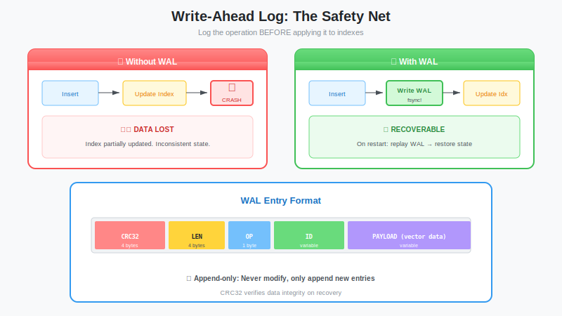

# The Append-Only Log: Implementing a Write-Ahead Log (WAL)

**Series:** Building a Vector Database from Scratch in Rust  
**Post:** 8 of 20  
**Reading Time:** ~15 minutes

---

## 1. Introduction: The "Memory Amnesia" Problem

In [Post #7](../post-07-mmap/blog.md), we built a high-speed storage engine using `mmap`. It's incredibly fast for reading massive datasets.

But `mmap` has a fatal flaw for *writing*:

1. **Resizing is hard:** You can't easily append to a memory-mapped file without unmapping, resizing, and remapping (which is slow and complex).
2. **Safety:** If the power fails while the OS is flushing dirty pages to disk, you might end up with a corrupted file that is neither the old version nor the new one.



So how do databases accept writes quickly while guaranteeing data safety?

They use a **Write-Ahead Log (WAL)**.

> **The Golden Rule of Databases:**  
> *Never modify data in memory until you have written a record of the intention to disk.*

In this post, we will build an append-only log that captures every `Insert` and `Delete` operation. This is the "Journal" of our database.

---

## 2. Theory: Why Append-Only?

A WAL is remarkably simple. It is a file where we only ever do one thing: **Append**.

### 2.1 The Physics of Drives


| Drive Type | Random Write | Sequential Write |
|------------|--------------|------------------|
| **HDD** | ~10ms (seek time) | ~100 MB/s |
| **SSD** | ~0.1ms + write amplification | ~500 MB/s (optimized) |
| **NVMe** | ~0.02ms | ~3 GB/s |

* **Hard Drives (HDD):** Writing randomly requires moving the physical disk head (slow, ~10ms). Writing sequentially just spins the platter (fast).
* **SSDs:** Writing to random pages causes "Write Amplification" (wearing out the drive). Sequential writes are optimized by the controller.

By treating our log as a continuous stream of bytes, we get maximum throughput.

### 2.2 Crash Consistency

Imagine we are writing a vector. We write the first half, and then **BOOM**—power failure.


When we restart, our file ends with half a vector.

| Approach | Result After Crash |
|----------|-------------------|
| **Overwriting a file** | File is corrupt. Mixed old + partial new data. |
| **Append-only WAL** | Tail is corrupt, but history is safe. Discard partial entry. |

With a WAL, we can simply detect the half-written entry (via checksum) and discard it. Everything before it is guaranteed complete.

---

## 3. Designing the WAL Format

We need a binary format that allows us to detect corruption.

### 3.1 The Entry Layout


```text
┌──────────────┬──────────────┬──────────────────────────────────┐
│ CRC32 (4B)   │ Length (4B)  │ Payload (Length bytes)           │
└──────────────┴──────────────┴──────────────────────────────────┘
```

| Field | Size | Purpose |
|-------|------|---------|
| **CRC32** | 4 bytes | Checksum of the Length field bytes and Payload bytes concatenated. Detects corruption. |
| **Length** | 4 bytes | Size of payload. Allows us to skip to next entry. |
| **Payload** | Variable | Serialized `WalEntry` (Insert or Delete) |

### 3.2 Why CRC First?

We put the checksum *before* the length so that if the length field itself is corrupted (partial write), we catch it immediately.

```rust
// Reading flow:
// 1. Read 4 bytes (CRC)
// 2. Read 4 bytes (Length)
// 3. Read `Length` bytes (Payload)
// 4. Compute CRC of (Length bytes + Payload)
// 5. Compare computed CRC with stored CRC
// 6. If mismatch → corruption detected, stop reading
```

### 3.3 The Entry Types

```rust
pub enum WalEntry {
    Insert { id: String, vector: Vec<f32> },
    Delete { id: String },
}
```

We serialize this using `bincode` (fast, compact binary format).

---

## 4. Rust Tooling

We need a few crates to make this efficient.

```toml
[dependencies]
# Fast CRC32 checksums (uses CPU hardware acceleration)
crc32fast = "1.3"

# Compact binary serialization (much faster than JSON)
bincode = "1.3"

# Derive Serialize/Deserialize
serde = { version = "1.0", features = ["derive"] }
```

> **SYSTEMS NOTE:** Why `bincode`? It's a Rust-specific binary format that's incredibly fast and compact. Since our WAL is internal (not exposed to users), we don't need the human-readability or cross-language compatibility of JSON.

| Format | 1M Entries Size | Serialize Time |
|--------|-----------------|----------------|
| JSON | ~150 MB | ~800 ms |
| bincode | ~40 MB | ~50 ms |

---

## 5. Implementing the WAL

### 5.1 The Data Structures

```rust
use serde::{Deserialize, Serialize};
use std::collections::HashMap;

/// Operations that can be logged
#[derive(Serialize, Deserialize, Debug, Clone)]
pub enum WalEntry {
    /// Insert or update a vector
    Insert {
        id: String,
        vector: Vec<f32>,
        metadata: Option<HashMap<String, String>>,
    },
    /// Delete a vector by ID
    Delete {
        id: String,
    },
}

impl WalEntry {
    /// Create an insert entry
    pub fn insert(id: impl Into<String>, vector: Vec<f32>) -> Self {
        Self::Insert {
            id: id.into(),
            vector,
            metadata: None,
        }
    }

    /// Create a delete entry
    pub fn delete(id: impl Into<String>) -> Self {
        Self::Delete { id: id.into() }
    }
}
```

### 5.2 The WAL Writer


We use `BufWriter` to batch small writes into large chunks (syscalls are expensive!).

```rust
use std::fs::{File, OpenOptions};
use std::io::{self, BufWriter, Write};
use crc32fast::Hasher;

pub struct WriteAheadLog {
    writer: BufWriter<File>,
    path: String,
    entries_since_sync: usize,
}

impl WriteAheadLog {
    /// Open or create a WAL file
    pub fn open(path: &str) -> io::Result<Self> {
        let file = OpenOptions::new()
            .create(true)
            .append(true)  // CRITICAL: Append mode only!
            .open(path)?;

        Ok(Self {
            writer: BufWriter::new(file),
            path: path.to_string(),
            entries_since_sync: 0,
        })
    }

    /// Append an entry to the log
    pub fn append(&mut self, entry: &WalEntry) -> io::Result<()> {
        // 1. Serialize the entry to bytes
        let payload = bincode::serialize(entry)
            .map_err(|e| io::Error::new(io::ErrorKind::InvalidData, e))?;

        // 2. Compute CRC32 checksum
        let mut hasher = Hasher::new();
        hasher.update(&(payload.len() as u32).to_le_bytes());
        hasher.update(&payload);
        let crc = hasher.finalize();

        // 3. Write: CRC (4) + Length (4) + Payload
        self.writer.write_all(&crc.to_le_bytes())?;
        self.writer.write_all(&(payload.len() as u32).to_le_bytes())?;
        self.writer.write_all(&payload)?;

        self.entries_since_sync += 1;

        // Note: Data is in BufWriter's buffer, not yet on disk!
        Ok(())
    }
}
```

### 5.3 The `fsync` Dilemma


Calling `write()` only puts data into the OS Page Cache. If power fails, data is lost.

```text
Your Code          OS Page Cache          Physical Disk
    │                    │                      │
    │  write()           │                      │
    │ ──────────────────►│                      │
    │                    │  (data here)         │
    │                    │                      │
    │                    │   POWER FAILURE      │
    │                    │                      │
    └────────────────────┴──────────────────────┘
                         Data is LOST!
```

To guarantee durability, we must call `sync_all()`:

```rust
impl WriteAheadLog {
    /// Force all buffered data to physical disk
    /// 
    /// This is SLOW but guarantees durability.
    pub fn sync(&mut self) -> io::Result<()> {
        // 1. Flush BufWriter's internal buffer to OS
        self.writer.flush()?;
        
        // 2. Force OS to write to physical disk
        self.writer.get_ref().sync_all()?;
        
        self.entries_since_sync = 0;
        Ok(())
    }

    /// Append and optionally sync based on policy
    pub fn append_with_policy(&mut self, entry: &WalEntry, sync_every: usize) -> io::Result<()> {
        self.append(entry)?;
        
        if self.entries_since_sync >= sync_every {
            self.sync()?;
        }
        
        Ok(())
    }
}
```

> **Performance Trade-off:**
> 
> | Strategy | Durability | Throughput |
> |----------|------------|------------|
> | Sync every write |  Zero data loss | ~200 writes/sec |
> | Sync every 100 writes |  May lose up to 100 | ~20,000 writes/sec |
> | Sync every 100ms |  May lose 100ms of data | ~50,000 writes/sec |
>
> Most production databases use "group commit" - the second or third option.

---

## 6. Reading (Replay)

When the database starts, we need to read the WAL from start to finish to rebuild state.


```rust
use std::io::{BufReader, Read};

impl WriteAheadLog {
    /// Read all valid entries from a WAL file
    pub fn read_all(path: &str) -> io::Result<Vec<WalEntry>> {
        let file = File::open(path)?;
        let mut reader = BufReader::new(file);
        let mut entries = Vec::new();

        loop {
            // 1. Try to read CRC (4 bytes)
            let mut crc_buf = [0u8; 4];
            match reader.read_exact(&mut crc_buf) {
                Ok(_) => {}
                Err(e) if e.kind() == io::ErrorKind::UnexpectedEof => {
                    break; // Clean end of file
                }
                Err(e) => return Err(e),
            }
            let stored_crc = u32::from_le_bytes(crc_buf);

            // 2. Read length (4 bytes)
            let mut len_buf = [0u8; 4];
            if reader.read_exact(&mut len_buf).is_err() {
                eprintln!("WAL truncated after CRC. Discarding partial entry.");
                break;
            }
            let len = u32::from_le_bytes(len_buf) as usize;

            // 3. Read payload
            let mut payload = vec![0u8; len];
            if reader.read_exact(&mut payload).is_err() {
                eprintln!("WAL truncated in payload. Discarding partial entry.");
                break;
            }

            // 4. Verify CRC
            let mut hasher = Hasher::new();
            hasher.update(&len_buf);
            hasher.update(&payload);
            let computed_crc = hasher.finalize();

            if computed_crc != stored_crc {
                eprintln!("CRC mismatch! WAL corrupted. Stopping at last good entry.");
                break;
            }

            // 5. Deserialize
            match bincode::deserialize(&payload) {
                Ok(entry) => entries.push(entry),
                Err(e) => {
                    eprintln!("Failed to deserialize entry: {}. Stopping.", e);
                    break;
                }
            }
        }

        Ok(entries)
    }
}
```

**Key insight:** We never error out completely. We read as much valid data as possible and stop at the first corruption. This maximizes data recovery.

---

## 7. Integration: The Full Write Path


Now we can update our architecture:

```rust
use std::collections::HashMap;

pub struct VectorStore {
    /// In-memory index for fast lookups
    vectors: HashMap<String, Vec<f32>>,
    /// Write-ahead log for durability
    wal: WriteAheadLog,
}

impl VectorStore {
    pub fn new(wal_path: &str) -> io::Result<Self> {
        // 1. Open (or create) WAL
        let wal = WriteAheadLog::open(wal_path)?;
        
        // 2. Replay existing entries
        let entries = WriteAheadLog::read_all(wal_path)?;
        let mut vectors = HashMap::new();
        
        for entry in entries {
            match entry {
                WalEntry::Insert { id, vector, .. } => {
                    vectors.insert(id, vector);
                }
                WalEntry::Delete { id } => {
                    vectors.remove(&id);
                }
            }
        }
        
        println!("Recovered {} vectors from WAL", vectors.len());
        
        Ok(Self { vectors, wal })
    }

    pub fn insert(&mut self, id: String, vector: Vec<f32>) -> io::Result<()> {
        // 1. Write to WAL FIRST (durability)
        let entry = WalEntry::insert(&id, vector.clone());
        self.wal.append(&entry)?;
        
        // 2. Then update in-memory state
        self.vectors.insert(id, vector);
        
        Ok(())
    }

    pub fn delete(&mut self, id: &str) -> io::Result<bool> {
        if !self.vectors.contains_key(id) {
            return Ok(false);
        }
        
        // 1. Write to WAL FIRST
        let entry = WalEntry::delete(id);
        self.wal.append(&entry)?;
        
        // 2. Then update in-memory state
        self.vectors.remove(id);
        
        Ok(true)
    }

    pub fn get(&self, id: &str) -> Option<&Vec<f32>> {
        self.vectors.get(id)
    }

    pub fn flush(&mut self) -> io::Result<()> {
        self.wal.sync()
    }
}
```

### The Write Flow

```text
1. Client sends POST /upsert
2. Server appends Insert to WAL (disk)
3. Server updates in-memory HashMap (fast search)
4. Server returns 200 OK
```

### The Crash Flow

```text
1. Power fails. RAM is gone.
2. Server restarts.
3. Server reads WAL file.
4. Server replays every Insert/Delete into HashMap.
5. Server is ready to serve!
```

---

## 8. Testing Durability

Let's write a test that simulates a crash:

```rust
#[test]
fn test_crash_recovery() -> io::Result<()> {
    let wal_path = "test_crash.wal";
    
    // Phase 1: Write some data
    {
        let mut store = VectorStore::new(wal_path)?;
        store.insert("vec1".into(), vec![1.0, 2.0, 3.0])?;
        store.insert("vec2".into(), vec![4.0, 5.0, 6.0])?;
        store.delete("vec1")?;
        store.flush()?;
        // store is dropped here - simulating crash
    }
    
    // Phase 2: "Restart" and verify recovery
    {
        let store = VectorStore::new(wal_path)?;
        assert!(store.get("vec1").is_none(), "vec1 should be deleted");
        assert_eq!(store.get("vec2"), Some(&vec![4.0, 5.0, 6.0]));
    }
    
    // Cleanup
    std::fs::remove_file(wal_path)?;
    Ok(())
}
```

---

## 9. Summary

We have built the durability layer of our database.


**What we learned:**
- **Sequential writes** maximize disk throughput
- **CRC checksums** detect partial writes from crashes
- **Replay** rebuilds state from the log
- **fsync** guarantees data reaches physical disk

**The architecture so far:**

```text
┌─────────────────────────────────────────────────────────────┐
│                        VectorStore                          │
├─────────────────────────────────────────────────────────────┤
│  HashMap<String, Vec<f32>>  (in-memory, fast)               │
├─────────────────────────────────────────────────────────────┤
│  WriteAheadLog              (on-disk, durable)              │
│  ├── append()  → Write entries                              │
│  ├── sync()    → Force to disk                              │
│  └── read_all() → Replay on startup                         │
└─────────────────────────────────────────────────────────────┘
```

**But there's a problem.**

The WAL grows forever. If we run for a year, the WAL might be 5TB. Replaying 5TB on startup takes forever.

We need a way to **checkpoint** this log. We need to turn the log into those efficient `mmap` segments we built in Post #7, then truncate the log.

In the next post, we will implement **Crash Recovery and Compaction**—the logic that runs on startup to replay the log and decides when to "flush" entries to immutable segment files.

---

**Next Post:** [Post #9: Crash Recovery: Replaying the WAL and Restoring State →](../post-09-crash-recovery/blog.md)
