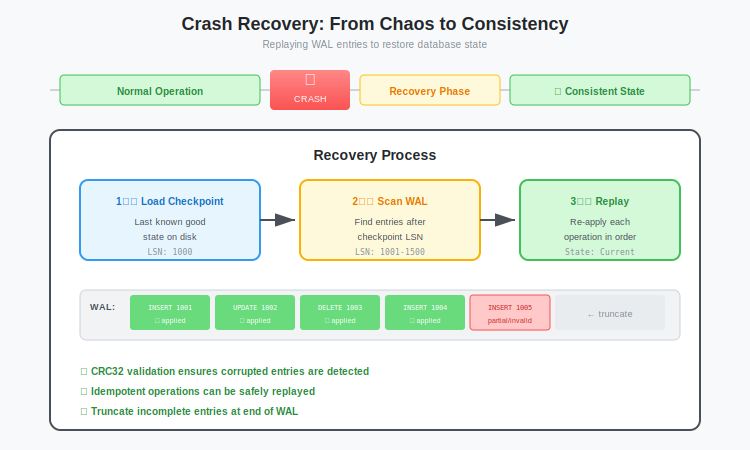

# Crash Recovery: Writing the Startup Logic to Replay Logs and Restore State

**Series:** Building a Vector Database from Scratch in Rust  
**Post:** 9 of 20  
**Reading Time:** ~15 minutes  

---

## 1. Introduction: The Morning After

In [Post #8](../post-08-wal/blog.md), we built a Write-Ahead Log (WAL) that captures every `Insert` and `Delete`. This guarantees that if our server crashes, the data is safe on disk.

But storing the data is only half the battle. When the server restarts, it has amnesia. The RAM is empty.

We need a recovery process that:

1. **Reads** the persistent files (WAL + Segments).
2. **Reconstructs** the in-memory state (HashMap).
3. **Compacts** the data to prevent the WAL from growing infinitely.

This is **Crash Recovery**, and it is the first thing your database does when it boots up.

In this post, we will write the logic to replay the WAL and, crucially, implement **Compaction**: the process of turning a messy, append-only log into a clean, read-optimized segment file.



---

## 2. The Problem of Infinite Logs

Why can't we just keep appending to the WAL forever?

### 2.1 The Three Costs

| Problem | Impact |
|---------|--------|
| **Startup Time** | Replaying 10 million inserts takes seconds. Replaying 10 billion takes hours. |
| **Disk Space** | Updating `vec_1` 1,000 times stores 1,000 copies. Current state needs only the last. |
| **Memory Access** | WAL uses sequential I/O. We want mmap segments for zero-copy access ([Post #7](../post-07-mmap/blog.md)). |

### 2.2 A Concrete Example

```
WAL Contents (chronological):
─────────────────────────────
Insert { id: "vec_1", vector: [1.0, 0.0, 0.0] }
Insert { id: "vec_2", vector: [0.0, 1.0, 0.0] }
Insert { id: "vec_1", vector: [0.5, 0.5, 0.0] }  ← Update
Delete { id: "vec_2" }
Insert { id: "vec_1", vector: [0.0, 0.0, 1.0] }  ← Another update

Actual State (what we care about):
──────────────────────────────────
vec_1 → [0.0, 0.0, 1.0]
```

5 WAL entries, but only 1 active vector. This is **write amplification** in reverse: we are storing history we do not need.


---

## 3. The Solution: Compaction (Checkpointing)

Periodically, we take the current in-memory state and flush it to a permanent `.vec` file. Once the flush is safely on disk, we truncate (empty) the WAL.

```
Before Compaction:
├── wal (5 entries, 500KB)
└── segments/ (empty)

After Compaction:
├── wal (0 entries, 0KB)
└── segments/
    └── segment_1704567890.vec (1 vector, 48 bytes)
```

This process is called:
- **Compaction** (LevelDB and RocksDB terminology)
- **Checkpointing** (PostgreSQL terminology)
- **Flushing** (general terminology)

They all mean the same thing: **persist the hot data, clear the log**.

---

## 4. The Architecture: Hybrid Storage

Our `VectorStore` now manages two types of storage:

```rust
pub struct VectorStore {
    // Hot Path (Recent Data)
    memtable: HashMap<String, Vec<f32>>,  // Current state in RAM
    wal: WriteAheadLog,                    // Durability guarantee
    
    // Cold Path (Historical Data)
    segments: Vec<MmapSegment>,            // Compacted, read-only
    
    // Configuration
    base_path: PathBuf,
    next_segment_id: u64,
}
```


### 4.1 Read Path

When you search for `id="vec_1"`:

1. **Check the MemTable first**, since the newest data lives here.
2. **Check Segments in reverse order**, with newer segments first.
3. **Return the first match**, or `None` if not found.

```rust
impl VectorStore {
    pub fn get(&self, id: &str) -> Option<&Vec<f32>> {
        // 1. Check MemTable (hot data)
        if let Some(vector) = self.memtable.get(id) {
            return Some(vector);
        }
        
        // 2. Check Segments in reverse order (newest first)
        // Note: Segments store vectors by index, not by ID
        // A real implementation needs an ID → index mapping
        // We'll cover this properly in Post #11 (Indexing)
        
        None
    }
}
```

### 4.2 Write Path

```rust
impl VectorStore {
    pub fn insert(&mut self, id: String, vector: Vec<f32>) -> io::Result<()> {
        // 1. WAL first (durability)
        self.wal.append(&WalEntry::Insert { 
            id: id.clone(), 
            vector: vector.clone(),
            metadata: None,
        })?;
        
        // 2. MemTable second (availability)
        self.memtable.insert(id, vector);
        
        Ok(())
    }
}
```

---

## 5. Step 1: The Replay Logic

 We already wrote a basic `read_all` in [Post #8](../post-08-wal/blog.md). Now we integrate it into the system startup.

### 5.1 The Recovery Function

```rust
use std::collections::HashMap;
use std::path::{Path, PathBuf};
use std::io;

impl VectorStore {
    /// Initialize the store by loading segments and replaying the WAL
    pub fn open(base_path: &Path) -> io::Result<Self> {
        // Ensure the directory exists
        std::fs::create_dir_all(base_path)?;
        
        let wal_path = base_path.join("wal");
        
        // Phase 1: Load Existing Segments
        let segments = Self::load_segments(base_path)?;
        println!("Loaded {} existing segments", segments.len());
        
        // Phase 2: Replay WAL into MemTable
        let memtable = Self::replay_wal(&wal_path)?;
        println!("Replayed WAL: {} active vectors", memtable.len());
        
        // Phase 3: Clean up failed compactions
        Self::cleanup_temp_files(base_path)?;
        
        // Phase 4: Open WAL for new writes
        let wal = WriteAheadLog::open(wal_path.to_str().unwrap())?;
        
        Ok(Self {
            memtable,
            wal,
            segments,
            base_path: base_path.to_path_buf(),
            next_segment_id: Self::compute_next_segment_id(base_path),
        })
    }
}
```


### 5.2 Replaying the WAL

```rust
impl VectorStore {
    fn replay_wal(wal_path: &Path) -> io::Result<HashMap<String, Vec<f32>>> {
        let mut memtable = HashMap::new();
        
        // If WAL doesn't exist, start fresh
        if !wal_path.exists() {
            return Ok(memtable);
        }
        
        // Read all entries
        let entries = WriteAheadLog::read_all(wal_path.to_str().unwrap())?;
        
        // Apply each entry in order
        for entry in entries {
            match entry {
                WalEntry::Insert { id, vector, .. } => {
                    memtable.insert(id, vector);
                }
                WalEntry::Delete { id } => {
                    memtable.remove(&id);
                }
            }
        }
        
        Ok(memtable)
    }
}
```

**Key Insight:** We apply entries in order. If `vec_1` was inserted, then deleted, then inserted again, the final state is correct because the last write wins.

### 5.3 Loading Existing Segments

```rust
impl VectorStore {
    fn load_segments(base_path: &Path) -> io::Result<Vec<MmapSegment>> {
        let mut segments = Vec::new();
        
        // Scan directory for .vec files
        for entry in std::fs::read_dir(base_path)? {
            let entry = entry?;
            let path = entry.path();
            
            // Only load .vec files (not .tmp!)
            if path.extension().and_then(|s| s.to_str()) == Some("vec") {
                match MmapSegment::open(path.to_str().unwrap()) {
                    Ok(segment) => {
                        println!("  Loaded segment: {:?}", path.file_name().unwrap());
                        segments.push(segment);
                    }
                    Err(e) => {
                        eprintln!("  Warning: Failed to load {:?}: {}", path, e);
                        // Continue loading other segments
                    }
                }
            }
        }
        
        // Sort by filename (timestamp) to maintain order
        // segments.sort_by_key(|s| s.path.clone());
        
        Ok(segments)
    }
}
```

### 5.4 Cleaning Up Failed Compactions

```rust
impl VectorStore {
    fn cleanup_temp_files(base_path: &Path) -> io::Result<()> {
        for entry in std::fs::read_dir(base_path)? {
            let entry = entry?;
            let path = entry.path();
            
            // Delete any .tmp files (failed compaction)
            if path.extension().and_then(|s| s.to_str()) == Some("tmp") {
                println!("  Deleting orphan temp file: {:?}", path.file_name().unwrap());
                std::fs::remove_file(path)?;
            }
        }
        
        Ok(())
    }
}
```

---

## 6. Step 2: Implementing Compaction

This is the most critical part of this post. We need to move data from the hot WAL to the cold Segment **without losing data** if we crash *during* the move.

### 6.1 The Algorithm

```
1. FREEZE   : Stop accepting new writes (or take a snapshot)
2. DUMP     : Write memtable to segment_N.vec.tmp
3. SYNC     : file.sync_all() to guarantee data is physically on disk
4. RENAME   : segment_N.vec.tmp to segment_N.vec (ATOMIC)
5. TRUNCATE : Clear the WAL file
6. CLEAR    : Empty the memtable
```


### 6.2 Why Rename is Atomic

Renaming a file is **atomic** on POSIX systems and on modern Windows with NTFS. This means:

- Either the file exists with the new name, OR
- It exists with the old name

You **never** see a half-renamed file. The filesystem guarantees this at the kernel level.

```rust
// This is atomic!
std::fs::rename("segment.vec.tmp", "segment.vec")?;
```

This is why we use the `.tmp` extension. It acts as a staging area that becomes visible to the rest of the system only when the write is complete.

### 6.3 The Compaction Code

```rust
impl VectorStore {
    /// Flush the in-memory MemTable to a Segment file
    pub fn compact(&mut self) -> io::Result<()> {
        if self.memtable.is_empty() {
            println!("Nothing to compact (memtable is empty)");
            return Ok(());
        }

        let vector_count = self.memtable.len();
        println!("Compacting {} vectors to disk...", vector_count);

        // Step 1: Prepare the data
        let vectors: Vec<Vector> = self.memtable
            .values()
            .map(|data| Vector::new(data.clone()))
            .collect();
        
        // Step 2: Generate filenames
        let segment_id = self.next_segment_id;
        self.next_segment_id += 1;
        
        let segment_name = format!("segment_{:016}.vec", segment_id);
        let temp_name = format!("{}.tmp", segment_name);
        
        let segment_path = self.base_path.join(&segment_name);
        let temp_path = self.base_path.join(&temp_name);
        
        // Step 3: Write to temporary file
        {
            let mut file = std::fs::File::create(&temp_path)?;
            write_segment(&mut file, &vectors)?;
            
            // Step 4: Fsync to guarantee durability
            file.sync_all()?;
        } // File handle dropped here
        
        // Step 5: Atomic Rename
        std::fs::rename(&temp_path, &segment_path)?;
        println!("  Created: {}", segment_name);
        
        // Step 6: Open as MmapSegment
        let segment = MmapSegment::open(segment_path.to_str().unwrap())?;
        self.segments.push(segment);
        
        // Step 7: Truncate WAL
        self.wal.truncate()?;
        println!("  WAL truncated");
        
        // Step 8: Clear MemTable
        self.memtable.clear();
        
        println!("Compaction complete!");
        Ok(())
    }
}
```

### 6.4 Implementing WAL Truncate

We need to add a `truncate` method to our `WriteAheadLog`:

```rust
impl WriteAheadLog {
    /// Clear the WAL file, resetting it to empty
    pub fn truncate(&mut self) -> io::Result<()> {
        // Close and reopen with truncation
        let file = OpenOptions::new()
            .write(true)
            .truncate(true)
            .open(&self.path)?;
        
        // Sync the truncation
        file.sync_all()?;
        
        // Reopen for appending
        self.file = BufWriter::new(
            OpenOptions::new()
                .create(true)
                .append(true)
                .open(&self.path)?
        );
        
        Ok(())
    }
}
```


---

## 7. Handling "Dirty" States

What if we crash during compaction? Let us analyze every possible crash point:

### Scenario A: Crash While Writing `.tmp`

```
State on Disk:
├── wal (full, valid)
└── segment_1.vec.tmp (partial, corrupt)
```

**Recovery:**
1. We see `segment_1.vec.tmp` with a `.tmp` extension, so we **delete it**.
2. We replay the full WAL
3. **Result:** Data safe, no loss

### Scenario B: Crash After Rename, Before WAL Truncate

```
State on Disk:
├── wal (full, valid)
└── segment_1.vec (complete, valid)
```

**Recovery:**
1. We load `segment_1.vec` into segments
2. We replay the full WAL into memtable
3. **Result:** We have duplicate data (segment + memtable have same vectors)
4. **Fix:** Waste some memory, but data is safe. Next compaction will deduplicate.

### Scenario C: Crash After WAL Truncate

```
State on Disk:
├── wal (empty)
└── segment_1.vec (complete, valid)
```

**Recovery:**
1. We load `segment_1.vec`
2. We replay empty WAL (nothing to do)
3. **Result:** Perfect state, as intended


### 7.1 The Idempotency Principle

Notice that in Scenario B, replaying the WAL is **idempotent**. If `vec_1` is already in the segment and the WAL says "Insert vec_1", we simply overwrite with the same value.

This is why we check the MemTable before Segments on reads: the MemTable always has the freshest version.

---

## 8. Triggering Compaction

When should we compact? Common strategies:

### 8.1 Size-Based

```rust
impl VectorStore {
    pub fn maybe_compact(&mut self) -> io::Result<()> {
        const MAX_MEMTABLE_SIZE: usize = 10_000; // vectors
        
        if self.memtable.len() >= MAX_MEMTABLE_SIZE {
            self.compact()?;
        }
        Ok(())
    }
}
```

### 8.2 Time-Based

```rust
impl VectorStore {
    pub fn maybe_compact(&mut self, last_compact: &mut Instant) -> io::Result<()> {
        const COMPACT_INTERVAL: Duration = Duration::from_secs(300); // 5 minutes
        
        if last_compact.elapsed() >= COMPACT_INTERVAL && !self.memtable.is_empty() {
            self.compact()?;
            *last_compact = Instant::now();
        }
        Ok(())
    }
}
```

### 8.3 Manual (On Shutdown)

```rust
impl VectorStore {
    pub fn shutdown(&mut self) -> io::Result<()> {
        println!("Shutting down, compacting remaining data...");
        self.compact()?;
        println!("Shutdown complete.");
        Ok(())
    }
}
```


---

## 9. The Complete Recovery Flow

Let's put it all together with a test scenario:

```rust
fn main() -> io::Result<()> {
    let db_path = Path::new("./test_db");
    
    // === First Run: Insert some data ===
    {
        let mut store = VectorStore::open(db_path)?;
        
        store.insert("vec_1".into(), vec![1.0, 0.0, 0.0])?;
        store.insert("vec_2".into(), vec![0.0, 1.0, 0.0])?;
        store.insert("vec_3".into(), vec![0.0, 0.0, 1.0])?;
        
        println!("Inserted 3 vectors");
        // Simulate crash: just drop without compacting
    }
    
    // === Second Run: Recovery ===
    {
        let mut store = VectorStore::open(db_path)?;
        // WAL replayed automatically
        
        assert_eq!(store.memtable.len(), 3);
        println!("Recovered 3 vectors from WAL!");
        
        // Now compact
        store.compact()?;
    }
    
    // === Third Run: Load from Segment ===
    {
        let store = VectorStore::open(db_path)?;
        
        assert_eq!(store.segments.len(), 1);
        assert_eq!(store.memtable.len(), 0); // WAL was truncated
        println!("Loaded 1 segment, memtable empty (as expected)");
    }
    
    Ok(())
}
```

**Output:**
```
Loaded 0 existing segments
Replayed WAL: 3 active vectors
Inserted 3 vectors

Loaded 0 existing segments
Replayed WAL: 3 active vectors
Recovered 3 vectors from WAL!
Compacting 3 vectors to disk...
  Created: segment_0000000000000001.vec
  WAL truncated
Compaction complete!

Loaded 1 existing segments
  Loaded segment: segment_0000000000000001.vec
Replayed WAL: 0 active vectors
Loaded 1 segment, memtable empty (as expected)
```


---

## 10. Performance Considerations

### 10.1 Compaction Blocks Writes

In our simple implementation, `compact()` takes a `&mut self`, which means:

- No other writes can happen during compaction.
- Reads are also blocked if using a `Mutex`.

**Solution:** We'll fix this in [Post #10](../post-10-concurrency/blog.md) with `RwLock` and snapshot isolation.

### 10.2 Compaction I/O

Compaction does significant I/O:

| Operation | I/O Type | Cost |
|-----------|----------|------|
| Write temp file | Sequential Write | Fast |
| `sync_all()` | Flush to disk | **Slow** (10-100ms) |
| Rename | Metadata update | Fast |
| Truncate WAL | Metadata update | Fast |

The `sync_all()` is the bottleneck. Some systems skip it for speed (risking data loss).

### 10.3 Segment Count

Each compaction creates a new segment. Over time, you get many segments:

```
segments/
├── segment_0000000000000001.vec
├── segment_0000000000000002.vec
├── segment_0000000000000003.vec
...
├── segment_0000000000000999.vec
```

**Problem:** Searching across 999 segments is slow.

**Solution:** **Segment Merging**, also called major compaction. We will cover this in a future post.

---

## 11. Summary

We now have a complete **LSM-Tree-lite** architecture:


| Operation | How It Works |
|-----------|--------------|
| **Write** | Append to WAL → Update MemTable |
| **Read** | Check MemTable → Check Segments (newest first) |
| **Recovery** | Load Segments → Replay WAL → Delete temp files |
| **Maintenance** | Compact MemTable → Write Segment → Truncate WAL |

This is the exact same architecture used by:

- **LevelDB** (Google)
- **RocksDB** (Facebook)
- **Cassandra** (Apache)
- **ScyllaDB**
- **CockroachDB**

### What We Built

```
VectorStore
    open()           : Recovery by loading segments and replaying the WAL
    insert()         : WAL + MemTable
    delete()         : WAL + MemTable
    get()            : MemTable then Segments
    compact()        : MemTable to Segment, then truncate WAL
    shutdown()       : Final compaction
```


---

## 12. What's Next?

Right now, our database is effectively **single-threaded**. Only one operation can happen at a time.

In the next post, we'll tackle **Concurrency**:

- `Arc<RwLock<...>>` for shared state
- Readers can search while compaction runs.
- Multiple readers operate in parallel.
- One writer at a time, but non-blocking.

**Next Post:** [Post #10: Concurrency Control: Arc, RwLock, and the Art of Not Blocking](../post-10-concurrency/blog.md)

---

## Exercises

1. **Implement `get()` properly:** Add an ID → index mapping so you can actually find vectors in segments.

2. **Add segment merging:** When you have N segments, merge them into one.

3. **Benchmark recovery time:** Insert 1 million vectors, measure startup time with vs without compaction.

4. **Handle corrupt segments:** What if a `.vec` file is truncated? Add validation.
