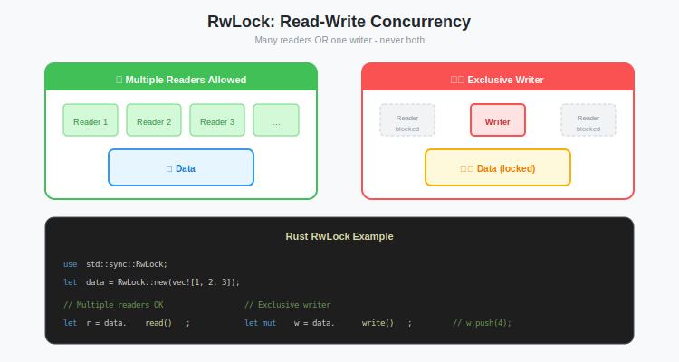

# Concurrency Control: Managing State with Arc, RwLock, and Mutex

**Series:** Building a Vector Database from Scratch in Rust  
**Post:** 10 of 20  
**Reading Time:** ~15 minutes  

---

## 1. Introduction: The Single-Threaded Bottleneck

In [Post #9](../post-09-crash-recovery/blog.md), we built a complete storage engine with crash recovery. It works, it is durable, and it is fast.

But it has a major limitation: **It is single-threaded.**

If you try to run our current code inside an Axum handler, which is multi-threaded, the Rust compiler will stop you. You cannot share a mutable `VectorStore` across threads without protection.

```rust
// This won't compile
async fn insert_handler(store: &mut VectorStore) {
    // Error: `VectorStore` cannot be shared between threads safely
}
```

If we wrap it in a simple `Mutex`, we solve safety but kill performance: if one user is inserting a vector, *nobody else can search*.

In this post, we will unlock the full power of modern CPUs. We will use **Atomic Reference Counting (`Arc`)** and **Read-Write Locks (`RwLock`)** to allow:

1. **Thousands of concurrent readers** (searching).
2. **One active writer** (inserting).
3. **Background compaction** running without freezing the server.


---

## 2. The Tools of the Trade

Rust forces you to think about concurrency *before* you write the code. Here are the key primitives.

### 2.1 The Ownership Problem

In single-threaded code, ownership is simple:

```rust
fn main() {
    let mut db = VectorStore::open(Path::new("./data")).unwrap();
    db.insert("vec_1".into(), vec![1.0, 0.0, 0.0]).unwrap();
    // db is dropped here
}
```

But in an HTTP server:

- `main` starts the server
- Handler 1 needs to search
- Handler 2 needs to insert
- Background task needs to compact

**Who owns the database?** Everyone needs it, but Rust only allows one owner.

### 2.2 `Rc` vs `Arc`: Shared Ownership

**Solution:** Reference counting. Multiple "owners" share a pointer to the data. The data is dropped when the last reference is gone.

| Type | Stands For | Thread-Safe? | Use Case |
|------|------------|--------------|----------|
| `Rc<T>` | Reference Counted | No | Single-threaded sharing |
| `Arc<T>` | Atomic Reference Counted | Yes | Multi-threaded sharing |

```rust
use std::sync::Arc;

let db = VectorStore::open(Path::new("./data")).unwrap();
let shared = Arc::new(db);

// Clone the Arc (not the data!)
let clone1 = Arc::clone(&shared);  // ref count: 2
let clone2 = Arc::clone(&shared);  // ref count: 3

// All three point to the same VectorStore
```


### 2.3 The Mutability Problem

`Arc` gives us shared ownership, but it only provides **immutable** access:

```rust
let shared = Arc::new(db);
shared.insert(...);  // Error: cannot borrow as mutable
```

We need a way to get `&mut` access safely. Enter locks.

### 2.4 `Mutex` vs `RwLock`: Managing Access

Both provide **interior mutability**, which is the ability to mutate data through a shared reference.

#### Mutex (Mutual Exclusion)

Only one thread can hold the lock at a time.

```rust
use std::sync::Mutex;

let db = Arc::new(Mutex::new(VectorStore::new()));

// Thread 1: Searching
{
    let guard = db.lock().unwrap();  // Blocks if anyone else has the lock
    guard.search(...);
}  // Lock released here

// Thread 2: Also searching
{
    let guard = db.lock().unwrap();  // Must wait for Thread 1!
    guard.search(...);
}
```

**Problem:** Searches are read-only! They should run in parallel.

#### RwLock (Read-Write Lock)

The library rule model:

- **Multiple readers allowed**: everyone can browse the shelves
- **One writer, exclusive**: the librarian closes the section to reshelve

```rust
use std::sync::RwLock;

let db = Arc::new(RwLock::new(VectorStore::new()));

// Thread 1: Searching (read lock)
{
    let guard = db.read().unwrap();  // Concurrent with other readers
    guard.search(...);
}

// Thread 2: Also searching (read lock)
{
    let guard = db.read().unwrap();  // Runs in parallel with Thread 1!
    guard.search(...);
}

// Thread 3: Inserting (write lock)
{
    let guard = db.write().unwrap();  // Waits for all readers to finish
    guard.insert(...);
}
```



### 2.5 Decision: RwLock

A Vector DB is **read-heavy**:

| Operation | Frequency | Lock Type |
|-----------|-----------|-----------|
| Search | Very High | Read |
| Insert | Medium | Write |
| Delete | Low | Write |
| Compact | Rare | Write |

Using `Mutex` would serialize all searches. Using `RwLock` allows thousands of concurrent searches.

---

## 3. Sync vs Async Locks

Here is a critical decision that trips up many developers.

### 3.1 The Problem with `std::sync::RwLock`

Standard library locks **block the OS thread**:

```rust
use std::sync::RwLock;

async fn search_handler(db: Arc<RwLock<VectorStore>>) {
    let guard = db.read().unwrap();  // Blocks the entire thread!
    
    // If this takes 100ms, the thread can't run other async tasks
    guard.search(...);
}
```

In an async runtime like Tokio:

- You have a thread pool (e.g., 4 threads for 4 CPU cores)
- Each thread runs many async tasks
- If a task blocks, the entire thread is frozen

With `std::sync::RwLock`, a slow search freezes 25 percent of your capacity.

### 3.2 The Solution: `tokio::sync::RwLock`

Tokio provides async-aware locks that **yield** instead of blocking:

```rust
use tokio::sync::RwLock;

async fn search_handler(db: Arc<RwLock<VectorStore>>) {
    let guard = db.read().await;  // Yields to other tasks while waiting
    guard.search(...);
}
```

When the lock is contended, the task is parked and other tasks run on the same thread.

| Lock | Waiting Behavior | Use Case |
|------|------------------|----------|
| `std::sync::RwLock` | Blocks OS thread | CPU-bound, short critical sections |
| `tokio::sync::RwLock` | Yields async task | I/O-bound, async handlers |


### 3.3 When to Use `std::sync`

Actually, `std::sync::RwLock` is sometimes better:

```rust
// OK: Very short critical section, no await inside
async fn get_count(db: Arc<std::sync::RwLock<VectorStore>>) -> usize {
    db.read().unwrap().len()  // Microseconds, no contention
}
```

**Rule of thumb:**
- Lock held for less than 1 microsecond, no `.await` inside: use `std::sync`
- Lock held longer, or contains `.await`: use `tokio::sync`

For our VectorStore, searches can take milliseconds, so we **use `tokio::sync::RwLock`**.

---

## 4. Architecture: The Shared State Pattern

Let us define our shared state type:

```rust
use std::sync::Arc;
use tokio::sync::RwLock;

// Type alias for clarity
pub type SharedVectorStore = Arc<RwLock<VectorStore>>;
```

### 4.1 Initialization

```rust
use std::path::Path;

#[tokio::main]
async fn main() -> std::io::Result<()> {
    // 1. Create the VectorStore (single-threaded)
    let store = VectorStore::open(Path::new("./data"))?;
    
    // 2. Wrap in Arc<RwLock> for sharing
    let shared_store: SharedVectorStore = Arc::new(RwLock::new(store));
    
    // 3. Clone for each consumer
    let http_store = Arc::clone(&shared_store);
    let compaction_store = Arc::clone(&shared_store);
    
    // 4. Start background compaction
    spawn_background_compaction(compaction_store);
    
    // 5. Start HTTP server
    start_http_server(http_store).await;
    
    Ok(())
}
```


---

## 5. Implementation: Thread-Safe Axum Server

Let us update our server from [Post #5](../post-05-async-axum/blog.md).

### 5.1 State Injection in Axum

Axum allows us to share state with handlers using the `.with_state()` method:

```rust
use axum::{Router, routing::post, extract::State};

#[tokio::main]
async fn main() {
    // Initialize shared state
    let store = VectorStore::open(Path::new("./data")).unwrap();
    let shared_state: SharedVectorStore = Arc::new(RwLock::new(store));

    // Build router with state
    let app = Router::new()
        .route("/search", post(search_handler))
        .route("/insert", post(insert_handler))
        .route("/delete", post(delete_handler))
        .with_state(shared_state);  // Inject here

    // Start server
    let listener = tokio::net::TcpListener::bind("0.0.0.0:3000").await.unwrap();
    println!("Server running on http://localhost:3000");
    axum::serve(listener, app).await.unwrap();
}
```

### 5.2 The Reader Handler (Search)

Multiple requests can run this simultaneously.

```rust
use axum::{extract::{State, Json}, http::StatusCode};

#[derive(Deserialize)]
struct SearchRequest {
    query: Vec<f32>,
    top_k: usize,
}

#[derive(Serialize)]
struct SearchResult {
    id: String,
    score: f32,
}

async fn search_handler(
    State(store): State<SharedVectorStore>,
    Json(request): Json<SearchRequest>,
) -> Json<Vec<SearchResult>> {
    // Acquire READ lock
    let db = store.read().await;
    
    // Perform search (multiple readers can do this concurrently)
    let results = db.search(&request.query, request.top_k);
    
    // Lock is released when `db` goes out of scope
    Json(results)
}
```

### 5.3 The Writer Handler (Insert)

This requires a **write lock**. It will wait for all active readers to finish, then block new readers until done.

```rust
#[derive(Deserialize)]
struct InsertRequest {
    id: String,
    vector: Vec<f32>,
}

async fn insert_handler(
    State(store): State<SharedVectorStore>,
    Json(request): Json<InsertRequest>,
) -> StatusCode {
    // Acquire WRITE lock (exclusive)
    let mut db = store.write().await;
    
    match db.insert(request.id, request.vector) {
        Ok(()) => StatusCode::CREATED,
        Err(e) => {
            eprintln!("Insert failed: {}", e);
            StatusCode::INTERNAL_SERVER_ERROR
        }
    }
}
```

### 5.4 Delete Handler

```rust
#[derive(Deserialize)]
struct DeleteRequest {
    id: String,
}

async fn delete_handler(
    State(store): State<SharedVectorStore>,
    Json(request): Json<DeleteRequest>,
) -> StatusCode {
    let mut db = store.write().await;
    
    match db.delete(&request.id) {
        Ok(()) => StatusCode::OK,
        Err(e) => {
            eprintln!("Delete failed: {}", e);
            StatusCode::INTERNAL_SERVER_ERROR
        }
    }
}
```


---

## 6. The Concurrency Trap: Deadlocks

Deadlocks occur when two or more tasks are waiting for each other forever.

### 6.1 The Upgrade Deadlock

The most common deadlock in `RwLock` code:

```rust
// DEADLOCK: Holding read lock while requesting write lock
async fn check_and_insert(store: SharedVectorStore, id: String, vector: Vec<f32>) {
    let db = store.read().await;  // Acquire read lock
    
    if db.get(&id).is_none() {
        // Still holding read lock!
        let mut w_db = store.write().await;  // DEADLOCK
        w_db.insert(id, vector).unwrap();
    }
}
```

**Why it deadlocks:**
1. Read lock is held
2. Write lock request waits for read lock to release
3. Read lock waits for function to complete
4. Function waits for write lock
5. **Circular wait, which means deadlock.**

### 6.2 The Fix: Drop Before Upgrade

```rust
// CORRECT: Drop read lock before acquiring write lock
async fn check_and_insert(store: SharedVectorStore, id: String, vector: Vec<f32>) {
    // Check if exists
    let exists = {
        let db = store.read().await;
        db.get(&id).is_some()
    };  // Read lock dropped here!
    
    if !exists {
        let mut db = store.write().await;
        // Re-check (another thread might have inserted)
        if db.get(&id).is_none() {
            db.insert(id, vector).unwrap();
        }
    }
}
```

### 6.3 The TOCTOU Problem

Notice we check twice. This is the **Time-Of-Check to Time-Of-Use** pattern:

1. **Check** with read lock → ID doesn't exist
2. **Drop** read lock
3. Another thread inserts the ID!
4. **Use** with write lock → ID now exists

The second check prevents duplicate inserts. This is a standard pattern in concurrent code.


### 6.4 Other Deadlock Patterns

#### Lock Ordering Deadlock

```rust
// Thread 1: lock A then B
let a = lock_a.write().await;
let b = lock_b.write().await;

// Thread 2: lock B then A
let b = lock_b.write().await;
let a = lock_a.write().await;  // Deadlock if Thread 1 has A
```

**Fix:** Always acquire locks in the same order.

#### Holding Lock Across Await

```rust
// BAD: Lock held during I/O
async fn slow_operation(store: SharedVectorStore) {
    let db = store.read().await;
    let result = db.search(...);
    
    // Still holding lock!
    external_api_call(result).await;  // Could take seconds
}

// GOOD: Release lock before I/O
async fn slow_operation(store: SharedVectorStore) {
    let result = {
        let db = store.read().await;
        db.search(...)
    };  // Lock released
    
    external_api_call(result).await;
}
```

---

## 7. Background Tasks: Compaction

In [Post #9](../post-09-crash-recovery/blog.md), we ran compaction manually. Now we spawn a background task that runs continuously.

### 7.1 The Background Compaction Task

```rust
use std::time::Duration;

fn spawn_background_compaction(store: SharedVectorStore) {
    tokio::spawn(async move {
        let mut interval = tokio::time::interval(Duration::from_secs(60));
        
        loop {
            interval.tick().await;
            
            // Step 1: Check if compaction needed (read lock)
            let needs_compact = {
                let db = store.read().await;
                db.needs_compaction()
            };  // Read lock dropped here!
            
            // Step 2: Compact if needed (write lock)
            if needs_compact {
                println!("Starting background compaction...");
                let mut db = store.write().await;
                
                match db.compact() {
                    Ok(()) => println!("Compaction complete"),
                    Err(e) => eprintln!("Compaction failed: {}", e),
                }
            }
        }
    });
}
```

### 7.2 Adding `needs_compaction()` to VectorStore

```rust
impl VectorStore {
    pub fn needs_compaction(&self) -> bool {
        const MAX_MEMTABLE_SIZE: usize = 10_000;
        self.memtable.len() >= MAX_MEMTABLE_SIZE
    }
}
```

### 7.3 Graceful Shutdown

To avoid data loss, we should compact on shutdown.

> **Warning:** `std::process::exit()` terminates immediately without running destructors. If your `WriteAheadLog` uses a `BufWriter`, its `Drop` implementation, which calls `flush()`, will never run. You **must** explicitly flush before calling `exit()`.

```rust
use tokio::signal;

async fn shutdown_signal(store: SharedVectorStore) {
    signal::ctrl_c().await.expect("Failed to listen for ctrl-c");
    
    println!("\nShutting down...");
    
    {
        let mut db = store.write().await;
        
        // Compact any remaining data
        if let Err(e) = db.compact() {
            eprintln!("Final compaction failed: {}", e);
        }
        
        // CRITICAL: Explicitly flush the WAL before exit!
        // std::process::exit() does NOT run destructors,
        // so BufWriter's Drop (which calls flush) won't run.
        if let Err(e) = db.flush_wal() {
            eprintln!("WAL flush failed: {}", e);
        }
    } // Write lock released, db dropped
    
    println!("Goodbye!");
    
    // Now safe to exit (data is on disk)
    std::process::exit(0);
}
```


---

## 8. Performance Considerations

### 8.1 Lock Contention

Even with `RwLock`, performance degrades under heavy write load:

| Scenario | Read Throughput | Write Throughput |
|----------|-----------------|------------------|
| 100% reads | Maximum | N/A |
| 99% reads, 1% writes | ~99% of max | Limited |
| 50% reads, 50% writes | Much lower | Moderate |

### 8.2 Minimizing Critical Sections

The longer you hold a lock, the more contention:

```rust
// BAD: Expensive computation inside lock
async fn search_handler(store: SharedVectorStore, query: Vec<f32>) {
    let db = store.read().await;
    let results = db.search(&query, 100);  // OK
    let json = serde_json::to_string(&results).unwrap();  // Why inside lock?
    println!("Searching...");  // I/O inside lock!
}

// GOOD: Minimal critical section
async fn search_handler(store: SharedVectorStore, query: Vec<f32>) {
    let results = {
        let db = store.read().await;
        db.search(&query, 100)
    };  // Lock released
    
    let json = serde_json::to_string(&results).unwrap();
    println!("Searching...");
}
```

### 8.3 Read-Write Lock Fairness

By default, `tokio::sync::RwLock` is **write-preferring**:

- When a writer is waiting, new readers must wait
- This prevents writer starvation

Some workloads might benefit from reader-preferring locks, but write-preferring is safer for databases.

---

## 9. Testing Concurrent Code

Concurrent bugs are notoriously hard to reproduce. Here are some techniques:

### 9.1 Stress Testing

```rust
#[tokio::test]
async fn test_concurrent_access() {
    let store = Arc::new(RwLock::new(VectorStore::new()));
    let mut handles = vec![];
    
    // Spawn 100 readers
    for i in 0..100 {
        let s = Arc::clone(&store);
        handles.push(tokio::spawn(async move {
            for _ in 0..1000 {
                let db = s.read().await;
                let _ = db.len();
            }
        }));
    }
    
    // Spawn 10 writers
    for i in 0..10 {
        let s = Arc::clone(&store);
        handles.push(tokio::spawn(async move {
            for j in 0..100 {
                let mut db = s.write().await;
                db.insert(format!("writer_{}_item_{}", i, j), vec![1.0]);
            }
        }));
    }
    
    // Wait for all to complete (no deadlocks!)
    for h in handles {
        h.await.unwrap();
    }
    
    let db = store.read().await;
    assert_eq!(db.len(), 1000);  // 10 writers × 100 items
}
```

### 9.2 Loom for Exhaustive Testing

The `loom` crate systematically explores all possible thread interleavings:

```rust
#[cfg(test)]
mod loom_tests {
    use loom::sync::Arc;
    use loom::sync::RwLock;
    
    #[test]
    fn test_no_data_race() {
        loom::model(|| {
            let data = Arc::new(RwLock::new(0));
            
            let d1 = Arc::clone(&data);
            let t1 = loom::thread::spawn(move || {
                *d1.write().unwrap() += 1;
            });
            
            let d2 = Arc::clone(&data);
            let t2 = loom::thread::spawn(move || {
                *d2.write().unwrap() += 1;
            });
            
            t1.join().unwrap();
            t2.join().unwrap();
            
            assert_eq!(*data.read().unwrap(), 2);
        });
    }
}
```

---

## 10. The Complete Server

Putting it all together:

```rust
use axum::{Router, routing::post, extract::{State, Json}, http::StatusCode};
use serde::{Deserialize, Serialize};
use std::sync::Arc;
use std::time::Duration;
use tokio::sync::RwLock;

type SharedVectorStore = Arc<RwLock<VectorStore>>;

#[tokio::main]
async fn main() {
    // Initialize
    let store = VectorStore::open(Path::new("./data")).unwrap();
    let shared: SharedVectorStore = Arc::new(RwLock::new(store));
    
    // Background compaction
    spawn_background_compaction(Arc::clone(&shared));
    
    // Graceful shutdown
    let shutdown_store = Arc::clone(&shared);
    tokio::spawn(shutdown_signal(shutdown_store));
    
    // Routes
    let app = Router::new()
        .route("/search", post(search_handler))
        .route("/insert", post(insert_handler))
        .route("/delete", post(delete_handler))
        .route("/health", get(health_handler))
        .with_state(shared);
    
    // Serve
    let listener = tokio::net::TcpListener::bind("0.0.0.0:3000").await.unwrap();
    println!("Server running on http://localhost:3000");
    axum::serve(listener, app).await.unwrap();
}

async fn health_handler() -> &'static str {
    "OK"
}
```


---

## 11. Summary

We have transformed our single-threaded library into a high-concurrency server.

| Concept | Tool | Purpose |
|---------|------|---------|
| Shared Ownership | `Arc` | Multiple threads reference the same data |
| Interior Mutability | `RwLock` | Safe mutation through shared reference |
| Async Safety | `tokio::sync::RwLock` | Non-blocking lock acquisition |
| Background Work | `tokio::spawn` | Compaction without freezing requests |

### Architecture Check-In

| Layer | Component | Status |
|-------|-----------|--------|
| Transport | Async HTTP (Axum) | Done |
| Concurrency | Arc + RwLock | Done |
| Engine | HNSW | Coming soon |
| Storage | WAL + Mmap | Done |

We have a solid, durable, **concurrent** storage engine. But searching is still **O(N)** (brute force).

In the next phase (Phase 3), we start the math. We will implement **Vector Math** correctly, optimize it, and then build the **HNSW Graph** to make searches fast.

---

## 12. What's Next?

We have completed the **Storage Layer**. Our database is:

- Persistent (WAL)
- Fast on restart (mmap segments)
- Crash-safe (recovery)
- Concurrent (Arc + RwLock)

But we are still doing **brute force search**: comparing the query against every vector.

Time for **Phase 3: The Search Engine**.

**Next Post:** [Post #11: Vector Math for Developers, The Linear Algebra You Actually Need](../post-11-vector-math/blog.md)

---

## Exercises

1. **Implement metrics:** Add a `/stats` endpoint showing read and write lock acquisition counts.

2. **Try `parking_lot`:** Replace `tokio::sync::RwLock` with `parking_lot::RwLock` and benchmark.

3. **Add request timeouts:** What happens if a lock is held for 10 seconds? Implement a timeout.

4. **Simulate writer starvation:** With 100 readers and 1 writer, does the writer ever get the lock?
