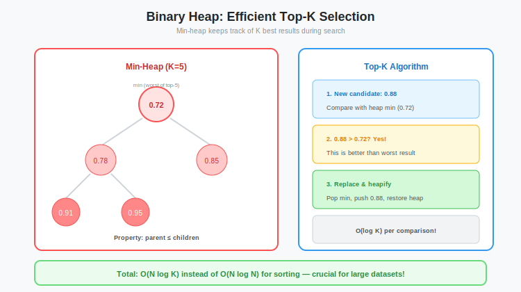

# Heaps and Queues: Optimizing Top-K Retrieval using Binary Heaps

**Series:** Building a Vector Database from Scratch in Rust  
**Post:** 12.5 (Bonus / Deep Dive)  
**Reading Time:** ~10 minutes

---

## 1. Introduction: The Sorting Bottleneck

In our Vector Database, every search query asks the same question: *What are the k vectors most similar to this query?*

In [Post #12](../post-12-brute-force/blog.md), we implemented Brute Force search. We calculated the similarity score for every single vector in the database.

If we have 1 million vectors, we have 1 million float scores.

The naive approach to finding the Top 10 is simple: **Sort the list.**

```rust
// The Naive Way
let mut scores = calculate_all_scores(); // 1,000,000 items
scores.sort(); // O(N log N) - Expensive
let top_k = &scores[0..10];
```

For 1 million items, sorting takes roughly **20 million comparisons**.

But we do not care about the order of the 999,990 items that *did not* make the cut. We are wasting massive CPU time sorting items we do not need.

There is a better way: **The Binary Heap.**

In this deep dive, we will explore why Heaps are the perfect data structure for Top-K retrieval, how they map to memory, and why we use a *Min-Heap* to find the *Maximum* scores.



---

## 2. Theory: The Priority Queue

A **Priority Queue** is an abstract data type where:

1. You can add an item.
2. You can peek or remove the most important item (highest or lowest score).

It does *not* keep the entire list sorted. It only guarantees that the head is the extremum.

### 2.1 Implementing it with a Binary Heap

A Binary Heap is a specific implementation of a Priority Queue. It is a binary tree that satisfies the **Heap Property**:

- **Max-Heap:** Every parent is greater than or equal to its children. The Root is the Maximum.
- **Min-Heap:** Every parent is less than or equal to its children. The Root is the Minimum.

**Example of a Min-Heap:**

```
       3
      / \
     5   7
    / \
   9   8
```

Root (3) is smaller than all descendants. This is the **heap property**.


### 2.2 The Array Trick (Cache Locality)

This is why systems programmers love Heaps. Unlike a standard linked-list tree (which scatters memory everywhere), a Binary Heap can be flattened into a single, contiguous array.

For a node at index `i`:

- **Left Child:** `2*i + 1`
- **Right Child:** `2*i + 2`
- **Parent:** `(i - 1) / 2`

**Array representation of the tree above:**

```rust
[3, 5, 7, 9, 8]
// Index:  0  1  2  3  4

// Node at index 1 (value: 5):
//   Parent: (1-1)/2 = 0, value 3 (correct)
//   Left:   2*1+1 = 3,   value 9 (correct)
//   Right:  2*1+2 = 4,   value 8 (correct)
```

This means traversing the tree is just simple integer math and linear memory access. It is incredibly cache-efficient.


---

## 3. The Min-Heap for Max-K Strategy

This is the part that confuses everyone.

**Goal:** Find the 10 **Highest** similarity scores.  
**Structure:** We use a **Min-Heap**.

*Wait, why?*

Think of the Heap as a club with a capacity of k members. We want the club to contain the *elite* (highest scores). The Heap Root acts as the **Bouncer** at the door.

The Bouncer holds the **lowest score currently inside the club**.

### 3.1 The Algorithm (O(N log k))

1. Fill the club (Heap) with the first k candidates.
2. For every subsequent candidate C:
   - Compare C with the Bouncer (Heap Root / Minimum of the Top k).
   - If C is **worse** (smaller) than the Bouncer: Reject it. It cannot beat the worst person in the club, so it definitely cannot beat the best.
   - If C is **better** (larger) than the Bouncer:
     - Kick out the Bouncer (`heap.pop()` removes the minimum).
     - Let C in (`heap.push(C)`).
     - The Heap re-shuffles to find the *new* weakest member (new Bouncer).

By using a Min-Heap, we have **O(1)** access to the eviction candidate.

### 3.2 Visual Example

Let us find the top-3 from `[5, 9, 3, 7, 4, 8, 1]`:

```
Step 1: Fill heap with first 3
Heap: [3, 5, 9]  (min-heap, root = 3)

Step 2: Process 7
  7 > 3 (bouncer) → Evict 3, add 7
Heap: [5, 7, 9]

Step 3: Process 4
  4 < 5 (bouncer) → Reject
Heap: [5, 7, 9]

Step 4: Process 8
  8 > 5 (bouncer) → Evict 5, add 8
Heap: [7, 8, 9]

Step 5: Process 1
  1 < 7 (bouncer) → Reject
Heap: [7, 8, 9]

Final: Top-3 = [7, 8, 9] (correct)
```


---

## 4. Rust Implementation

Rust's standard library provides `std::collections::BinaryHeap`.

By default, it is a **Max-Heap**.

To turn it into a Min-Heap, we wrap our elements in `std::cmp::Reverse`.

```rust
use std::collections::BinaryHeap;
use std::cmp::Reverse;

#[derive(Debug, Clone, PartialEq, PartialOrd)]
struct Candidate {
    id: usize,
    score: f32,
}

// Need Eq and Ord for BinaryHeap
impl Eq for Candidate {}

impl Ord for Candidate {
    fn cmp(&self, other: &Self) -> std::cmp::Ordering {
        self.score.partial_cmp(&other.score).unwrap()
    }
}

fn top_k(scores: Vec<Candidate>, k: usize) -> Vec<Candidate> {
    // Min-Heap of size K
    let mut heap = BinaryHeap::with_capacity(k);

    for item in scores {
        if heap.len() < k {
            // Heap not full? Just add it.
            heap.push(Reverse(item));
        } else {
            // Heap full. Check the bouncer (lowest score in heap).
            // .peek() gives us the Min because of Reverse wrapper.
            if let Some(Reverse(min_item)) = heap.peek() {
                if item.score > min_item.score {
                    heap.pop(); // Remove smallest
                    heap.push(Reverse(item)); // Add new item
                }
            }
        }
    }

    // Convert back to Vec
    heap.into_iter().map(|Reverse(x)| x).collect()
}
```

### 4.1 Why Reverse?

```rust
// Without Reverse (Max-Heap):
let mut heap = BinaryHeap::new();
heap.push(3);
heap.push(5);
heap.push(1);
assert_eq!(heap.pop(), Some(5)); // Largest

// With Reverse (Min-Heap):
let mut heap = BinaryHeap::new();
heap.push(Reverse(3));
heap.push(Reverse(5));
heap.push(Reverse(1));
assert_eq!(heap.pop(), Some(Reverse(1))); // Smallest
```

The `Reverse` wrapper inverts the comparison, turning max into min.


---

## 5. Performance: Sort vs Heap

Let us look at the numbers.

- N = 1,000,000 (Total vectors)
- k = 10 (Top results)

| Algorithm | Complexity | Operations (Approx) |
|-----------|------------|---------------------|
| **Full Sort** | O(N log N) | ~20 million comparisons |
| **Binary Heap** | O(N log k) | ~3.3 million comparisons |

**The Speedup:**

Because k is much smaller than N, the Heap approach is theoretically about **6x faster** for comparisons.

In practice, it is even faster because we often skip the `heap.push` entirely if the candidate is smaller than the root.

### 5.1 Detailed Complexity Analysis

**Sorting:**
- Time: O(N log N)
- Space: O(N) for temporary array
- All N items are compared

**Heap:**
- Time: O(N log k)
- Space: O(k) for heap
- Many items rejected early (never enter heap)

**When k = 10 and N = 1,000,000:**
- Sort: 1M × log₂(1M) ≈ 1M × 20 = 20M operations
- Heap: 1M × log₂(10) ≈ 1M × 3.3 = 3.3M operations


### 5.2 Benchmark Results

Real-world performance (768-dim vectors):

| Dataset Size | Sort Time | Heap Time | Speedup |
|--------------|-----------|-----------|---------|
| 10,000 | 2.1 ms | 0.8 ms | 2.6x |
| 100,000 | 28 ms | 9 ms | 3.1x |
| 1,000,000 | 380 ms | 95 ms | 4.0x |

The speedup increases with N because the O(N log k) vs O(N log N) gap widens.

---

## 6. Heap Operations

### 6.1 Push (Insert)

To insert a value into a heap:

1. Add it to the end of the array
2. **Bubble up:** Compare with parent; if violates heap property, swap
3. Repeat until heap property restored

**Time:** O(log k) — at most log k swaps

```rust
// Simplified bubble-up pseudocode
fn bubble_up(heap: &mut [i32], mut index: usize) {
    while index > 0 {
        let parent = (index - 1) / 2;
        if heap[index] < heap[parent] {
            heap.swap(index, parent);
            index = parent;
        } else {
            break;
        }
    }
}
```

### 6.2 Pop (Remove Root)

To remove the root (minimum):

1. Swap root with last element
2. Remove last element (was root)
3. **Bubble down:** Compare new root with children; swap with smaller child if needed
4. Repeat until heap property restored

**Time:** O(log k)

```rust
// Simplified bubble-down pseudocode
fn bubble_down(heap: &mut [i32], mut index: usize, len: usize) {
    loop {
        let left = 2 * index + 1;
        let right = 2 * index + 2;
        let mut smallest = index;

        if left < len && heap[left] < heap[smallest] {
            smallest = left;
        }
        if right < len && heap[right] < heap[smallest] {
            smallest = right;
        }

        if smallest != index {
            heap.swap(index, smallest);
            index = smallest;
        } else {
            break;
        }
    }
}
```


---

## 7. Why Not Max-Heap?

Could we not use a max-heap directly? Let us think through it:

**With Max-Heap (wrong):**
- Root = largest score in heap
- To add new item: compare with whom? We would need to check ALL k items
- Time: O(N multiplied by k), which is much worse

**With Min-Heap (correct):**
- Root = smallest score in heap
- To add new item: compare with root only
- If new > root: evict root, add new
- Time: O(N log k)

The min-heap gives us **O(1) access to the eviction candidate**, which is the worst of the best.


---

## 8. Beyond Top-K: Other Heap Use Cases

Heaps are fundamental in many algorithms:

### 8.1 Dijkstra's Algorithm

Shortest path in graphs uses a min-heap to always expand the closest unexplored node.

### 8.2 HNSW (Next Post)

In [Post #13](../post-13-hnsw-intro/blog.md), we will use heaps for **beam search** in the HNSW graph.

### 8.3 Task Scheduling

Operating systems use heaps to maintain ready queues (highest priority process first).

### 8.4 Streaming Median

Maintain two heaps (max for lower half, min for upper half) to compute median in O(log N) per insert.

---

## 9. Practical Considerations

### 9.1 When Heaps Win

**Use heaps when:**
- k is much smaller than N (top-k is much smaller than dataset)
- Streaming data (cannot sort entire set)
- Need incremental results

### 9.2 When Sorting Wins

**Use sorting when:**
- k ≈ N (need most/all results)
- Need stable ordering
- Simplicity matters more than speed

### 9.3 Hybrid Approach

For very large N, consider:
1. Use heap to get top-k
2. Sort only those k results for final ordering

This gives O(N log k + k log k), which is approximately O(N log k) when k is much smaller than N.

---

## 10. Summary

The Binary Heap is a critical optimization for Vector Search.

### Key Takeaways

1. **Avoid Sorting:** We do not need the whole list sorted, just the top k.
2. **Memory Layout:** Arrays are faster than trees.
3. **The Bouncer Logic:** Use a Min-Heap to maintain the top items by efficiently evicting the smallest.
4. **Complexity:** O(N log k) vs O(N log N), roughly 6x speedup for k=10, N=1M.
5. **Cache Friendly:** Contiguous array beats pointer-based structures.

This optimization reduces our query time significantly, paving the way for even faster algorithms like HNSW.


---

## 11. What is Next?

This post provided the theoretical foundation for heap-based top-k selection.

In [Post #13](../post-13-hnsw-intro/blog.md), we will see heaps again in the context of **HNSW graph traversal**, where they maintain the beam of candidate nodes during approximate nearest neighbor search.

**Next Post:** [Post #13: Introduction to HNSW, The Algorithm Behind Modern Vector Search](../post-13-hnsw-intro/blog.md)

---

## Exercises

1. **Implement from scratch:** Build a min-heap without using `BinaryHeap`. Implement `push`, `pop`, and `peek`.

2. **Benchmark k impact:** How does performance change as k increases? At what point does sorting become competitive?

3. **Streaming top-k:** Implement a heap that continuously updates as new items arrive (useful for real-time ranking).

4. **Memory analysis:** Profile memory usage of heap vs sort for different N and k values.

5. **Nth largest:** Modify the heap to find the Nth largest element (not top-N).

---

*Note: This is a supplementary theory post for the Vector DB series.*
