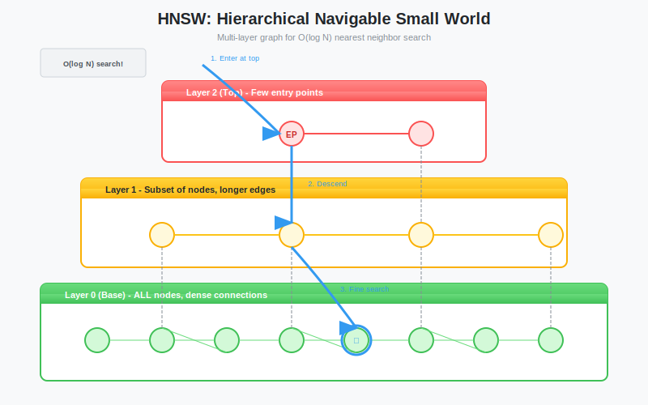

# Introduction to HNSW: The Theory of Approximate Nearest Neighbors and Graph-Based Search

**Series:** Building a Vector Database from Scratch in Rust  
**Post:** 13 of 20  
**Reading Time:** ~20 minutes

---

## 1. Introduction: The Scalability Wall

In [Post #12](../post-12-brute-force/blog.md), we built a brute force search engine. It works perfectly: 100% accuracy, zero complexity.

But it hit a wall.

- Searching 1 million vectors took **150ms**.
- Searching 100 million vectors would take **15 seconds**.

For a production database, searching every single vector (O(N)) is impossible. We need a way to find the needle *without* checking every strand of hay.

We need **Approximate Nearest Neighbor (ANN)** search.

In this post, we will explore the theory behind the algorithm that powers almost every modern vector database (Milvus, Weaviate, Pinecone, and ours): **HNSW (Hierarchical Navigable Small World)**.



---

## 2. The Trade-off: Accuracy vs. Speed

In traditional databases (SQL), approximate is a dirty word. You never want approximate bank balances.

But in Vector Search, **approximate is a feature, not a bug.**

- **Exact Search:** Find the absolute best match in 15 seconds.
- **Approximate Search:** Find a 99% match in 2 milliseconds.

For a chatbot or recommendation engine, the user cannot tell the difference between the #1 result and the #2 result. But they *can* tell the difference between 2ms and 15 seconds.

### 2.1 The Pareto Frontier

Consider this trade-off curve:

| Recall (Accuracy) | Latency | Approach |
|-------------------|---------|----------|
| 100% | 150 ms | Brute Force |
| 99.5% | 5 ms | HNSW (high ef_search) |
| 98% | 2 ms | HNSW (medium ef_search) |
| 95% | 1 ms | HNSW (low ef_search) |

**The key insight:** Going from 98% to 100% costs 75x more latency. That last 2% is incredibly expensive.

HNSW allows us to make this trade-off explicitly by tuning parameters at runtime.


---

## 3. Foundation: The Small World Phenomenon

Before we get to the H (Hierarchical), we need to understand the NSW (Navigable Small World).

### 3.1 Six Degrees of Separation

The Small World theory states that in many networks (social graphs, the internet, neurons), you can reach any node from any other node in a very small number of hops.

**Example:** You and any random person on Earth are connected by roughly 6 social connections on average.

**Why?** Because networks naturally form:
1. **Local clusters** (you know your neighbors)
2. **Long-range connections** (you have a friend in another city)

### 3.2 Applying to Vectors

If we connect our vectors in a graph where neighbors are connected to neighbors, we create a **Proximity Graph**.

```
Vector A [0.1, 0.2, 0.3] ---- Vector B [0.11, 0.19, 0.32]
                    \              /
                     Vector C [0.12, 0.21, 0.31]
```

Vectors that are semantically similar (close in embedding space) are connected by edges.

### 3.3 The Greedy Walk Algorithm

How do we search a graph?

1. **Start** at an arbitrary entry point.
2. **Look** at all connected neighbors.
3. **Move** to the neighbor that is closest to the **Query Vector**.
4. **Repeat** until no neighbor is closer than where you currently are.

This is essentially **gradient descent on a graph**.

```rust
fn greedy_search(entry: NodeId, query: &[f32], graph: &Graph) -> NodeId {
    let mut current = entry;
    loop {
        let mut best = current;
        let mut best_dist = distance(query, graph.get_vector(current));
        
        // Check all neighbors
        for neighbor in graph.neighbors(current) {
            let dist = distance(query, graph.get_vector(neighbor));
            if dist < best_dist {
                best = neighbor;
                best_dist = dist;
            }
        }
        
        // No improvement? We are at a local minimum
        if best == current {
            return current;
        }
        
        current = best; // Move to better neighbor
    }
}
```


### 3.4 The Problem: Local Minima

If you start on the wrong side of the graph, the greedy walk might get stuck in a cluster that is *close* to the query, but not the *closest*.

**Example:**

```
[Entry Point] --> [Cluster A]  (locally best)

                        [Cluster B]  (globally best, but unreachable)
```

You need to cross a gap to reach the better cluster, but greedy search never moves backwards.

**Solution:** Start with a better entry point.


---

## 4. The H in HNSW: Adding Hierarchy

How do we fix the local minima problem and speed up traversal?

We need **Highways**.

HNSW borrows its core idea from a classic data structure: **The Skip List**.

### 4.1 The Skip List Analogy

Imagine you have a sorted linked list of 1000 numbers:

```
1 -> 2 -> 3 -> 4 -> ... -> 998 -> 999 -> 1000
```

Finding number `500` takes 500 hops.

**Solution:** Add express lanes that skip over multiple nodes.

```
Layer 2: 1 ---------> 100 ---------> 200 ---------> ...
Layer 1: 1 -> 10 -> 20 -> 30 -> ... -> 100 -> ...
Layer 0: 1 -> 2 -> 3 -> 4 -> 5 -> ... (all nodes)
```

To find `500`:
1. Start at Layer 2: Jump 1 to 100 to 200 to 300 to 400 to 500 (5 hops)
2. Drop to Layer 0 near target

**Result:** Finding `500` now takes about 10 hops instead of 500.


### 4.2 HNSW Layers

HNSW applies this concept to graphs. We build multiple **Layers**:

- **Layer 0 (Ground Level):** Contains **every** vector. High precision, short links.
- **Layer 1:** A subset of vectors (e.g., 50%). Longer links.
- **Layer 2:** A smaller subset (e.g., 25%).
- **Layer N (Top Level):** Only a few entry points. Very long links spanning the whole dataset.

**Key difference from skip lists:**
- Skip lists are 1D (sorted)
- HNSW is N-dimensional (vectors in high-dim space)
- Edges connect semantically similar vectors, not just next/previous


### 4.3 Layer Assignment

When inserting a new vector, which layers should it belong to?

**Algorithm:** Random selection with exponential decay probability.

```rust
fn select_layer(max_layer: usize, ml: f32) -> usize {
    let r: f32 = rand::random(); // Random [0, 1)
    let level = (-r.ln() * ml).floor() as usize;
    level.min(max_layer)
}
```

Where `ml` (typically 1 / ln(M)) controls the probability distribution.

**Result:**
- ~50% of nodes are Layer 0 only
- ~25% reach Layer 1
- ~12.5% reach Layer 2
- Very few reach top layer

This creates a natural hierarchy like a pyramid.


---

## 5. The Algorithm: Zooming In

Searching in HNSW is like using **Google Maps**:

### 5.1 The Search Process

1. **Top Layer (World View):** Zoom out. You are looking for New York. You take giant steps across the map until you are generally in the Northeast US.

2. **Middle Layer (City View):** Drop down. Now you see highways. You navigate to Manhattan.

3. **Bottom Layer (Street View):** Drop down. Now you see every street. You perform a local greedy search to find the exact address.

### 5.2 The Algorithm in Pseudocode

```rust
fn hnsw_search(query: &[f32], k: usize, ef_search: usize) -> Vec<Candidate> {
    let entry_point = graph.entry_point(); // Top layer node
    let mut current_layer = graph.max_layer();
    
    // Phase 1: Navigate down layers (zoom in)
    let mut current = entry_point;
    while current_layer > 0 {
        // Greedy search at this layer
        current = greedy_search_layer(query, current, current_layer);
        current_layer -= 1;
    }
    
    // Phase 2: Beam search at ground layer
    let candidates = beam_search(query, current, ef_search);
    
    // Phase 3: Return top-k
    select_top_k(candidates, k)
}
```

### 5.3 Beam Search (Not Greedy!)

At the ground layer (Layer 0), we do not use greedy search. We use **Beam Search**:

- Maintain a set of `ef_search` candidates (not just 1)
- Explore from all of them simultaneously
- Keep the best `ef_search` as we go

This avoids local minima at the final layer.

**Complexity:** O(ef_search multiplied by log N)

Since ef_search is a small constant (10-500), this is effectively **O(log N)**.


---

## 6. Construction: Building the Graph

How do we build this structure?

### 6.1 Insertion Algorithm

When a new vector arrives:

1. **Assign Layer:** Use exponential decay to decide the vector's maximum layer.

2. **Find Entry Point:** Start at the top layer.

3. **For Each Layer (Top to Bottom):**
   - Perform greedy search to find the `M` nearest neighbors at that layer
   - Add bidirectional edges between the new node and those neighbors
   - Update existing nodes' connections (prune if more than M edges)
   - **Note:** Edge pruning is the hardest part of HNSW implementation. We will cover the pruning heuristics in detail in Post #14

4. **Update Entry Point:** If the new node reached the top layer, it might become the new global entry point.

### 6.2 The Heuristic: Diverse Connections

**Naive approach:** Connect to the M closest neighbors.

**Problem:** All M neighbors might be in the same cluster (redundant).

**Better approach:** Connect to neighbors that are close *in different directions*.

```rust
fn select_neighbors_heuristic(
    candidates: Vec<NodeId>,
    m: usize,
    query: &[f32]
) -> Vec<NodeId> {
    let mut selected = Vec::new();
    
    for candidate in candidates {
        // Check if candidate is diverse (not too similar to already selected)
        if is_diverse(candidate, &selected, query) {
            selected.push(candidate);
            if selected.len() >= m {
                break;
            }
        }
    }
    
    selected
}
```

This ensures edges span different regions of the space, improving navigability.

**Important:** The `is_diverse()` function involves comparing distances and angles between candidates. The exact heuristic (from the HNSW paper) is non-trivial and critical to graph quality. We will implement the full algorithm with pruning logic in Post #14.


### 6.3 Concurrency During Build

**Challenge:** How do you insert into a graph while others are reading it?

**Solution:** Read-Copy-Update (RCU) or fine-grained locking per node.

We will tackle this in Post #14.

---

## 7. Configuration Hyperparameters

HNSW is powerful but complex. There are three knobs you must turn:

### 7.1 M (Max Connections per Node)

- **What:** Maximum number of edges per node
- **Range:** Typically 4-64
- **Trade-off:**
  - Higher M = Better recall (more paths to explore)
  - Higher M = More memory (M x N edges)
  - Higher M = Slower search (more neighbors to check)

**Typical value:** 16

### 7.2 ef_construction (Build-time Search Depth)

- **What:** Size of beam search during graph construction
- **Range:** Typically 100-500
- **Trade-off:**
  - Higher = Better graph quality (finds better neighbors)
  - Higher = Much slower indexing

**Typical value:** 200

**Rule of thumb:** ef_construction should be > M × 2

### 7.3 ef_search (Query-time Search Depth)

- **What:** Size of beam search during queries
- **Range:** Typically 10-1000
- **Trade-off:**
  - Higher = Better recall (explores more candidates)
  - Higher = Slower search

**Typical value:** 100-200

**Critical insight:** This is tunable *at runtime*. You can adjust per-query based on user requirements.

```rust
// Low-latency mode
db.search(query, k=10, ef_search=50);  // 1ms, 95% recall

// High-accuracy mode
db.search(query, k=10, ef_search=500); // 5ms, 99.5% recall
```


---

## 8. Complexity Analysis

Let us compare algorithms:

| Algorithm | Build Time | Search Time | Memory | Recall |
|-----------|------------|-------------|--------|--------|
| **Brute Force** | O(1) | O(N x D) | O(N x D) | 100% |
| **HNSW** | O(N x log N x M) | O(log N x D) | O(N x D x 1.3) | 95-99.9% |

Where:
- N = number of vectors
- D = dimensions
- M = max connections

### 8.1 Why O(log N)?

The hierarchy creates a search tree with branching factor M.

- Top layer: ~1 node
- Layer below: ~M nodes
- Layer below: ~M² nodes
- ...
- Ground layer: N nodes

Number of layers = log_M(N)

At each layer, we check M neighbors. Total: M multiplied by log_M(N) = O(log N)

### 8.2 Real-World Performance

| Vectors | Brute Force | HNSW (M=16, ef=200) | Speedup |
|---------|-------------|---------------------|---------|
| 100K | 15 ms | 1.2 ms | 12x |
| 1M | 150 ms | 2.0 ms | 75x |
| 10M | 1.5 sec | 3.5 ms | 428x |
| 100M | 15 sec | 5.0 ms | 3000x |

The speedup increases with dataset size.


---

## 9. Comparison with Other ANN Algorithms

HNSW is not the only ANN algorithm. Here is how it compares:

### 9.1 Inverted File Index (IVF)

- **Idea:** Cluster vectors, search only relevant clusters
- **Pros:** Simple, memory-efficient
- **Cons:** Accuracy suffers, requires retraining on data changes

### 9.2 Locality-Sensitive Hashing (LSH)

- **Idea:** Hash similar vectors to same bucket
- **Pros:** O(1) query time (in theory)
- **Cons:** Poor accuracy in high dimensions, memory-intensive

### 9.3 Product Quantization (PQ)

- **Idea:** Compress vectors with lossy compression
- **Pros:** Massive memory savings (10-20x)
- **Cons:** Accuracy loss, not suitable for all use cases

### 9.4 Why HNSW Wins

| Metric | HNSW | IVF | LSH | PQ |
|--------|------|-----|-----|-----|
| **Accuracy** | Excellent | Good | Fair | Good |
| **Speed** | Very Good | Good | Excellent | Good |
| **Memory** | Good | Very Good | Fair | Excellent |
| **Ease** | Fair | Very Good | Good | Good |

**HNSW is the best all-around choice** for modern vector databases. It is why Pinecone, Weaviate, Milvus, and Qdrant all use it.


---

## 10. Real-World Example: Image Search

Let us make this concrete with an example.

**Scenario:** You have 10 million images, each embedded into a 512-dimensional vector.

### 10.1 Brute Force

```
Query: "cat playing piano"
Compare with 10,000,000 image vectors
Time: approximately 1.5 seconds
Result: Exactly the top-10 matches
```

### 10.2 HNSW (M=16, ef_search=100)

```
Query: "cat playing piano"
Start at top layer (1 entry point)
Layer 3: Jump to "animal videos" cluster (5 hops)
Layer 2: Refine to "cat videos" (8 hops)
Layer 1: Refine to "cats with instruments" (12 hops)
Layer 0: Search 100 candidates (beam search)
Time: approximately 3 milliseconds
Result: Top-10 matches (99% overlap with brute force)
```

**User experience:**
- Brute force: "Why is this search so slow?"
- HNSW: "Wow, instant results!"

The 1% difference in accuracy is invisible to users, but the 500x speed difference is everything.

---

## 11. Limitations and Edge Cases

HNSW is powerful, but not perfect.

### 11.1 Build Time

Inserting N vectors takes O(N log N) time with HNSW vs O(N) for brute force.

For 10 million vectors, building the index might take 30-60 minutes.

**Mitigation:** Build incrementally, support concurrent inserts.

### 11.2 Memory Overhead

HNSW adds approximately 20 to 30 percent memory overhead for the graph structure.

**Mitigation:** Use product quantization to compress vectors.

### 11.3 Updates and Deletes

Modifying the graph after construction is tricky.

**Deletes:** Mark as tombstone (lazy deletion)
**Updates:** Delete + Re-insert

We will handle this in Post #14.

### 11.4 Dimensionality Curse

HNSW works best in 100 to 2000 dimensions. Beyond that, all ANN algorithms struggle.

**Mitigation:** Use PCA or other dimensionality reduction.

---

## 12. Summary

We have moved from the brute-force scanning of lists to the intelligent traversal of graphs.

### Key Insights

1. **Approximate ≠ Bad:** 99% accuracy at 100x speed is the right trade-off for most applications.

2. **Graphs > Lists:** Navigating connections beats scanning everything.

3. **Hierarchy = Speed:** Multiple layers enable logarithmic search (O(log N)).

4. **Small World Property:** Most vectors are reachable in a small number of hops if you start at the right place.

5. **Tunable at Runtime:** Adjust `ef_search` per query to balance speed vs accuracy.

### The HNSW Formula

```
Search Time = O(ef_search x log N x D)
Memory = O(N x D x M)
Recall = 95-99.9% (configurable)
```

### What We Built

- **Posts #1-10:** Storage engine (WAL, mmap, recovery)
- **Post #11:** Vector math (cosine similarity)
- **Post #12:** Brute force search (O(N) baseline)
- **Post #13 (this):** HNSW theory (O(log N) solution)

**Next:** Implementation.


---

## 13. What is Next?

**The Catch:**

HNSW is complex to implement. It requires managing:
- Graph connectivity (bidirectional edges)
- Memory layout (cache-efficient node storage)
- Concurrency (inserts while searching)
- Parameter tuning (M, ef_construction, ef_search)

In the next posts, we will implement HNSW. We have two options:

1. **Wrap a battle-tested library** (like `hnswlib-rs`)
2. **Implement a simplified version** from scratch

We will do **Option 1** for production, then explore Option 2 for education.

**Topics in Post #14:**
- Integrating `hnswlib-rs` into our VectorStore
- Building the graph during insertion
- Handling concurrent reads/writes
- Persisting the graph to disk

**Topics in Post #15:**
- The search algorithm implementation
- Tuning M, ef_construction, ef_search
- Benchmarking: Recall vs Latency curves
- When to use HNSW vs brute force

**Next Post:** [Post #14: Implementing HNSW Part 1, Building the Graph Structure](../post-14-hnsw-impl-1/blog.md)

---

## Exercises

1. **Skip List Implementation:** Write a skip list in Rust. Compare search time with a regular linked list.

2. **Greedy Search Simulation:** Create a 2D grid of points. Implement greedy search and visualize how it can get stuck in local minima.

3. **Layer Probability:** Implement the `select_layer` function. Generate 10,000 nodes and plot the distribution across layers.

4. **Parameter Exploration:** Read the HNSW paper and understand how `ml = 1 / ln(M)` was derived.

5. **Complexity Proof:** Prove why the expected number of layers is O(log N) given exponential decay probability.
