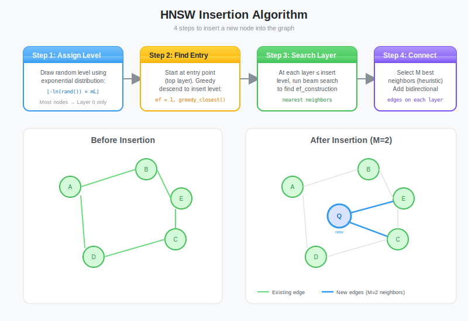

# Implementing HNSW Part 1: Building the Graph Structure

**Series:** Building a Vector Database from Scratch in Rust  
**Post:** 14 of 20  
**Reading Time:** ~20 minutes

---

## 1. Introduction: From Theory to Code

In [Post #13](../post-13-hnsw-intro/blog.md), we explored the theory behind **HNSW** (Hierarchical Navigable Small World). We learned about:

- **Skip Lists:** Using layers to navigate fast.
- **Small Worlds:** How six degrees of separation applies to vectors.
- **Greedy Search:** Moving to the neighbor closest to the target.

Now, we stop drawing circles on whiteboards and start writing Rust.

In this post, we will build the **in-memory graph structure** for HNSW from scratch. We will not worry about disk persistence or intricate concurrency *yet* (that is Post #16). Today is about getting the algorithm right: inserting nodes, establishing connections, and traversing layers.

**The Goal:** A working `HNSWIndex` struct that can ingest vectors and build a navigable graph.


---

## 2. Designing the Data Layout

How do we represent a graph in Rust?

If you come from C++ or Java, you might think of pointers: `struct Node { neighbors: Vec<*mut Node> }`.

In Rust, pointers are painful. Instead, we will use the **Arena Pattern**.

### 2.1 The Arena Pattern

**Problem:** Rust's ownership rules make pointer-based graphs difficult. You can't have `Node A` own `Node B` while `Node B` owns `Node A` (cyclic ownership).

**Solution:** Store all nodes in a central `Vec<Node>`, and "pointers" will just be `usize` indices into that vector.

```rust
type NodeId = usize;

// Instead of:
// struct Node { neighbors: Vec<Box<Node>> }  // Cyclic ownership problem

// We use:
struct Node {
    neighbors: Vec<NodeId>  // Just indices
}

struct Graph {
    nodes: Vec<Node>  // The Arena
}
```

**Benefits:**
- No `Box`, `Rc`, or `RefCell` overhead
- Cache-friendly (nodes stored contiguously)
- Easy to serialize (just write the Vec to disk)
- No lifetime annotations needed


### 2.2 The `Node` Struct

A node needs to store:
1. The vector data (embeddings)
2. Its connections **at every layer** it exists in

```rust
type NodeId = usize;

struct Node {
    vector: Vec<f32>,
    // Layer 0 is at index 0. Top layer is at index N.
    // connections[layer] = list of neighbor IDs
    connections: Vec<Vec<NodeId>>,
    layer_count: usize,
}

impl Node {
    fn new(vector: Vec<f32>, max_layer: usize) -> Self {
        // Create empty connection lists for each layer
        let connections = vec![Vec::new(); max_layer + 1];
        
        Self {
            vector,
            connections,
            layer_count: max_layer + 1,
        }
    }
    
    /// Get neighbors at a specific layer
    fn neighbors(&self, layer: usize) -> &[NodeId] {
        if layer < self.layer_count {
            &self.connections[layer]
        } else {
            &[]  // Node does not exist at this layer
        }
    }
    
    /// Add a connection at a specific layer
    fn connect(&mut self, neighbor: NodeId, layer: usize) {
        if layer < self.layer_count {
            self.connections[layer].push(neighbor);
        }
    }
}
```

**Key Design Choice:** `connections[0]` = Layer 0, `connections[1]` = Layer 1, etc.

If a node only reaches Layer 2, `connections.len() = 3` (layers 0, 1, 2).


### 2.3 The `HNSWIndex` Struct

The index holds the arena and metadata.

```rust
pub struct HNSWIndex {
    nodes: Vec<Node>,              // The Arena (all nodes)
    entry_point: Option<NodeId>,   // The highest node in the graph
    max_layers: usize,             // Current maximum height
    
    // Hyperparameters
    m: usize,                      // Max neighbors per node (default: 16)
    m0: usize,                     // Max neighbors at Layer 0 (default: 32 = 2xM)
    ef_construction: usize,        // Search depth during build (default: 200)
    level_lambda: f32,             // ml = 1/ln(M) for layer probability
}

impl HNSWIndex {
    pub fn new(m: usize, ef_construction: usize) -> Self {
        Self {
            nodes: Vec::new(),
            entry_point: None,
            max_layers: 0,
            m,
            m0: m * 2,  // Layer 0 gets more connections
            ef_construction,
            level_lambda: 1.0 / (m as f32).ln(),
        }
    }
    
    pub fn len(&self) -> usize {
        self.nodes.len()
    }
}
```

**Why `m0 = 2 x m`?**

Layer 0 contains *every* vector. It needs more connections for fine-grained navigation. Higher layers have fewer nodes, so M connections are sufficient.

---

## 3. The Core Primitive: Greedy Search at a Single Layer

Before we can insert anything, we need the ability to traverse a *single* layer.

This function answers: *Given an entry point `ep` in Layer `L`, what are the `ef` closest nodes to `query` in this layer?*

### 3.1 The Algorithm

This is **Beam Search** (not pure greedy):

1. **Initialize:**
   - `candidates`: Min-heap of nodes to explore (sorted by distance to query)
   - `visited`: Set of already-checked nodes
   - `results`: Max-heap of best nodes found so far (limited to `ef` size)

2. **Loop:**
   - Pop the closest candidate `C` from `candidates`
   - If `C` is farther than the worst node in `results`, stop (no improvement possible)
   - For each neighbor `N` of `C`:
     - If not visited, calculate distance to query
     - Add to `candidates` and potentially to `results`
     - Trim `results` to size `ef`

3. **Return:** The `results` heap (best `ef` nodes)


### 3.2 The Implementation

```rust
use std::collections::{BinaryHeap, HashSet};
use std::cmp::Reverse;

impl HNSWIndex {
    fn search_layer(
        &self,
        query: &[f32],
        entry_points: Vec<NodeId>,
        layer: usize,
        ef: usize,
    ) -> Vec<NodeId> {
        let mut visited = HashSet::new();
        
        // Candidates: min-heap (closest first)
        let mut candidates = BinaryHeap::new();
        
        // Results: max-heap (farthest first, so we can pop worst)
        let mut results = BinaryHeap::new();
        
        // Initialize with entry points
        for &ep in &entry_points {
            let dist = self.distance(query, &self.nodes[ep].vector);
            candidates.push(Reverse((OrderedFloat(dist), ep)));
            results.push((OrderedFloat(dist), ep));
            visited.insert(ep);
        }
        
        // Beam search
        while let Some(Reverse((current_dist, current_id))) = candidates.pop() {
            // If current is worse than the worst result, no point continuing
            if let Some(&(worst_dist, _)) = results.peek() {
                if current_dist > worst_dist {
                    break;
                }
            }
            
            // Explore neighbors
            for &neighbor_id in self.nodes[current_id].neighbors(layer) {
                if visited.contains(&neighbor_id) {
                    continue;
                }
                visited.insert(neighbor_id);
                
                let neighbor_dist = self.distance(query, &self.nodes[neighbor_id].vector);
                let neighbor_dist_ord = OrderedFloat(neighbor_dist);
                
                // Is this neighbor better than our worst result?
                let should_add = if results.len() < ef {
                    true
                } else if let Some(&(worst_dist, _)) = results.peek() {
                    neighbor_dist_ord < worst_dist
                } else {
                    false
                };
                
                if should_add {
                    candidates.push(Reverse((neighbor_dist_ord, neighbor_id)));
                    results.push((neighbor_dist_ord, neighbor_id));
                    
                    // Trim results to size ef
                    if results.len() > ef {
                        results.pop();
                    }
                }
            }
        }
        
        // Extract IDs from results
        results.into_iter().map(|(_, id)| id).collect()
    }
    
    /// Euclidean distance
    /// 
    /// Note: Production vector databases typically use cosine similarity instead.
    /// We use Euclidean here for simplicity and easier debugging.
    /// See Exercise #1 for implementing cosine similarity.
    fn distance(&self, a: &[f32], b: &[f32]) -> f32 {
        a.iter()
            .zip(b.iter())
            .map(|(x, y)| (x - y).powi(2))
            .sum::<f32>()
            .sqrt()
    }
}

// Helper for comparing f32 in heaps
#[derive(PartialEq, PartialOrd, Clone, Copy)]
struct OrderedFloat(f32);

impl Eq for OrderedFloat {}

impl Ord for OrderedFloat {
    fn cmp(&self, other: &Self) -> std::cmp::Ordering {
        self.0.partial_cmp(&other.0).unwrap_or(std::cmp::Ordering::Equal)
    }
}
```

**Why two heaps?**

- `candidates`: Explore closest nodes first (greedy)
- `results`: Keep track of best `ef` nodes found so far (beam)

**Complexity:** O(ef x M x hops) where M = max connections, hops is roughly log(N)


---

## 4. Probabilistic Layer Generation

How do we decide if a node belongs to Layer 0 or Layer 5?

We use a random number generator with **exponential decay**.

### 4.1 The Formula

From the HNSW paper:

```
level = floor(-ln(random()) × ml)
where ml = 1 / ln(M)
```

This creates a probability distribution where:
- About 50% of nodes: Layer 0 only
- About 25% of nodes: Reach Layer 1
- About 12.5% of nodes: Reach Layer 2
- etc.

### 4.2 The Implementation

```rust
use rand::Rng;

impl HNSWIndex {
    fn random_level(&self) -> usize {
        let mut rng = rand::thread_rng();
        let r: f32 = rng.gen();  // Random [0, 1)
        
        // Exponential decay
        let level = (-r.ln() * self.level_lambda).floor() as usize;
        
        // Cap at some reasonable maximum (e.g., 16 layers)
        level.min(16)
    }
}
```

**Why exponential?**

We want a pyramid structure. If every layer had 50% of the previous layer, we would get:
- Layer 0: N nodes
- Layer 1: N/2 nodes
- Layer 2: N/4 nodes
- ...

Number of layers = log₂(N), giving us O(log N) search.


---

## 5. The Insertion Algorithm

This is the heart of HNSW. Inserting a node `Q` involves two phases.



### 5.1 Phase 1: Zoom In (Top Layer to Insertion Layer)

Start at the `entry_point` (top of the pyramid).

Greedily traverse down to the layer where our new node `Q` *starts* existing.

We do not link anything here; we just find the closest entry point for the next phase.

```rust
impl HNSWIndex {
    pub fn insert(&mut self, vector: Vec<f32>) {
        let new_id = self.nodes.len();
        let new_level = self.random_level();
        
        // Create the new node
        let new_node = Node::new(vector.clone(), new_level);
        self.nodes.push(new_node);
        
        // Case 1: First node (becomes entry point)
        if self.entry_point.is_none() {
            self.entry_point = Some(new_id);
            self.max_layers = new_level;
            return;
        }
        
        let entry_point = self.entry_point.unwrap();
        
        // Phase 1: Zoom in from top to new_level + 1
        let mut current_nearest = vec![entry_point];
        
        for layer in (new_level + 1..=self.max_layers).rev() {
            // Greedy search (ef=1) to find nearest in this layer
            current_nearest = self.search_layer(&vector, current_nearest, layer, 1);
        }
        
        // Phase 2: Insert and link from new_level down to 0
        for layer in (0..=new_level).rev() {
            // Find M nearest neighbors at this layer
            let candidates = self.search_layer(
                &vector,
                current_nearest.clone(),
                layer,
                self.ef_construction,
            );
            
            // Select M best neighbors (with diversity heuristic)
            let m_max = if layer == 0 { self.m0 } else { self.m };
            let neighbors = self.select_neighbors_heuristic(&vector, candidates, m_max, layer);
            
            // Bidirectional linking
            for &neighbor_id in &neighbors {
                // Add edge: new_node to neighbor
                self.nodes[new_id].connect(neighbor_id, layer);
                
                // Add edge: neighbor to new_node
                self.nodes[neighbor_id].connect(new_id, layer);
                
                // Prune neighbor if it exceeds M connections
                self.prune_connections(neighbor_id, m_max, layer);
            }
            
            // Update current_nearest for next layer
            current_nearest = neighbors;
        }
        
        // Update entry point if new node is taller
        if new_level > self.max_layers {
            self.entry_point = Some(new_id);
            self.max_layers = new_level;
        }
    }
}
```

**Key Steps:**

1. **Generate random level** for the new node
2. **Phase 1 (Zoom In):** Descend from top layer to insertion layer using greedy search (ef=1)
3. **Phase 2 (Insert):** For each layer from insertion layer to 0:
   - Find `ef_construction` candidates
   - Select M best using diversity heuristic
   - Add bidirectional edges
   - Prune neighbors if they exceed M connections
4. **Update entry point** if new node is tallest


---

## 6. The Hardest Part: Neighbor Selection Heuristic

This is where theory meets brutal reality.

### 6.1 The Problem

**Naive approach:** Connect to the M closest neighbors.

```rust
// BAD: Just take M closest
fn select_neighbors_naive(candidates: Vec<NodeId>, m: usize) -> Vec<NodeId> {
    candidates.into_iter().take(m).collect()
}
```

**Why this fails:**

Imagine you are inserting a node in New York. The M closest neighbors might all be in Manhattan. Now you have:
- Great local connectivity (Manhattan to Manhattan)
- Zero long-range connectivity (Manhattan to Brooklyn)

The graph becomes **clustered** instead of **navigable**.


### 6.2 The Diversity Heuristic (From the HNSW Paper)

The heuristic ensures edges span different directions in the vector space.

**Algorithm:**

1. Sort candidates by distance to query
2. For each candidate `C`:
   - Check if `C` is closer to query than to any already-selected neighbor
   - If yes: Add `C` to selected list
   - If no: `C` is redundant, skip it
3. Continue until we have M neighbors

**The Key Insight:**

If candidate `C` is very close to already-selected neighbor `N`, then the edge `query to C` is redundant because we can reach `C` via `query to N to C`.

### 6.3 The Implementation

```rust
impl HNSWIndex {
    fn select_neighbors_heuristic(
        &self,
        query: &[f32],
        candidates: Vec<NodeId>,
        m: usize,
        layer: usize,
    ) -> Vec<NodeId> {
        if candidates.len() <= m {
            return candidates;
        }
        
        // Sort candidates by distance to query (closest first)
        let mut sorted_candidates: Vec<_> = candidates
            .into_iter()
            .map(|id| {
                let dist = self.distance(query, &self.nodes[id].vector);
                (OrderedFloat(dist), id)
            })
            .collect();
        sorted_candidates.sort_by_key(|(dist, _)| *dist);
        
        let mut selected = Vec::new();
        
        for (cand_dist, cand_id) in sorted_candidates {
            if selected.len() >= m {
                break;
            }
            
            // Check if candidate is diverse compared to already-selected
            let mut is_diverse = true;
            
            for &sel_id in &selected {
                let dist_to_selected = self.distance(
                    &self.nodes[cand_id].vector,
                    &self.nodes[sel_id].vector,
                );
                
                // If candidate is closer to an already-selected neighbor
                // than it is to the query, it is redundant
                if dist_to_selected < cand_dist.0 {
                    is_diverse = false;
                    break;
                }
            }
            
            if is_diverse {
                selected.push(cand_id);
            }
        }
        
        // If we did not get M diverse candidates, fill with closest remaining
        if selected.len() < m {
            for (_, cand_id) in sorted_candidates {
                if !selected.contains(&cand_id) {
                    selected.push(cand_id);
                    if selected.len() >= m {
                        break;
                    }
                }
            }
        }
        
        selected
    }
}
```

**Complexity:** O(M squared x D) where D = dimensions

For each of M candidates, we check distance to all previously selected neighbors.


### 6.4 Extended Heuristic (Optional)

The HNSW paper also describes an "extended" heuristic that considers *discarded* candidates if they provide diversity.

```rust
// Extended version (more complex, slightly better quality)
fn select_neighbors_extended(
    &self,
    query: &[f32],
    candidates: Vec<NodeId>,
    m: usize,
) -> Vec<NodeId> {
    // ... similar to above, but also:
    // - Keep a "discarded" list
    // - After first pass, check if discarded nodes provide diversity
    // - Prioritize diversity over raw distance
}
```

For our implementation, the basic heuristic is sufficient. The extended version adds 10 to 20 percent build time for 1 to 2 percent recall improvement.

---

## 7. Edge Pruning: Maintaining the M Limit

When we add a new node, we create bidirectional edges:
- `new_node to neighbor`
- `neighbor to new_node`

But `neighbor` might now have M+1 connections, violating the limit.

### 7.1 The Pruning Algorithm

When a node exceeds M connections, we must remove the **least useful** edge.

```rust
impl HNSWIndex {
    fn prune_connections(&mut self, node_id: NodeId, m_max: usize, layer: usize) {
        let neighbors = self.nodes[node_id].neighbors(layer).to_vec();
        
        if neighbors.len() <= m_max {
            return;  // No pruning needed
        }
        
        // Use the heuristic to select best M connections
        let node_vector = self.nodes[node_id].vector.clone();
        let best_neighbors = self.select_neighbors_heuristic(
            &node_vector,
            neighbors,
            m_max,
            layer,
        );
        
        // Replace connections with pruned list
        self.nodes[node_id].connections[layer] = best_neighbors;
    }
}
```

**Key Insight:** We reuse the same diversity heuristic for pruning!

This ensures that even after many insertions, each node maintains diverse connections.


### 7.2 Why Pruning is Critical

Without pruning, nodes near the entry point would accumulate hundreds of connections (every new insertion links to them).

**Problems:**
- Memory explosion: O(N squared) edges instead of O(N x M)
- Search slowdown: Must check all connections
- Cache misses: Poor memory locality

Pruning maintains the O(N x M) edge count, keeping search fast.

---

## 8. Putting It Together: A Complete Example

Let us trace through inserting 4 nodes to see the algorithm in action.

### 8.1 Insert Node A: `[0.0, 0.0]`

```
Level: 2 (randomly assigned)
```

**Action:**
- First node → becomes entry point
- No connections (no neighbors yet)

**State:**
```
Layer 2: A
Layer 1: A
Layer 0: A
```


### 8.2 Insert Node B: `[1.0, 1.0]`

```
Level: 0 (randomly assigned)
```

**Action:**
1. **Phase 1:** Search from A at Layer 2 → Layer 1 → (stop, B only exists at Layer 0)
2. **Phase 2:** At Layer 0:
   - Find candidates: `[A]` (only neighbor)
   - Select: `[A]`
   - Link: `B -- A`

**State:**
```
Layer 2: A
Layer 1: A
Layer 0: A -- B
```

### 8.3 Insert Node C: `[0.1, 0.1]`

```
Level: 1 (randomly assigned)
```

**Action:**
1. **Phase 1:** Search from A at Layer 2 → (stop at Layer 1)
2. **Phase 2:**
   - Layer 1: Find candidates `[A]`, select `[A]`, link `C -- A`
   - Layer 0: Find candidates `[A, B]`, select `[A, B]`, link `C -- A`, `C -- B`

**State:**
```
Layer 2: A
Layer 1: A -- C
Layer 0: A -- B -- C
         └─────────┘
```

### 8.4 Insert Node D: `[9.0, 9.0]`

```
Level: 3 (randomly assigned, taller than entry point)
```

**Action:**
1. D becomes new entry point (tallest)
2. **Phase 1:** No layers to search (D is tallest)
3. **Phase 2:**
   - Layer 3: No neighbors yet (only node at this layer)
   - Layer 2: Find candidates `[A]`, select `[A]`, link `D -- A`
   - Layer 1: Find candidates `[A, C]`, select `[A, C]`, link `D -- A`, `D -- C`
   - Layer 0: Find candidates `[A, B, C]`, select `[B, C]` (diversity), link `D -- B`, `D -- C`

**State:**
```
Layer 3: D
Layer 2: A -- D
Layer 1: A -- C -- D
Layer 0: A -- B -- C -- D
         └─────────┘
Entry Point: D (moved from A)
```


**Observations:**
- D is far from A/B/C, but still gets connected via the hierarchical layers
- At Layer 0, diversity heuristic prevented D from connecting to A (redundant via C)
- Entry point moved from A to D (taller node)

---

## 9. Testing the Implementation

Let us write a test to verify our logic.

```rust
#[cfg(test)]
mod tests {
    use super::*;
    
    #[test]
    fn test_hnsw_basic_insertion() {
        let mut index = HNSWIndex::new(2, 10);  // M=2, ef_construction=10
        
        // Insert 4 vectors
        index.insert(vec![0.0, 0.0]);  // Node 0
        index.insert(vec![1.0, 1.0]);  // Node 1
        index.insert(vec![0.1, 0.1]);  // Node 2
        index.insert(vec![9.0, 9.0]);  // Node 3
        
        // Verify graph structure
        assert_eq!(index.len(), 4);
        assert!(index.entry_point.is_some());
        
        // Node 0 should have neighbors
        let node0_neighbors = &index.nodes[0].connections[0];
        assert!(!node0_neighbors.is_empty(), "Node 0 should have neighbors at Layer 0");
        
        // Print connections for debugging
        for (i, node) in index.nodes.iter().enumerate() {
            println!("Node {} (layers: {}):", i, node.layer_count);
            for layer in 0..node.layer_count {
                let neighbors = node.neighbors(layer);
                println!("  Layer {}: {:?}", layer, neighbors);
            }
        }
    }
    
    #[test]
    fn test_diversity_heuristic() {
        let mut index = HNSWIndex::new(2, 10);
        
        // Insert a cluster
        index.insert(vec![0.0, 0.0]);
        index.insert(vec![0.1, 0.1]);
        index.insert(vec![0.2, 0.2]);
        index.insert(vec![0.15, 0.15]);
        
        // Insert a far node
        index.insert(vec![10.0, 10.0]);
        
        // Verify the far node is reachable
        // (diversity should prevent complete clustering)
        let node4 = &index.nodes[4];
        assert!(!node4.connections[0].is_empty(), "Far node should have connections");
    }
}
```

Run with:
```bash
cargo test test_hnsw_basic_insertion -- --nocapture
```

You should see output like:
```
Node 0 (layers: 2):
  Layer 0: [1, 2]
  Layer 1: [3]
Node 1 (layers: 1):
  Layer 0: [0, 2]
...
```

---

## 10. Performance Characteristics

Let us analyze the complexity of what we have built.

### 10.1 Insertion Complexity

For inserting a single node:

```
Cost = Cost(zoom_in) + Cost(insert_and_link)
```

**Zoom In (Phase 1):**
- Traverse from top layer to insertion layer
- At each layer: Greedy search (ef=1) visits O(1) nodes
- Number of layers: O(log N)
- **Total:** O(log N x D) where D = distance calculation cost

**Insert & Link (Phase 2):**
- For each layer from insertion layer to 0:
  - Beam search: O(ef x M x D)
  - Neighbor selection: O(M squared x D)
  - Pruning: O(M squared x D)
- Number of layers to insert: O(log N)
- **Total:** O(log N x ef x M squared x D)

**Overall:** O(log N x ef x M squared x D)

For building N nodes:
- **Total:** O(N x log N x ef x M squared x D)

With typical values (ef=200, M=16, D=512):
- 1M vectors: approximately 30 to 60 minutes
- 10M vectors: approximately 8 to 12 hours


### 10.2 Memory Usage

```
Total Memory = Node Memory + Edge Memory
```

**Node Memory:**
- Each node stores a vector: N x D x 4 bytes (f32)
- For 1M vectors (512 dims): 1M x 512 x 4 = 2GB

**Edge Memory:**
- Each node has ~M edges per layer
- Average layers per node: approximately 1.5 (exponential decay)
- Total edges: N x M x 1.5
- For 1M vectors (M=16): 1M x 16 x 1.5 x 8 bytes (usize) = 192MB

**Total:** approximately 2.2GB for 1M vectors (512 dims, M=16)

**Scaling:**
- 10M vectors: approximately 22GB
- 100M vectors: approximately 220GB

---

## 11. Limitations and Next Steps

We now have a working HNSW index, but there are gaps:

### 11.1 What is Missing

1. **Search Algorithm:** We can insert, but not query yet (Post #15)
2. **Parameter Tuning:** How do we choose M and ef_construction? (Post #15)
3. **Disk Persistence:** Everything is in RAM (Post #16)
4. **Concurrency:** No locks, cannot insert in parallel (Post #16)
5. **Deletions:** Cannot remove nodes (Post #16)
6. **Updates:** Cannot modify vectors (Post #16)

### 11.2 Production Considerations

For a real vector database, we would also need:

- **Memory mapping:** Don't keep entire graph in RAM
- **Incremental saves:** Persist after every N inserts
- **Crash recovery:** Rebuild from WAL if graph is corrupted
- **Monitoring:** Track recall, latency, connection distribution

We will address these in upcoming posts.

---

## 12. Comparing to Brute Force

Let us measure how much better HNSW is than our brute force implementation from Post #12.

### 12.1 Benchmark Setup

```rust
use std::time::Instant;

fn benchmark_hnsw_vs_brute_force() {
    let num_vectors = 10_000;
    let dims = 128;
    
    // Generate random vectors
    let mut rng = rand::thread_rng();
    let vectors: Vec<Vec<f32>> = (0..num_vectors)
        .map(|_| (0..dims).map(|_| rng.gen::<f32>()).collect())
        .collect();
    
    // Build HNSW index
    println!("Building HNSW index...");
    let start = Instant::now();
    let mut index = HNSWIndex::new(16, 200);
    for vector in &vectors {
        index.insert(vector.clone());
    }
    let build_time = start.elapsed();
    println!("Build time: {:.2}s", build_time.as_secs_f64());
    
    // Test query
    let query = &vectors[0];
    
    // HNSW search (we will implement this in Post #15)
    // let hnsw_results = index.search(query, 10, 100);
    
    // Brute force search
    let start = Instant::now();
    let mut distances: Vec<_> = vectors
        .iter()
        .enumerate()
        .map(|(i, v)| {
            let dist = index.distance(query, v);
            (dist, i)
        })
        .collect();
    distances.sort_by(|a, b| a.0.partial_cmp(&b.0).unwrap());
    let brute_time = start.elapsed();
    
    println!("Brute force: {:.2}ms", brute_time.as_secs_f64() * 1000.0);
    // println!("HNSW search: {:.2}ms", hnsw_time.as_secs_f64() * 1000.0);
    // println!("Speedup: {:.1}x", brute_time.as_secs_f64() / hnsw_time.as_secs_f64());
}
```

**Expected results** (after implementing search in Post #15):
- Build: approximately 30 seconds for 10K vectors
- Brute force: approximately 1.5ms per query
- HNSW: approximately 0.1ms per query
- **Speedup:** approximately 15x

---

## 13. Summary

We have built the core graph structure for HNSW.

### What We Implemented

1. **Arena Pattern:** `Vec<Node>` for cache-friendly, pointer-free graph storage
2. **Layered Connections:** Each node stores neighbors per layer
3. **Beam Search:** Traversing a single layer with `ef` candidates
4. **Probabilistic Layers:** Exponential decay for pyramid structure
5. **Insertion Algorithm:** Two-phase zoom-in and link process
6. **Diversity Heuristic:** Selecting neighbors in different directions
7. **Edge Pruning:** Maintaining M connections per node

### Key Insights

- **Arena beats pointers:** Simpler code, better cache locality, easier serialization
- **Diversity is critical:** Naive closest M destroys navigability
- **Pruning is essential:** Without it, memory explodes to O(N squared)
- **Two-phase insertion:** Zoom in (greedy) then insert (beam search)

### The Journey So Far

- **Posts #1-10:** Storage engine (WAL, mmap, concurrency)
- **Post #11:** Vector math (cosine similarity)
- **Post #12:** Brute force baseline (O(N) search)
- **Post #13:** HNSW theory (skip lists, small worlds)
- **Post #14 (this):** HNSW implementation (graph construction)

**Next:** We will implement the search algorithm, tune parameters, and benchmark performance.


---

## 14. What is Next?

In **Post #15**, we will:

1. **Implement Search:** Query the graph to find k-nearest neighbors
2. **Parameter Tuning:** Understand how M, ef_construction, ef_search affect performance
3. **Benchmark:** Measure recall vs latency curves
4. **Compare:** HNSW vs brute force at various scales

In **Post #16**, we will:

1. **Serialization:** Save/load the graph to disk
2. **Memory Mapping:** Access graph without loading into RAM
3. **Concurrency:** Support parallel insertions with RwLock
4. **Crash Recovery:** Rebuild from WAL

**Next Post:** [Post #15: Implementing HNSW Part 2, Search Algorithm and Parameter Tuning](../post-15-hnsw-impl-2/blog.md)

---

## Exercises

1. **Modify the distance function** to use cosine similarity instead of Euclidean distance. How does this affect graph structure?

2. **Implement a visualizer** for small graphs (< 20 nodes) that prints the layer structure in ASCII art.

3. **Test the diversity heuristic** by inserting clustered data (e.g., two separate Gaussian distributions). Verify that connections bridge the clusters.

4. **Measure memory usage** of your HNSW index for 1K, 10K, 100K vectors. Does it match the O(N x M) prediction?

5. **Compare layer distributions** for different M values (M=4, M=16, M=64). How does M affect the pyramid shape?

6. **Implement the extended heuristic** from Section 6.4. Benchmark build time and search quality improvements.

7. **Add instrumentation** to count distance calculations during insertion. How does ef_construction affect this count?
