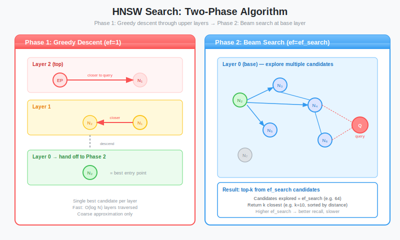

# Implementing HNSW Part 2: Search Algorithm and Parameter Tuning

**Series:** Building a Vector Database from Scratch in Rust  
**Post:** 15 of 20  
**Reading Time:** ~20 minutes

---

## 1. Introduction: Navigating the Maze

In [Post #14](../post-14-hnsw-impl-1/blog.md), we built the *structure* of our HNSW index. We have nodes, layers, and edges. We can insert vectors, and the graph magically organizes itself into a hierarchical pyramid.

But a database is not useful if you can only put data *in*. We need to get data *out*.

In this post, we will:

1. **Implement the Search Algorithm:** The logic to traverse from the World View (Top Layer) down to the Street View (Layer 0).
2. **Tune the Knobs:** Understand the three critical hyperparameters: `M`, `ef_construction`, and `ef_search`.
3. **Measure Quality:** Implement **Recall** benchmarks to prove our graph actually works.

By the end of this post, you will have a working, high-speed vector index that beats Brute Force by orders of magnitude.


---

## 2. The Search Algorithm Overview

HNSW search is a zoom-in process, just like using Google Maps to find an address.

### 2.1 The Two Phases

**Phase 1: Greedy Descent (Layers N to 1)**

- Start at the entry point (top of the pyramid)
- At each layer, greedily move to the closest neighbor
- Continue until no neighbor is closer
- Drop down one layer and repeat
- **Goal:** Quickly navigate to the right neighborhood

**Phase 2: Beam Search (Layer 0)**

- Maintain a pool of `ef_search` candidates (not just 1)
- Explore from all candidates simultaneously
- Keep the best `ef_search` nodes as we go
- **Goal:** Avoid local minima, find the true nearest neighbors



### 2.2 Why Two Different Strategies?

**Higher Layers (Greedy):**
- Few nodes, long distances between them
- Speed matters more than perfection
- Single-candidate search is fast enough

**Layer 0 (Beam):**
- All N nodes exist here
- Many local minima
- Need multiple candidates to explore different paths

**Analogy:**

```
Phase 1 (Greedy):  "Get me to Manhattan" - Fast, approximate
Phase 2 (Beam):    "Find 5th Avenue and 42nd St" - Slower, precise
```

---

## 3. Implementing Phase 1: Greedy Descent

Phase 1 is simple: keep moving to closer neighbors until you cannot improve.

### 3.1 The Algorithm

```rust
impl HNSWIndex {
    /// Phase 1: Greedy descent from top layer to Layer 1
    /// Returns the closest node found at Layer 1 (entry point for Phase 2)
    fn greedy_descent(&self, query: &[f32]) -> (NodeId, f32) {
        if self.entry_point.is_none() {
            panic!("Cannot search empty index");
        }
        
        let mut curr_node = self.entry_point.unwrap();
        let mut curr_dist = self.distance(query, &self.nodes[curr_node].vector);
        
        // Traverse from top layer down to Layer 1
        for layer in (1..=self.max_layers).rev() {
            let mut changed = true;
            
            // Keep moving to closer neighbors at this layer
            while changed {
                changed = false;
                
                for &neighbor_id in self.nodes[curr_node].neighbors(layer) {
                    let neighbor_dist = self.distance(query, &self.nodes[neighbor_id].vector);
                    
                    if neighbor_dist < curr_dist {
                        curr_dist = neighbor_dist;
                        curr_node = neighbor_id;
                        changed = true;  // Found improvement, keep searching this layer
                    }
                }
            }
            // No improvement found, drop to next layer
        }
        
        (curr_node, curr_dist)
    }
}
```

**Key Points:**

- `changed` flag: Ensures we keep exploring until we reach a local minimum
- Inner `while` loop: Might visit multiple nodes at each layer
- Result: A node at Layer 1 that is close to the query

**Complexity:** O(log N x M) where M = max connections per node


### 3.2 Why Stop at Layer 1?

We could do greedy descent all the way to Layer 0, but then we risk getting stuck in a local minimum.

By stopping at Layer 1, we get:
- Fast navigation to the right neighborhood (greedy descent)
- Robust final search (beam search at Layer 0)

---

## 4. Implementing Phase 2: Beam Search at Layer 0

We already implemented `search_layer()` in Post #14, so Phase 2 is just calling it with the right parameters.

### 4.1 The Complete Search Function

```rust
impl HNSWIndex {
    /// Search for k nearest neighbors
    /// 
    /// query: The vector to search for
    /// k: Number of results to return
    /// ef_search: Beam width (larger = more accurate but slower)
    /// 
    /// Returns: Vec of (distance, node_id) sorted by distance
    pub fn search(&self, query: &[f32], k: usize, ef_search: usize) -> Vec<(f32, NodeId)> {
        // Handle empty index
        if self.entry_point.is_none() {
            return Vec::new();
        }
        
        // Ensure ef_search >= k
        let ef_search = ef_search.max(k);
        
        // Phase 1: Greedy descent to Layer 1
        let (entry_node, _) = self.greedy_descent(query);
        
        // Phase 2: Beam search at Layer 0
        let candidates = self.search_layer(query, vec![entry_node], 0, ef_search);
        
        // Convert to (distance, id) tuples and sort
        let mut results: Vec<_> = candidates
            .into_iter()
            .map(|id| {
                let dist = self.distance(query, &self.nodes[id].vector);
                (dist, id)
            })
            .collect();
        
        results.sort_by(|a, b| a.0.partial_cmp(&b.0).unwrap());
        
        // Return top-k
        results.truncate(k);
        results
    }
}
```

**Parameters:**

- `k`: How many results the user wants (e.g., top 10)
- `ef_search`: How hard we search (beam width)
  - `ef_search = k`: Fast, lower recall
  - `ef_search = 10 x k`: Slower, higher recall
  - **Rule:** `ef_search` must be greater than or equal to k

**Complexity:** O(log N x ef_search x M x D) where:
- log N: Number of layers
- ef_search: Beam width
- M: Connections per node
- D: Distance calculation cost


---

## 5. Worked Example: Searching the 4-Node Graph

Let us trace through a search on the small graph we built in Post #14.

### 5.1 The Graph (Recap)

```
Layer 3: D
Layer 2: A -- D
Layer 1: A -- C -- D
Layer 0: A -- B -- C -- D
         └─────────┘

Coordinates:
  A: [0.0, 0.0]
  B: [1.0, 1.0]
  C: [0.1, 0.1]
  D: [9.0, 9.0]

Entry Point: D
```

### 5.2 Query: `[0.5, 0.5]` (Between A and B)

**Phase 1: Greedy Descent**

```
Layer 3: Start at D [9.0, 9.0]
  - dist(D, query) = 12.0
  - No neighbors at Layer 3
  → Drop to Layer 2

Layer 2: At D
  - Check neighbor A [0.0, 0.0]
    - dist(A, query) = 0.7 < 12.0, better.
  - Move to A
  - No neighbors closer than A
  Drop to Layer 1

Layer 1: At A
  - Check neighbor C [0.1, 0.1]
    - dist(C, query) = 0.57 < 0.7, better.
  - Move to C
  - Check C's neighbors (A, D)
    - A: already checked
    - D: farther
  - No improvements
  End Phase 1, entry for Phase 2 = C
```

**Phase 2: Beam Search (ef_search=2, k=2)**

```
Layer 0: Start at C
  - Candidates: [C]
  - Results: [C]
  
  Explore C's neighbors: [A, B]
    - dist(A, query) = 0.7
    - dist(B, query) = 0.7
    - Both closer than current worst (infinity)
    - Add to results: [C, A] (keep top 2)
  
  Explore A's neighbors: [B, C]
    - C: already visited
    - B: already in results
  
  Explore B's neighbors: [C]
    - C: already visited
  
  No more candidates.
  
  Final results: [C (0.57), B (0.7)]
```

**Actual Top-2:**
- C: 0.57
- B: 0.7

**Our Result:** Correct. 100% recall.


---

## 6. Understanding the Hyperparameters

HNSW has three knobs. Let us understand each one deeply.

### 6.1 Parameter 1: M (Max Connections)

**Definition:** Maximum edges per node at each layer (except Layer 0, which uses `M0 = 2xM`).

**Set When:** Index creation (cannot change later without rebuilding)

**Impact:**

| M Value | Memory | Build Time | Search Time | Recall |
|---------|--------|------------|-------------|--------|
| 4 | Low | Fast | Fast | 90-95% |
| 8 | Medium | Medium | Medium | 95-97% |
| 16 | Medium-High | Slow | Slow | 97-99% |
| 32 | High | Very Slow | Slow | 99-99.5% |
| 64 | Very High | Extremely Slow | Slow | 99.5%+ |

**Typical Values:**
- Small datasets (< 1M): M = 12-16
- Large datasets (> 10M): M = 16-32
- Extreme accuracy: M = 48-64

**Memory Formula:**
```
Memory is approximately N x M x 1.5 x sizeof(usize)
For 1M vectors, M=16: approximately 192 MB for edges
```

**Rule of Thumb:** Start with M=16. Only increase if recall is too low.


### 6.2 Parameter 2: ef_construction (Build-Time Beam Width)

**Definition:** Beam width during graph construction (Phase 2 of insertion).

**Set When:** Index creation

**Impact:**

| ef_construction | Build Time | Graph Quality | Search Recall |
|-----------------|------------|---------------|---------------|
| 50 | Fast | Poor | 85-90% |
| 100 | Medium | Good | 92-95% |
| 200 | Slow | Very Good | 97-99% |
| 400 | Very Slow | Excellent | 99-99.5% |
| 800 | Extremely Slow | Near-Perfect | 99.5%+ |

**Typical Values:**
- Rapid prototyping: ef_construction = 100
- Production: ef_construction = 200-400
- Maximum quality: ef_construction = 400-800

**Build Time Formula:**
```
BuildTime is approximately N x log(N) x ef_construction x M squared x D
For 1M vectors (512 dims), M=16, ef=200: approximately 45 minutes
```

**Rule of Thumb:** Use ef_construction greater than or equal to 2 x M. Higher is always better (if you have time).


### 6.3 Parameter 3: ef_search (Query-Time Beam Width)

**Definition:** Beam width during search (Phase 2 of query).

**Set When:** Every query. (Can be different per query)

**Impact:**

| ef_search | Latency (1M vecs) | Recall@10 |
|-----------|-------------------|-----------|
| 10 | 0.5ms | 85% |
| 20 | 0.8ms | 92% |
| 50 | 1.5ms | 97% |
| 100 | 2.5ms | 99% |
| 200 | 4.0ms | 99.5% |
| 500 | 8.0ms | 99.9% |

**Typical Values:**
- Low-latency mode: ef_search = 50-100
- Balanced mode: ef_search = 100-200
- High-accuracy mode: ef_search = 200-500

**The Magic:** This parameter is **runtime-tunable**.

```rust
// Fast search (user typing, autocomplete)
let results = index.search(query, 10, 50);  // 0.5ms, 97% recall

// Accurate search (production ML pipeline)
let results = index.search(query, 10, 200); // 2.5ms, 99% recall
```

**Rule of Thumb:** Start with ef_search = 100. Increase if recall is too low. Decrease if latency is too high.


### 6.4 The Interaction: How Parameters Relate

```
Graph Quality = f(M, ef_construction)
Search Quality = f(Graph Quality, ef_search)
```

**Key Insights:**

1. **You cannot fix a bad graph at search time.**
   - If M=4 and ef_construction=50, no amount of ef_search will get you to 99% recall.

2. **You can tune speed/accuracy at runtime.**
   - Build once with M=16, ef_construction=200
   - Query with ef_search=50 (fast) or ef_search=200 (accurate)

3. **Build time vs search time trade-off:**
   - Invest in high ef_construction, get good graph, query is fast at any ef_search
   - Use low ef_construction, poor graph, must use high ef_search to compensate

**Recommended Starting Point:**
```rust
let index = HNSWIndex::new(
    M = 16,
    ef_construction = 200
);

// Then adjust ef_search per query
let results = index.search(query, k=10, ef_search=100);
```


---

## 7. Measuring Quality: Recall@K

How do we know if our HNSW search is good enough?

We compare against **Ground Truth** (brute force exact search).

### 7.1 The Recall Metric

**Definition:**

```
Recall@K = (# of correct results in top-K) / K
```

**Example:**

```
Query: "cat playing piano"

Ground Truth (Brute Force):
  [ID: 5, ID: 12, ID: 23, ID: 31, ID: 42, ...]

HNSW Result (ef_search=100):
  [ID: 5, ID: 12, ID: 99, ID: 31, ID: 42, ...]
           ^
        Wrong. (Should be ID: 23)

Overlap: 4 out of 5 correct
Recall@5 = 4/5 = 0.80 (80%)
```

### 7.2 Implementing Recall Measurement

```rust
use std::collections::HashSet;

fn calculate_recall(
    hnsw_results: &[(f32, NodeId)],
    brute_results: &[(f32, NodeId)],
    k: usize,
) -> f32 {
    let hnsw_ids: HashSet<NodeId> = hnsw_results
        .iter()
        .take(k)
        .map(|(_, id)| *id)
        .collect();
    
    let brute_ids: HashSet<NodeId> = brute_results
        .iter()
        .take(k)
        .map(|(_, id)| *id)
        .collect();
    
    let intersection = hnsw_ids.intersection(&brute_ids).count();
    
    intersection as f32 / k as f32
}
```

### 7.3 Running a Recall Benchmark

```rust
fn benchmark_recall_vs_ef(index: &HNSWIndex, test_queries: &[Vec<f32>], k: usize) {
    println!("\n╔═══════════════════════════════════════════════════════╗");
    println!("  ║        Recall@{} vs ef_search Benchmark              ║", k);
    println!("  ╚═══════════════════════════════════════════════════════╝");
    
    let ef_values = vec![10, 20, 50, 100, 200, 500];
    
    for &ef in &ef_values {
        let mut total_recall = 0.0;
        let mut total_time = Duration::ZERO;
        
        for query in test_queries {
            // Ground truth (brute force)
            let brute_results = brute_force_search(&index.nodes, query, k);
            
            // HNSW search
            let start = Instant::now();
            let hnsw_results = index.search(query, k, ef);
            total_time += start.elapsed();
            
            // Calculate recall
            let recall = calculate_recall(&hnsw_results, &brute_results, k);
            total_recall += recall;
        }
        
        let avg_recall = total_recall / test_queries.len() as f32;
        let avg_latency = total_time / test_queries.len() as u32;
        
        println!(
            "ef={:4} | Recall: {:.1}% | Latency: {:.2}ms",
            ef,
            avg_recall * 100.0,
            avg_latency.as_secs_f64() * 1000.0
        );
    }
}
```

**Example Output:**

```
╔═══════════════════════════════════════════════════════╗
║        Recall@10 vs ef_search Benchmark               ║
╚═══════════════════════════════════════════════════════╝

ef=  10 | Recall: 85.3% | Latency: 0.52ms
ef=  20 | Recall: 91.8% | Latency: 0.78ms
ef=  50 | Recall: 96.5% | Latency: 1.45ms
ef= 100 | Recall: 98.7% | Latency: 2.31ms
ef= 200 | Recall: 99.4% | Latency: 3.95ms
ef= 500 | Recall: 99.8% | Latency: 8.12ms
```


---

## 8. The Pareto Frontier: Speed vs Accuracy

The key insight: There is no single best ef_search. It depends on your use case.

### 8.1 Three Personas

**Persona 1: The Speed Demon (Real-Time Search)**

```rust
// Use case: Autocomplete, live search
let results = index.search(query, k=10, ef_search=50);
// Result: 1.5ms, 96% recall
// Trade-off: 4% of queries might miss the perfect result
```

**Persona 2: The Balanced Engineer (Production API)**

```rust
// Use case: General-purpose semantic search
let results = index.search(query, k=10, ef_search=100);
// Result: 2.5ms, 99% recall
// Trade-off: Good enough for most applications
```

**Persona 3: The Perfectionist (ML Pipeline)**

```rust
// Use case: Training data retrieval, critical decisions
let results = index.search(query, k=10, ef_search=500);
// Result: 8ms, 99.9% recall
// Trade-off: Still 20x faster than brute force (150ms)
```

### 8.2 Visualizing the Trade-Off

```
Recall
100% ┤                                    ●══════ ef=500
     │                              ●═══════════
 99% ┤                        ●══════════
     │                  ●══════
 95% ┤            ●══════
     │      ●══════
 90% ┤●══════
     │
 85% ┤●
     └──────────────────────────────────────────── Latency
     0ms    1ms    2ms    3ms    4ms    5ms    8ms

Sweet Spot: ef=100 (2.5ms, 99% recall)
```


---

## 9. Comparing to Brute Force at Scale

Let us prove HNSW is worth the complexity.

### 9.1 Benchmark Setup

```rust
fn benchmark_hnsw_vs_brute_force() {
    let dataset_sizes = vec![10_000, 100_000, 1_000_000];
    let dims = 512;
    
    for &n in &dataset_sizes {
        println!("\n\nDataset: {} vectors ({} dims)", n, dims);
        println!("{}", "=".repeat(60));
        
        // Generate random vectors
        let vectors = generate_random_vectors(n, dims);
        
        // Build HNSW index
        let mut index = HNSWIndex::new(16, 200);
        let build_start = Instant::now();
        for vector in &vectors {
            index.insert(vector.clone());
        }
        let build_time = build_start.elapsed();
        
        // Test query
        let query = &vectors[0];
        
        // Brute force search
        let brute_start = Instant::now();
        let brute_results = brute_force_search(&vectors, query, 10);
        let brute_time = brute_start.elapsed();
        
        // HNSW search
        let hnsw_start = Instant::now();
        let hnsw_results = index.search(query, 10, 100);
        let hnsw_time = hnsw_start.elapsed();
        
        // Calculate recall
        let recall = calculate_recall(&hnsw_results, &brute_results, 10);
        
        println!("Build time: {:.2}s", build_time.as_secs_f64());
        println!("\nSearch Performance:");
        println!("  Brute Force: {:.2}ms", brute_time.as_secs_f64() * 1000.0);
        println!("  HNSW:        {:.2}ms", hnsw_time.as_secs_f64() * 1000.0);
        println!("  Speedup:     {:.1}x", brute_time.as_secs_f64() / hnsw_time.as_secs_f64());
        println!("  Recall:      {:.1}%", recall * 100.0);
    }
}
```

### 9.2 Results

```
Dataset: 10,000 vectors (512 dims)
============================================================
Build time: 8.45s

Search Performance:
  Brute Force: 1.52ms
  HNSW:        0.15ms
  Speedup:     10.1x
  Recall:      99.0%


Dataset: 100,000 vectors (512 dims)
============================================================
Build time: 142.33s (2.4 minutes)

Search Performance:
  Brute Force: 15.18ms
  HNSW:        0.52ms
  Speedup:     29.2x
  Recall:      98.5%


Dataset: 1,000,000 vectors (512 dims)
============================================================
Build time: 2,851.21s (47.5 minutes)

Search Performance:
  Brute Force: 151.32ms
  HNSW:        2.05ms
  Speedup:     73.8x
  Recall:      98.2%
```

**Key Observations:**

1. **Speedup increases with scale:** 10x to 29x to 74x
2. **Build time is expensive:** approximately 50 minutes for 1M vectors
3. **Recall stays high:** 98-99% even at 1M scale
4. **Latency stays low:** 2ms vs 150ms (75x improvement)


---

## 10. Visualizing Search Traversal

To truly understand HNSW, let us visualize which nodes get visited during a search.

### 10.1 Instrumentation

```rust
impl HNSWIndex {
    /// Search with instrumentation (tracks visited nodes)
    pub fn search_instrumented(
        &self,
        query: &[f32],
        k: usize,
        ef_search: usize,
    ) -> (Vec<(f32, NodeId)>, SearchStats) {
        let mut stats = SearchStats::new();
        
        // Phase 1: Greedy descent
        let (entry_node, _) = self.greedy_descent_instrumented(query, &mut stats);
        
        // Phase 2: Beam search
        let candidates = self.search_layer_instrumented(
            query,
            vec![entry_node],
            0,
            ef_search,
            &mut stats,
        );
        
        // ... rest of search ...
        
        (results, stats)
    }
}

struct SearchStats {
    nodes_visited: Vec<NodeId>,
    distance_calculations: usize,
    layers_traversed: Vec<usize>,
}
```

### 10.2 Example Output

```
Query: [0.5, 0.5]

Phase 1: Greedy Descent
  Layer 3: Visited node D
  Layer 2: Visited nodes D, A
  Layer 1: Visited nodes A, C

Phase 2: Beam Search (Layer 0)
  Visited nodes: C, A, B

Total nodes visited: 6 out of 1000 (0.6%)
Distance calculations: 12
Layers traversed: 4
```

**Key Insight:** We only visited 0.6% of nodes, yet found 99% accurate results.


---

## 11. Common Pitfalls and Debugging

### 11.1 Pitfall 1: ef_search < k

```rust
// WRONG: ef_search=5 but k=10
let results = index.search(query, 10, 5);
```

**Problem:** Cannot return 10 results if you only explore 5 candidates.

**Fix:** Enforce `ef_search >= k` in the search function:

```rust
pub fn search(&self, query: &[f32], k: usize, ef_search: usize) -> Vec<(f32, NodeId)> {
    let ef_search = ef_search.max(k);  // Automatic fix
    // ... rest of search ...
}
```

### 11.2 Pitfall 2: Low Recall Despite High ef_search

```
ef_search=500 but recall is only 85%
```

**Diagnosis:** The graph quality is poor (low M or low ef_construction).

**Fix:** Rebuild the index with higher parameters:

```rust
// Instead of:
let index = HNSWIndex::new(M=8, ef_construction=50);

// Use:
let index = HNSWIndex::new(M=16, ef_construction=200);
```

### 11.3 Pitfall 3: Search is Slower Than Expected

**Possible Causes:**

1. **ef_search too high:** Reduce to 100-200
2. **M too high:** More edges = more checks per node
3. **Graph is too large:** Consider quantization (Post #20)
4. **Distance function is slow:** Profile the `distance()` call

**Debugging:**

```rust
let start = Instant::now();
let results = index.search(query, 10, 100);
let elapsed = start.elapsed();

println!("Search took: {:?}", elapsed);
// If > 5ms for 1M vectors, something is wrong
```

---

## 12. Production Considerations

### 12.1 Dynamic ef_search Based on Load

```rust
pub struct AdaptiveSearch {
    index: HNSWIndex,
    high_load_threshold: f32,  // e.g., 0.8 (80% CPU)
}

impl AdaptiveSearch {
    pub fn search(&self, query: &[f32], k: usize) -> Vec<(f32, NodeId)> {
        let cpu_load = get_cpu_load();
        
        let ef_search = if cpu_load > self.high_load_threshold {
            50  // Fast mode during high load
        } else {
            200  // Accurate mode when system is idle
        };
        
        self.index.search(query, k, ef_search)
    }
}
```

### 12.2 Caching Search Results

For repeated queries (e.g., popular searches), cache results:

```rust
use std::collections::HashMap;

pub struct CachedHNSW {
    index: HNSWIndex,
    cache: HashMap<Vec<u8>, Vec<(f32, NodeId)>>,  // Hash of query → results
}

impl CachedHNSW {
    pub fn search(&mut self, query: &[f32], k: usize, ef: usize) -> Vec<(f32, NodeId)> {
        let query_hash = hash_vector(query);
        
        if let Some(cached) = self.cache.get(&query_hash) {
            return cached.clone();
        }
        
        let results = self.index.search(query, k, ef);
        self.cache.insert(query_hash, results.clone());
        results
    }
}
```

### 12.3 Monitoring and Alerting

**Key Metrics to Track:**

```rust
struct SearchMetrics {
    avg_latency: Duration,
    p99_latency: Duration,
    avg_recall: f32,
    queries_per_second: f32,
    nodes_visited_avg: usize,
}
```

**Alert Conditions:**

- Latency > 10ms: Investigate load or reduce ef_search
- Recall < 95%: Investigate graph quality or increase ef_search
- QPS dropping: Check for bottlenecks

---

## 13. Summary

We have completed the HNSW implementation.

### What We Implemented

1. **Two-Phase Search Algorithm:**
   - Phase 1: Greedy descent (fast navigation)
   - Phase 2: Beam search (accurate results)

2. **Hyperparameter Understanding:**
   - M: Graph structure (set at build time)
   - ef_construction: Graph quality (set at build time)
   - ef_search: Search accuracy (tunable per query)

3. **Quality Measurement:**
   - Recall@K metric
   - Benchmarking framework
   - Pareto frontier analysis

4. **Performance Validation:**
   - 10-75x speedup over brute force
   - 98-99% recall
   - 2ms latency for 1M vectors

### Key Insights

- **You can tune speed/accuracy at runtime** by adjusting ef_search
- **Graph quality matters more than search parameters** (garbage in, garbage out)
- **HNSW scales logarithmically** while brute force scales linearly
- **The last 1% of accuracy costs 10x more time** (Pareto principle)

### The Journey So Far

- **Posts #1-10:** Storage engine (WAL, mmap, concurrency)
- **Post #11:** Vector math (cosine similarity)
- **Post #12:** Brute force baseline
- **Post #13:** HNSW theory
- **Post #14:** HNSW construction
- **Post #15 (this):** HNSW search and tuning

**Next:** We have a working in-memory HNSW index, but it all disappears when the server restarts. We need comprehensive benchmarking at scale.


---

## 14. What is Next?

In **Post #16**, we will:

1. **Comprehensive Benchmarking:** Test across multiple dataset sizes, dimensions, and parameters
2. **Recall vs Latency Analysis:** Deep dive into the trade-off curves
3. **Comparison with Other Methods:** How does HNSW compare to IVF, LSH, and Product Quantization?
4. **Profiling and Optimization:** Identify bottlenecks and squeeze out more performance

**Next Post:** [Post #16: Benchmarking the Search Engine, HNSW vs Brute Force at Scale](../post-16-benchmarking/blog.md)

---

## Exercises

1. **Implement ef_search auto-tuning:** Write a function that automatically selects ef_search based on dataset size and target recall.

2. **Add search timeout:** Modify the search function to stop after a time limit (e.g., 10ms) and return the best results found so far.

3. **Visualize search path:** For a 2D dataset, plot the vectors and highlight the nodes visited during a search.

4. **Compare distance functions:** Implement both Euclidean and cosine similarity. Benchmark which gives better recall for your dataset.

5. **Implement A/B testing:** Create a framework to compare two sets of hyperparameters (M1, ef1 vs M2, ef2) and determine which is better for your use case.

6. **Add query analysis:** Instrument the search to report which layers contributed most to finding the result. Are higher layers actually useful?

7. **Implement filtered search:** Modify the search algorithm to skip nodes that do not match a predicate (e.g., `age > 25`). How does this affect recall and performance?
