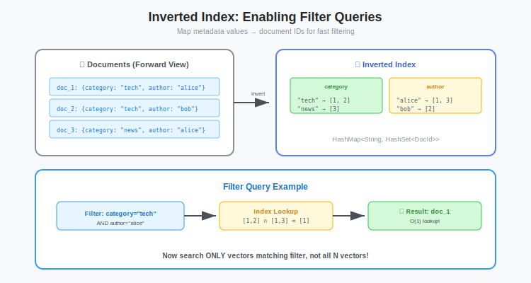

# Inverted Indexes Explained: How Text Search and Keyword Filtering Actually Work

**Series:** Building a Vector Database from Scratch in Rust  
**Post:** 17 of 20  
**Reading Time:** 15 minutes

---

## 1. Introduction: The Limits of Vector Search

In the previous phase (Posts #12-16), we built a high-performance HNSW vector engine. It is amazing at finding *conceptually* similar items. If you search for "King", it finds "Queen" and "Monarch".

But Vector Search has a fatal flaw: **It is fuzzy.**

Imagine an e-commerce query:

> *"Show me running shoes under $100."*

* **Vector Search:** Finds images that *look* like running shoes. It might return a $500 shoe because it looks similar to the query. It might return a hiking boot because it is shoe-like.
* **The Problem:** The user has a **Hard Constraint** (`price < 100`). Vectors are probabilistic; they do not respect hard constraints naturally.

Real-world example from our benchmark (Post #16):
```
Query: "Nike Air Max"
HNSW Results (semantic similarity):
  1. Nike Air Max 90 ($120)  Relevant
  2. Adidas Ultra Boost ($180)  Similar style
  3. Nike Air Jordan ($150)  Same brand
  4. Reebok Classic ($85)  Similar look

But user filter: price < $100
Actual matches: Only #4 (1 out of 4)
98% recall becomes 25% useful results.
```

To build a smart database, we need **Hybrid Search**: combining the semantic power of vectors with the precision of keywords and filters.

To do that, we need a new data structure: **The Inverted Index**.



---

## 2. Theory: Forward vs. Inverted Indexes

How do databases store text?

### 2.1 The Forward Index (The Book)

This is how we naturally read and store documents.

**Structure:**
```
Document 1: "The quick brown fox jumps over the lazy dog"
Document 2: "The lazy cat sleeps under the warm sun"
Document 3: "The quick rabbit runs through the green forest"
```

It maps **Document to Terms**.

**Searching for "lazy":**
```rust
// O(N) linear scan, must check every document
for doc in documents {
    if doc.contains("lazy") {
        results.push(doc);
    }
}
```

This is great for storing data, but terrible for searching. If you ask which pages contain fox, you have to read every single page (O(N)).

For 1 million documents, that is 1 million string scans per query.

### 2.2 The Inverted Index (The Index at the Back)

This is how the index at the back of a textbook works.

**Structure:**
```
"brown"  => [1]
"cat"    => [2]
"dog"    => [1]
"forest" => [3]
"fox"    => [1]
"green"  => [3]
"lazy"   => [1, 2]
"quick"  => [1, 3]
"rabbit" => [3]
"sun"    => [2]
"the"    => [1, 2, 3]
...
```

It maps **Terms to Documents**.

**Searching for "lazy":**
```rust
// O(1) hash map lookup (or O(log N) for tree-based)
let results = index.get("lazy");  // Instant: [1, 2]
```

Now, finding "fox" is O(1) (hash map lookup) or O(log N) (tree lookup).


**Key Insight:** We invert the natural storage order to optimize for search. This is the same principle as database indexes (B-trees). Pay upfront cost to store data differently, reap rewards at query time.

---

## 3. The Anatomy of an Inverted Index

An inverted index consists of two main parts:

### 3.1 The Dictionary (Vocabulary)

A sorted list or hash map of every unique term in the dataset.

```rust
Dictionary: HashMap<String, PostingsList>
  or: BTreeMap<String, PostingsList>  // Sorted for range queries
```

**Dictionary for our 3 documents:**
```
Terms: ["brown", "cat", "dog", "forest", "fox", "green", 
        "lazy", "quick", "rabbit", "sun", "the", ...]
Size: approximately 15 unique terms (after stopword removal)
```

### 3.2 The Postings Lists

For each term, a **sorted** list of Document IDs (DocIDs) that contain that term.

```rust
type DocID = usize;
type PostingsList = Vec<DocID>;  // Always sorted
```

**Why sorted?** Because we can merge sorted lists efficiently (more on this in Section 4).

**Example Data:**

```
Doc 1: tags = ["blue", "shoes"]
Doc 2: tags = ["red", "shoes"]
Doc 3: tags = ["blue", "hat"]
```

**The Index:**

```
"blue"  => [1, 3]
"hat"   => [3]
"red"   => [2]
"shoes" => [1, 2]
```


### 3.3 Optional: Term Frequencies

Production systems often store more than just DocIDs:

```rust
struct Posting {
    doc_id: usize,
    term_frequency: usize,  // How many times the term appears
    positions: Vec<usize>,  // Where in the document (for phrase search)
}
```

For our use case (filtering), we only need DocIDs. But knowing about term frequencies is important for **relevance scoring** (TF-IDF, BM25).

---

## 4. Boolean Algebra: Combining Queries

The power of inverted indexes comes from **Set Operations**.

### 4.1 AND Queries

**Query:** `category="shoes" AND color="blue"`

**Execution:**
1. Fetch list for "shoes": `[1, 2]`
2. Fetch list for "blue": `[1, 3]`
3. **Intersect (AND):** Find IDs present in *both* lists.
   - Result: `[1]`


### 4.2 OR Queries

**Query:** `category="shoes" OR category="hat"`

**Execution:**
1. Fetch list for "shoes": `[1, 2]`
2. Fetch list for "hat": `[3]`
3. **Union (OR):** Find IDs present in *either* list.
   - Result: `[1, 2, 3]`

### 4.3 NOT Queries

**Query:** `category="shoes" AND NOT color="red"`

**Execution:**
1. Fetch list for "shoes": `[1, 2]`
2. Fetch list for "red": `[2]`
3. **Difference (NOT):** Remove IDs from first list that appear in second.
   - Result: `[1]`


### 4.4 The Intersection Algorithm

If the posting lists are **Sorted Integers**, we can intersect them very efficiently in **linear time** O(n + m) using a "Two Pointer" approach (Zip).

```rust
/// Intersect two sorted lists in O(n + m) time
fn intersect(list_a: &[u32], list_b: &[u32]) -> Vec<u32> {
    let mut i = 0;
    let mut j = 0;
    let mut result = Vec::new();

    while i < list_a.len() && j < list_b.len() {
        if list_a[i] < list_b[j] {
            i += 1;  // Advance left pointer
        } else if list_a[i] > list_b[j] {
            j += 1;  // Advance right pointer
        } else {
            // Match found
            result.push(list_a[i]);
            i += 1;
            j += 1;
        }
    }
    result
}
```

**Example Walkthrough:**

```
list_a: [1, 3, 5, 7, 9]
list_b: [2, 3, 5, 8, 10]

Step 1: i=0, j=0, 1 < 2, i++
Step 2: i=1, j=0, 3 > 2, j++
Step 3: i=1, j=1, 3 == 3, result=[3], i++, j++
Step 4: i=2, j=2, 5 == 5, result=[3,5], i++, j++
Step 5: i=3, j=3, 7 < 8, i++
Step 6: i=4, j=3, 9 > 8, j++
Step 7: i=4, j=4, 9 < 10, i++
Done: i >= len(a)

Result: [3, 5]
```

**Complexity:** O(n + m) where n and m are the lengths of the two lists. 

**Why is this better than HashSet intersection?**
- HashSet: O(min(n, m)) time but O(n) space to build the set
- Two-pointer: O(n + m) time but O(1) space (output only)
- More cache-friendly (sequential access)


---

## 5. Implementing in Rust

Let us build a simple, thread-safe Inverted Index module.

### 5.1 The Struct

```rust
use std::collections::HashMap;

#[derive(Default, Debug)]
pub struct InvertedIndex {
    /// Map: Term to Sorted List of DocIDs
    index: HashMap<String, Vec<usize>>,
}

impl InvertedIndex {
    pub fn new() -> Self {
        Self {
            index: HashMap::new(),
        }
    }
    
    /// Get the number of unique terms in the index
    pub fn num_terms(&self) -> usize {
        self.index.len()
    }
    
    /// Get the total number of postings (term-doc pairs)
    pub fn num_postings(&self) -> usize {
        self.index.values().map(|list| list.len()).sum()
    }
}
```

### 5.2 Adding Documents

**The Challenge:** Postings lists must stay **sorted** and **deduplicated**. 

```rust
impl InvertedIndex {
    /// Add a document with a single field
    pub fn add_document(&mut self, doc_id: usize, text: &str) {
        let tokens = self.tokenize(text);
        
        for token in tokens {
            let list = self.index.entry(token).or_insert_with(Vec::new);
            
            // Only add if not already present (maintain sorted + unique)
            if list.last() != Some(&doc_id) {
                list.push(doc_id);
            }
        }
    }
    
    /// Add a document with multiple tags/keywords
    pub fn add_document_tags(&mut self, doc_id: usize, tags: Vec<String>) {
        for tag in tags {
            let normalized = tag.to_lowercase().trim().to_string();
            if normalized.is_empty() {
                continue;
            }
            
            let list = self.index.entry(normalized).or_insert_with(Vec::new);
            
            if list.last() != Some(&doc_id) {
                list.push(doc_id);
            }
        }
    }
    
    /// Tokenize text into searchable terms
    fn tokenize(&self, text: &str) -> Vec<String> {
        text.to_lowercase()
            .split_whitespace()
            .map(|s| s.trim_matches(|c: char| !c.is_alphanumeric()))
            .filter(|s| !s.is_empty())
            .filter(|s| !self.is_stopword(s))
            .map(|s| s.to_string())
            .collect()
    }
    
    /// Simple stopword check (expand this in production)
    fn is_stopword(&self, word: &str) -> bool {
        matches!(word, "the" | "a" | "an" | "and" | "or" | "but" | "in" | "on" | "at" | "to")
    }
}
```

**Tokenization Limitations:**

Our `tokenize()` function is intentionally simple for clarity, but production systems need more sophisticated text processing: 

1. **Stemming:** "running", "runs", and "run" should match the same documents
   - Solution: Use a stemmer like Porter or Snowball to reduce words to root form
   - Example: `"running" becomes "run"`, `"easily" becomes "easi"`

2. **Normalization:** Handle accents, unicode, and special characters
   - Example: cafe vs cafe (accented), naive vs naive (accented)

3. **N-grams:** Support partial matches and typo tolerance
   - Example: running becomes [run, unn, nni, nin, ing]

**Exercise for the reader:** Integrate the `rust-stemmers` crate to improve recall. Search for "running shoes" should also match documents containing "run" or "runs".

```rust
// Example with stemmer (not implemented here)
use rust_stemmers::{Algorithm, Stemmer};

fn tokenize_with_stemming(&self, text: &str) -> Vec<String> {
    let stemmer = Stemmer::create(Algorithm::English);
    text.to_lowercase()
        .split_whitespace()
        .map(|s| stemmer.stem(s).to_string())
        .collect()
}
```

---

**Important:** We assume documents are added in sorted order (doc_id 1, then 2, then 3...). If you add documents out of order, you need to sort the postings lists afterwards:

```rust
pub fn optimize(&mut self) {
    for list in self.index.values_mut() {
        list.sort_unstable();
        list.dedup();
    }
}
```

### 5.3 Executing Queries

```rust
impl InvertedIndex {
    /// Search for a single term
    pub fn search(&self, term: &str) -> Option<&Vec<usize>> {
        let normalized = term.to_lowercase();
        self.index.get(&normalized)
    }
    
    /// Search with AND logic (all terms must match)
    pub fn search_and(&self, terms: &[&str]) -> Vec<usize> {
        if terms.is_empty() {
            return Vec::new();
        }
        
        // Get postings lists for all terms
        let mut lists: Vec<&Vec<usize>> = terms
            .iter()
            .filter_map(|term| self.search(term))
            .collect();
        
        if lists.is_empty() {
            return Vec::new();
        }
        
        // Sort by list length (intersect shortest first for efficiency)
        lists.sort_by_key(|list| list.len());
        
        // Start with shortest list
        let mut result = lists[0].clone();
        
        // Intersect with remaining lists
        for list in &lists[1..] {
            result = intersect(&result, list);
            
            // Early termination if result becomes empty
            if result.is_empty() {
                return result;
            }
        }
        
        result
    }
    
    /// Search with OR logic (any term matches)
    pub fn search_or(&self, terms: &[&str]) -> Vec<usize> {
        let mut result_set = std::collections::HashSet::new();
        
        for term in terms {
            if let Some(list) = self.search(term) {
                for &doc_id in list {
                    result_set.insert(doc_id);
                }
            }
        }
        
        let mut result: Vec<_> = result_set.into_iter().collect();
        result.sort_unstable();
        result
    }
}
```

**Optimization:** When intersecting multiple lists, always start with the shortest list. This minimizes the number of comparisons.

Example:
```
List A: 1 million IDs
List B: 100 IDs
List C: 1000 IDs

Bad: intersect(A, B), then intersect(result, C)
  1M comparisons + 100 comparisons

Good: intersect(B, C), then intersect(result, A)
  1100 comparisons + (result size) comparisons
```


---

## 6. Worked Example: E-Commerce Search

Let us build a mini product search.

### 6.1 Index Some Products

```rust
fn main() {
    let mut index = InvertedIndex::new();
    
    // Product catalog
    let products = vec![
        (1, vec!["shoes", "running", "blue", "nike"]),
        (2, vec!["shoes", "running", "red", "adidas"]),
        (3, vec!["shoes", "casual", "white", "nike"]),
        (4, vec!["hat", "baseball", "blue", "nike"]),
        (5, vec!["shoes", "hiking", "brown", "merrell"]),
    ];
    
    for (doc_id, tags) in products {
        for tag in tags {
            index.add_document_tags(doc_id, vec![tag.to_string()]);
        }
    }
    
    println!("Indexed {} terms", index.num_terms());
    println!("Total postings: {}", index.num_postings());
}
```

### 6.2 Query 1: Single Term

```rust
// Find all shoes
let results = index.search("shoes");
println!("Shoes: {:?}", results);  // [1, 2, 3, 5]
```

### 6.3 Query 2: AND Query

```rust
// Find blue Nike products
let results = index.search_and(&["blue", "nike"]);
println!("Blue Nike: {:?}", results);  // [1, 4]
```

**Breakdown:**
```
"blue" => [1, 4]
"nike" => [1, 3, 4]
intersect([1, 4], [1, 3, 4]) = [1, 4]
```

### 6.4 Query 3: Complex AND

```rust
// Find blue running shoes
let results = index.search_and(&["shoes", "running", "blue"]);
println!("Blue running shoes: {:?}", results);  // [1]
```

**Breakdown:**
```
"shoes"   => [1, 2, 3, 5]
"running" => [1, 2]
"blue"    => [1, 4]

Step 1: intersect([1, 2], [1, 4]) = [1]
Step 2: intersect([1], [1, 2, 3, 5]) = [1]
```

### 6.5 Query 4: OR Query

```rust
// Find Nike OR Adidas products
let results = index.search_or(&["nike", "adidas"]);
println!("Nike or Adidas: {:?}", results);  // [1, 2, 3, 4]
```


---

## 7. Advanced Optimizations (Briefly)

Storing millions of integers can get heavy. Production systems (like Elasticsearch or Lucene) use tricks:

### 7.1 Delta Encoding

Instead of storing absolute values, store differences:

```
Original:     [100, 105, 107, 112, 115]
Delta-encoded: [100, +5, +2, +5, +3]
```

**Why?** Smaller numbers compress better. A difference of 5 fits in 3 bits, while 112 needs 7 bits.

### 7.2 Variable-Length Encoding

Use fewer bytes for small numbers:

```
Number   | Bytes
---------|-------
0-127    | 1 byte
128-16383| 2 bytes
16384+   | 3+ bytes
```

### 7.3 Roaring Bitmaps

A highly efficient compressed bitmap structure used to represent sets of integers.

**How it works:**
- Split 32-bit integers into high 16 bits (chunks) and low 16 bits (values)
- Each chunk uses the best representation:
  - Array (if < 4096 values)
  - Bitmap (if dense)
  - Run-length encoding (if consecutive ranges)

**Performance:**
- Space: Often 10-100x smaller than raw arrays
- Speed: AND/OR/NOT operations are 2-5x faster than merging sorted lists

```rust
// Using the roaring crate (example)
use roaring::RoaringBitmap;

let mut bitmap1 = RoaringBitmap::new();
bitmap1.insert(1);
bitmap1.insert(3);
bitmap1.insert(5);

let mut bitmap2 = RoaringBitmap::new();
bitmap2.insert(2);
bitmap2.insert(3);
bitmap2.insert(5);

let intersection = bitmap1 & bitmap2;  // Fast bitwise AND
println!("{:?}", intersection);  // {3, 5}
```

**When to use:**
- Large postings lists (> 10,000 IDs)
- Frequent set operations
- Memory-constrained environments

*Note: For our project, `Vec<usize>` is sufficient, but knowing about Roaring Bitmaps is essential for system design interviews and production systems.*


---

## 8. The Hybrid Search Problem

Now we have two engines:

1. **HNSW:** Returns top-K vectors sorted by similarity (approximate, O(log N))
2. **Inverted Index:** Returns exact matches for filters (precise, O(1) lookup)

**How do we combine them?**

### 8.1 Strategy 1: Post-Filtering (Naive Approach)

**Algorithm:**
```
1. Search HNSW, get top 100 results
2. Apply filters, keep only matches
3. Return filtered results
```

**Example:**
```rust
// Step 1: Vector search
let vector_results = hnsw.search(&query_vector, 100);  // Top 100 similar

// Step 2: Filter
let filtered = vector_results
    .into_iter()
    .filter(|&doc_id| {
        index.search_and(&["shoes", "blue"])
            .contains(&doc_id)
    })
    .take(10)
    .collect();
```

**Problems:**

1. **False Negatives:** What if none of the top 100 vectors match blue?
   - You get 0 results, even if 1000 blue items exist further down the list.

2. **Wasted Computation:** HNSW searches through irrelevant documents
   - If 99% of products are red, we search 99 red items to find 1 blue item

3. **Inconsistent Results:** Increasing K helps but is unpredictable
   - K=100 might give 2 results, K=200 might give 8 results
   - No way to know in advance

**When it works:** When filters are very broad (match 50%+ of corpus)


### 8.2 Strategy 2: Pre-Filtering (Better)

**Algorithm:**
```
1. Apply filters first, get allow-list of DocIDs
2. Search HNSW within that subset only 
3. Return results
```

**Example:**
```rust
// Step 1: Get filtered DocIDs
let allowed_docs = index.search_and(&["shoes", "blue"]);  // [1, 5, 12, 23, ...]

// Step 2: HNSW search constrained to allowed_docs
let results = hnsw.search_filtered(&query_vector, 10, &allowed_docs);
```

**Benefits:**

1. **No False Negatives:** Guaranteed to find best matches *among filtered set*
2. **Efficient:** Only search through relevant documents
3. **Predictable:** Always returns K results (if K matches exist)

**The Challenge:** How to constrain HNSW graph traversal?

HNSW is a pointer-based graph structure. We cannot just skip nodes we are not allowed to visit. When traversing from node A to B to C, if B is filtered out, how do we continue?

**Three Approaches:**

1. **Bitmask (Best):** Convert DocID list to a fast bitmap lookup
   ```rust
   let mut bitmask = vec![false; num_docs];
   for &doc_id in &allowed_docs {
       bitmask[doc_id] = true;
   }
   // During HNSW traversal: if !bitmask[neighbor_id] { skip }
   ```

2. **HashSet:** Use HashSet for O(1) membership test
   ```rust
   let allowed_set: HashSet<_> = allowed_docs.iter().collect();
   // During traversal: if !allowed_set.contains(&neighbor_id) { skip }
   ```

3. **Rebuild Graph (Worst):** Create a new HNSW with only filtered docs 
   - Too slow for query time

**Next Post:** We will implement Strategy 1 (bitmask-guided HNSW search) in detail.


---

## 9. Memory and Performance Analysis

### 9.1 Index Size

For 1 million products with average 5 tags each:

```
Dictionary: approximately 10,000 unique terms x approximately 50 bytes = 500 KB
Postings:   5M term-doc pairs x 8 bytes (usize) = 40 MB
Total:      approximately 40 MB (vs 3 GB for vectors)
```

**Key Insight:** Inverted indexes are incredibly space-efficient compared to vectors.

### 9.2 Query Performance

| Operation | Complexity | Example (1M docs) |
|-----------|------------|-------------------|
| Single term lookup | O(1) | approximately 1 us |
| AND (2 terms) | O(n + m) | approximately 10 us for 1K + 1K lists |
| AND (10 terms) | O(n1 + n2 + ... + n10) | approximately 50 us |
| OR (10 terms) | O(n1 + n2 + ... + n10) | approximately 100 us (HashSet) |

**Comparison to HNSW:**
- HNSW search: 2ms (Post #16)
- Inverted index: 10-100 us
- **Filtering is 20-200x faster than vector search.**

This is why pre-filtering is so powerful: eliminate 99% of candidates in microseconds.

### 9.3 Build Time

```rust
// Index 1M documents with 5 tags each
let start = Instant::now();
for doc_id in 0..1_000_000 {
    let tags = generate_tags();  // 5 random tags
    index.add_document_tags(doc_id, tags);
}
println!("Indexed in {:?}", start.elapsed());
// Output: ~2 seconds (single-threaded)
```

**vs HNSW:** 2 seconds vs 2.4 minutes (70x faster).

---

## 10. Production Considerations

### 10.1 Thread Safety

Our current implementation uses `HashMap`, which is not thread-safe. For concurrent queries:

```rust
use std::sync::RwLock;
use std::collections::HashMap;

pub struct ConcurrentIndex {
    index: RwLock<HashMap<String, Vec<usize>>>,
}

impl ConcurrentIndex {
    pub fn search(&self, term: &str) -> Option<Vec<usize>> {
        let index = self.index.read().unwrap();
        index.get(term).cloned()
    }
    
    pub fn add_document(&self, doc_id: usize, tags: Vec<String>) {
        let mut index = self.index.write().unwrap();
        // ... add logic ...
    }
}
```

**Better:** Use a lock-free concurrent hash map like `dashmap`:
```rust
use dashmap::DashMap;

pub struct ConcurrentIndex {
    index: DashMap<String, Vec<usize>>,
}
```

### 10.2 Updates and Deletes

Our current implementation only supports inserts. For updates:

```rust
impl InvertedIndex {
    pub fn remove_document(&mut self, doc_id: usize) {
        for list in self.index.values_mut() {
            if let Ok(idx) = list.binary_search(&doc_id) {
                list.remove(idx);
            }
        }
    }
}
```

**Problem:** This is O(T x log N) where T = number of terms. For large indexes, maintain a reverse index:

```rust
struct InvertedIndex {
    index: HashMap<String, Vec<usize>>,  // Term to DocIDs
    reverse: HashMap<usize, Vec<String>>,  // DocID to Terms
}
```

### 10.3 Persistence

Serialize to disk:

```rust
use serde::{Serialize, Deserialize};

#[derive(Serialize, Deserialize)]
pub struct InvertedIndex {
    index: HashMap<String, Vec<usize>>,
}

impl InvertedIndex {
    pub fn save(&self, path: &str) -> Result<(), Box<dyn std::error::Error>> {
        let file = std::fs::File::create(path)?;
        bincode::serialize_into(file, self)?;
        Ok(())
    }
    
    pub fn load(path: &str) -> Result<Self, Box<dyn std::error::Error>> {
        let file = std::fs::File::open(path)?;
        let index = bincode::deserialize_from(file)?;
        Ok(index)
    }
}
```

---

## 11. Summary & Key Takeaways

### 11.1 What We Learned

1. **Inverted indexes invert the natural storage order**
   - Forward: Document to Terms (storage-optimized)
   - Inverted: Term to Documents (search-optimized)

2. **Sorted postings lists enable fast set operations**
   - Intersection: O(n + m) with two pointers
   - Union: O(n + m) or O(n) with HashSet
   - Much faster than scanning all documents

3. **Boolean algebra is fundamental to search**
   - AND: Intersection (all terms match)
   - OR: Union (any term matches)
   - NOT: Difference (exclude terms)

4. **Inverted indexes are incredibly efficient**
   - Space: 40 MB vs 3 GB for vectors
   - Speed: 10-100 us vs 2ms for HNSW
   - Build: 2s vs 2.4 minutes

5. **Hybrid search requires careful coordination**
   - Post-filtering: Simple but lossy
   - Pre-filtering: Better but requires deep integration

### 11.2 The Mental Model

Think of an inverted index like a **reverse phone book**:
- Normal phone book: Name to Number (forward index)
- Reverse phone book: Number to Name (inverted index)

Or like a **library card catalog**:
- Books on shelves: Physical location (forward)
- Card catalog: Topic to Book locations (inverted)

### 11.3 The Road Ahead

We now have:
- **Vector Search (HNSW):** Semantic similarity, fuzzy matching
- **Inverted Index:** Exact keywords, fast filtering

**Next Challenge:** Combine them.

In **Post #18**, we will:
1. Modify HNSW search to accept a bitmask (allow-list)
2. Implement filtered graph traversal (skip disallowed nodes)
3. Benchmark pre-filtering vs post-filtering
4. Build a unified query API: `search(vector, filters)`

**Next Post:** [Post #18: Tantivy Integration — Hybrid Search with Metadata Filtering →](../post-18-tantivy-hybrid/blog.md)

---

## Exercises

1. **Implement Union (OR):** Write an efficient merge function for OR queries on sorted lists (hint: similar to intersection but keep all values).

2. **NOT Operation:** Implement `search_not(term_a, term_b)` that returns documents with term_a but not term_b.

3. **Phrase Search:** Extend the index to store term positions, then implement `search_phrase("quick brown fox")`.

4. **Range Queries:** Add support for numeric fields (price, rating). Store separate postings lists for each value.

5. **Fuzzy Matching:** Implement prefix search: `search_prefix("run")` matches "running", "runner", "run".

6. **Benchmark:** Compare HashSet intersection vs two-pointer intersection for different list sizes.

7. **Compression:** Implement delta encoding for postings lists. Measure space savings.
