# Vector Math for Developers: Linear Algebra Basics, Dot Product, and Cosine Similarity

> **TL;DR.** This post teaches the three pieces of linear algebra that power every vector search: magnitude (L2 norm), the dot product, and cosine similarity. You will implement each as a small, tested Rust math kernel, learn why cosine similarity beats Euclidean distance for semantic search, and pre-normalize vectors so that similarity collapses into a single dot product per comparison.
>
> **What you will build:**
> - A `vector_math` module with `magnitude`, `dot_product`, `cosine_similarity`, and `euclidean_distance`
> - A `normalize` step that runs on insert so search avoids square roots entirely
> - A unit test suite covering identical, opposite, perpendicular, and zero vectors
> - An understanding of how LLVM auto-vectorizes these loops into SIMD instructions

---

## 1. Introduction: The Engine Under the Hood

In the [previous post on concurrency control](../10-concurrency/index.md) we wrapped our storage engine in `Arc`, `RwLock`, and `Mutex` so many readers and writers could share state safely. That gave us a database that is fast, crash-safe, and concurrent, but it is still just a bit bucket: it stores data without *understanding* it. This post adds the math kernels that turn stored bytes into a notion of similarity, the foundation every later search engine will call.

We have built a storage engine that is fast, crash-safe, and concurrent. But currently, our database is just a bit bucket. It stores data, but it does not *understand* it.

To make it a **Vector** Database, we need to teach it Math.

You do not need a PhD in Linear Algebra to build a vector DB, but you do need to understand three core concepts: **Magnitude**, **Dot Product**, and **Cosine Similarity**. These three formulas power almost every AI application in existence, from ChatGPT to recommendation systems.

In this post, we will stop being systems engineers for a moment and become math engineers. We will implement the core mathematical kernels that run millions of times per search query.

---

## 2. What is a Vector?

To a programmer, a vector is just `Vec<f32>`.

To a mathematician, a vector is an arrow in space with **Direction** and **Magnitude**.

### 2.1 The Coordinate Space

If we have a vector `v = [3, 4]`:

- It sits at point (x=3, y=4) in 2D space
- It has a **direction** (pointing toward that coordinate)
- It has a **magnitude** (how far from the origin)

In the context of AI:

- The vector represents a **concept** (e.g., "Dog")
- Nearby vectors represent **similar concepts** (e.g., "Puppy", "Canine")
- Distant vectors represent **unrelated concepts** (e.g., "Refrigerator")

### 2.2 Dimensions in the Real World

In AI, we don't use 2 dimensions; we use hundreds or thousands:

| Model | Dimensions |
|-------|------------|
| Word2Vec | 300 |
| BERT | 768 |
| OpenAI Ada-002 | 1536 |
| OpenAI text-embedding-3-large | 3072 |

The math is exactly the same, just harder to visualize.



---

## 3. The Core Operations

### 3.1 Magnitude (The Length)

How long is the arrow? We use the **Pythagorean Theorem**, also called the Euclidean Norm or L2 Norm.

For a 2D vector `[3, 4]`:

$$\|v\| = \sqrt{3^2 + 4^2} = \sqrt{9 + 16} = \sqrt{25} = 5$$

For an n-dimensional vector:

$$\|v\| = \sqrt{\sum_{i=1}^{n} v_i^2}$$

**Rust Implementation:**

```rust
/// Calculate the magnitude (L2 norm) of a vector
pub fn magnitude(v: &[f32]) -> f32 {
    v.iter()
        .map(|x| x * x)
        .sum::<f32>()
        .sqrt()
}

#[test]
fn test_magnitude() {
    assert_eq!(magnitude(&[3.0, 4.0]), 5.0);
    assert_eq!(magnitude(&[1.0, 0.0, 0.0]), 1.0);
}
```

### 3.2 The Dot Product

This is the most important operation in deep learning. It is the sum of the products of corresponding entries.

$$a \cdot b = \sum_{i=1}^{n} a_i \times b_i$$

For `a = [1, 2, 3]` and `b = [4, 5, 6]`:

$$a \cdot b = (1 \times 4) + (2 \times 5) + (3 \times 6) = 4 + 10 + 18 = 32$$

**Rust Implementation:**

```rust
/// Calculate the dot product of two vectors
pub fn dot_product(a: &[f32], b: &[f32]) -> f32 {
    assert_eq!(a.len(), b.len(), "Dimension mismatch");
    
    a.iter()
        .zip(b.iter())
        .map(|(x, y)| x * y)
        .sum()
}

#[test]
fn test_dot_product() {
    assert_eq!(dot_product(&[1.0, 2.0, 3.0], &[4.0, 5.0, 6.0]), 32.0);
}
```

### 3.3 Geometric Meaning of Dot Product

The dot product tells us how much two vectors "align" with each other:

| Dot Product | Meaning | Angle |
|-------------|---------|-------|
| **Positive (large)** | Pointing in similar direction | < 90° |
| **Zero** | Perpendicular (orthogonal) | = 90° |
| **Negative** | Pointing in opposite directions | > 90° |

This is why the dot product is so useful for similarity: it captures **directional alignment**.

---

## 4. Similarity Metrics

How do we decide if the concept of King is close to Queen? We need a way to measure similarity.

### 4.1 Euclidean Distance (L2 Distance)

Measure the straight-line distance between the tips of the arrows.

$$d(a, b) = \sqrt{\sum_{i=1}^{n} (a_i - b_i)^2}$$

**Rust Implementation:**

```rust
/// Calculate the Euclidean distance between two vectors
pub fn euclidean_distance(a: &[f32], b: &[f32]) -> f32 {
    assert_eq!(a.len(), b.len(), "Dimension mismatch");
    
    a.iter()
        .zip(b.iter())
        .map(|(x, y)| (x - y).powi(2))
        .sum::<f32>()
        .sqrt()
}

#[test]
fn test_euclidean_distance() {
    let a = [0.0, 0.0];
    let b = [3.0, 4.0];
    assert_eq!(euclidean_distance(&a, &b), 5.0);
}
```

**When to use Euclidean Distance:**

- Spatial data (GPS coordinates, physical locations)
- When magnitude matters

**The Problem (Curse of Dimensionality):**

In high dimensions (768+), all points tend to become **equidistant**. The difference between the nearest and farthest neighbor shrinks, making Euclidean distance less useful for semantic search.

### 4.2 Cosine Similarity (The Gold Standard)

Measures the **angle** between vectors, ignoring their length.

$$\cos(\theta) = \frac{a \cdot b}{\|a\| \times \|b\|}$$

**Range:** -1 to +1

| Value | Meaning |
|-------|---------|
| **1.0** | Identical direction (same concept) |
| **0.0** | Perpendicular (unrelated concepts) |
| **-1.0** | Opposite direction (antonyms) |

**Why is this better for AI?**

In many embedding models, a longer vector might just mean a word appeared more frequently in the training data, not that it is semantically different. Cosine similarity normalizes this out and only cares about **direction**.

---

## 5. Implementing in Rust

Let us build a clean, efficient math module for our database.

### 5.1 The Complete Implementation

```rust
/// Vector math utilities for similarity search
pub mod vector_math {
    /// Calculate the magnitude (L2 norm) of a vector
    pub fn magnitude(v: &[f32]) -> f32 {
        v.iter()
            .map(|x| x * x)
            .sum::<f32>()
            .sqrt()
    }

    /// Calculate the dot product of two vectors
    pub fn dot_product(a: &[f32], b: &[f32]) -> f32 {
        debug_assert_eq!(a.len(), b.len(), "Dimension mismatch");
        
        a.iter()
            .zip(b.iter())
            .map(|(x, y)| x * y)
            .sum()
    }

    /// Calculate cosine similarity between two vectors
    /// Returns a value in the range [-1, 1]
    pub fn cosine_similarity(a: &[f32], b: &[f32]) -> f32 {
        // 1. Validate dimensions
        if a.len() != b.len() {
            panic!("Dimension mismatch: {} vs {}", a.len(), b.len());
        }
        
        // 2. Compute components
        let dot = dot_product(a, b);
        let mag_a = magnitude(a);
        let mag_b = magnitude(b);
        
        // 3. Handle zero vectors (prevent division by zero)
        if mag_a == 0.0 || mag_b == 0.0 {
            return 0.0;
        }
        
        // 4. Compute similarity
        dot / (mag_a * mag_b)
    }

    /// Calculate Euclidean distance between two vectors
    pub fn euclidean_distance(a: &[f32], b: &[f32]) -> f32 {
        debug_assert_eq!(a.len(), b.len(), "Dimension mismatch");
        
        a.iter()
            .zip(b.iter())
            .map(|(x, y)| (x - y).powi(2))
            .sum::<f32>()
            .sqrt()
    }

    /// Normalize a vector to unit length (magnitude = 1)
    pub fn normalize(v: &[f32]) -> Vec<f32> {
        let mag = magnitude(v);
        if mag == 0.0 {
            return vec![0.0; v.len()];
        }
        v.iter().map(|x| x / mag).collect()
    }
}
```

### 5.2 Testing the Implementation

```rust
#[cfg(test)]
mod tests {
    use super::vector_math::*;

    #[test]
    fn test_identical_vectors() {
        let v = [1.0, 2.0, 3.0];
        assert!((cosine_similarity(&v, &v) - 1.0).abs() < 1e-6);
    }

    #[test]
    fn test_opposite_vectors() {
        let a = [1.0, 0.0];
        let b = [-1.0, 0.0];
        assert!((cosine_similarity(&a, &b) - (-1.0)).abs() < 1e-6);
    }

    #[test]
    fn test_perpendicular_vectors() {
        let a = [1.0, 0.0];
        let b = [0.0, 1.0];
        assert!(cosine_similarity(&a, &b).abs() < 1e-6);
    }

    #[test]
    fn test_normalize() {
        let v = normalize(&[3.0, 4.0]);
        assert!((magnitude(&v) - 1.0).abs() < 1e-6);
    }
}
```

---

## 6. Optimization: Pre-computation and Normalization

### 6.1 The Problem

Calculating magnitude involves a square root (`sqrt`). Square roots are **slow**.

If we have 1 million vectors and run `magnitude(v)` every time we search, we are wasting CPU cycles:

```rust
// Every search does this 1,000,000 times:
for stored_vector in all_vectors {
    let score = cosine_similarity(&query, &stored_vector);
    //          calls sqrt() TWICE per comparison
}
```

That is **2 million square roots** per search.

### 6.2 The Solution: Normalize on Insert

If we normalize vectors when they are inserted, their magnitude is always 1.0:

```rust
// On INSERT (once):
let normalized = normalize(&user_vector);
store.insert(id, normalized);

// On SEARCH (every query):
for stored in all_vectors {
    // stored is already normalized (magnitude = 1.0)
    let score = dot_product(&query_normalized, &stored);
    // No sqrt() needed
}
```

### 6.3 Why This Works

For normalized vectors where $\|a\| = 1$ and $\|b\| = 1$:

$$\cos(\theta) = \frac{a \cdot b}{\|a\| \times \|b\|} = \frac{a \cdot b}{1 \times 1} = a \cdot b$$

**Cosine similarity becomes a simple dot product!**

```rust
/// Cosine similarity for pre-normalized vectors
/// Assumes both a and b have magnitude = 1.0
pub fn cosine_similarity_normalized(a: &[f32], b: &[f32]) -> f32 {
    dot_product(a, b)  // That is it
}
```

### 6.4 Trade-offs

| Approach | Insert Cost | Search Cost | Storage |
|----------|-------------|-------------|---------|
| Store raw | None | O(2 sqrt) per vector | Original |
| Store normalized | O(1 sqrt + 1 div) | O(1 dot product) | Original |
| Store both | O(1 sqrt) | Flexible | 2x |

For read-heavy workloads (which vector DBs are), **normalize on insert** is the clear winner.

---

## 7. SIMD: A Glimpse of Speed

Modern CPUs can multiply 8 or 16 numbers at once using **SIMD (Single Instruction, Multiple Data)** instructions:

- **SSE:** 4 × 32-bit floats
- **AVX2:** 8 × 32-bit floats
- **AVX-512:** 16 × 32-bit floats

### 7.1 Auto-Vectorization

Rust's iterator chain (`iter().map().sum()`) is extremely smart. The LLVM compiler often auto-vectorizes these loops into SIMD assembly:

```rust
// This innocent-looking code...
fn dot_product(a: &[f32], b: &[f32]) -> f32 {
    a.iter().zip(b).map(|(x, y)| x * y).sum()
}

// ...might compile to AVX2 instructions that process 8 floats at once
```

### 7.2 Checking Auto-Vectorization

You can inspect the generated assembly:

```bash
RUSTFLAGS="-C target-cpu=native" cargo rustc --release -- --emit=asm
```

Look for instructions like `vmulps` (AVX multiply), `vaddps` (AVX add).

### 7.3 When Auto-Vectorization Fails

Sometimes LLVM cannot figure it out. In [Post #12](../12-brute-force/index.md), we will:

1. Benchmark our naive implementation
2. Compare against hand-optimized SIMD
3. See if the difference matters

---

## 8. Putting It All Together

Here is our complete vector math module:

```rust
// src/math.rs

/// Vector mathematics for similarity search
pub struct VectorMath;

impl VectorMath {
    /// Magnitude (L2 norm)
    #[inline]
    pub fn magnitude(v: &[f32]) -> f32 {
        v.iter().map(|x| x * x).sum::<f32>().sqrt()
    }

    /// Dot product
    #[inline]
    pub fn dot(a: &[f32], b: &[f32]) -> f32 {
        a.iter().zip(b).map(|(x, y)| x * y).sum()
    }

    /// Cosine similarity (general case)
    #[inline]
    pub fn cosine(a: &[f32], b: &[f32]) -> f32 {
        let dot = Self::dot(a, b);
        let mag_a = Self::magnitude(a);
        let mag_b = Self::magnitude(b);
        
        if mag_a == 0.0 || mag_b == 0.0 {
            0.0
        } else {
            dot / (mag_a * mag_b)
        }
    }

    /// Cosine similarity for normalized vectors (fast path)
    #[inline]
    pub fn cosine_normalized(a: &[f32], b: &[f32]) -> f32 {
        Self::dot(a, b)
    }

    /// Euclidean distance
    #[inline]
    pub fn euclidean(a: &[f32], b: &[f32]) -> f32 {
        a.iter()
            .zip(b)
            .map(|(x, y)| (x - y).powi(2))
            .sum::<f32>()
            .sqrt()
    }

    /// Normalize to unit length
    pub fn normalize(v: &[f32]) -> Vec<f32> {
        let mag = Self::magnitude(v);
        if mag == 0.0 {
            vec![0.0; v.len()]
        } else {
            v.iter().map(|x| x / mag).collect()
        }
    }

    /// Normalize in place
    pub fn normalize_mut(v: &mut [f32]) {
        let mag = Self::magnitude(v);
        if mag != 0.0 {
            for x in v.iter_mut() {
                *x /= mag;
            }
        }
    }
}
```

---

## 9. Summary

We now have the mathematical foundation to compare vectors:

| Operation | Formula | Use Case |
|-----------|---------|----------|
| **Magnitude** | $\sqrt{\sum v_i^2}$ | Measuring vector length |
| **Dot Product** | $\sum a_i \times b_i$ | Fast similarity (normalized) |
| **Cosine Similarity** | $\frac{a \cdot b}{\|a\| \|b\|}$ | Semantic similarity |
| **Euclidean Distance** | $\sqrt{\sum (a_i - b_i)^2}$ | Spatial distance |

### Key Insights

1. **Cosine similarity** is the gold standard for semantic search
2. **Normalize on insert** to make search faster
3. **LLVM auto-vectorizes** simple iterator patterns
4. The math is simple, but the optimization is where it gets interesting

---

## 10. What's Next?

We have the math. Now we need to use it.

In the next post, we will implement **Brute Force Search (k-NN)**:

- Compare a query against every vector in the database
- Return the top-k most similar
- Benchmark: How fast is it? How slow does it get at scale?

This will set the stage for **HNSW** (Post #13), which makes search sublinear.

---

## Common pitfalls

- **Comparing vectors of different dimensions.** The dot product zips two slices and stops at the shorter one, so a 768-dim query against a 1536-dim vector will silently return a garbage score instead of crashing. Validate `a.len() == b.len()` up front (as `cosine_similarity` does) rather than trusting `zip` to catch it.
- **Forgetting to handle the zero vector.** A vector of all zeros has magnitude 0, and dividing by it gives `NaN`, which then poisons every comparison and sort that touches it. Guard the divisor: if either magnitude is 0, return 0.0 instead of computing `dot / 0.0`.
- **Mixing normalized and raw vectors in the same index.** The fast path `cosine_normalized` is only correct when *both* operands have magnitude 1.0. If you normalize on insert but forget to normalize the query (or vice versa), the dot product is no longer cosine similarity and your rankings quietly drift. Normalize the query the same way you normalize stored vectors.
- **Using `==` for floating-point comparisons in tests.** `assert_eq!(cosine_similarity(&v, &v), 1.0)` can fail because summing many `f32` products accumulates rounding error. Compare with a tolerance, for example `(score - 1.0).abs() < 1e-6`, as the test suite does.
- **Assuming Euclidean distance behaves like cosine similarity.** In high dimensions (768+) points tend toward being equidistant, so L2 distance loses discriminative power for semantic search. Reach for cosine similarity when you care about direction, and reserve Euclidean distance for genuinely spatial data.
- **Expecting auto-vectorization without measuring it.** LLVM often turns the iterator chains into AVX instructions, but not always: a missing `target-cpu` flag, a debug build, or an awkward loop shape can leave you on the scalar path. Inspect the emitted assembly for `vmulps`/`vaddps` and benchmark before claiming a speedup.

---

## What to read next

- **[The Brute Force Engine: Exact k-NN Search](../12-brute-force/index.md)**: put these kernels to work by scoring a query against every stored vector and returning the top-k, then measure exactly how slow that gets at scale.

---

## Further reading

- The Rust Programming Language (Klabnik and Nichols), chapters on iterators and closures: the foundation for the `iter().zip().map().sum()` patterns used in every kernel here. https://doc.rust-lang.org/book/
- Mikolov et al., "Efficient Estimation of Word Representations in Vector Space" (2013): the Word2Vec paper that popularized treating words as dense vectors whose directions encode meaning. https://arxiv.org/abs/1301.3781
- Aggarwal, Hinneburg, and Keim, "On the Surprising Behavior of Distance Metrics in High Dimensional Space" (2001): the classic analysis of why distances concentrate as dimensionality grows. https://bib.dbvis.de/uploadedFiles/155.pdf
- Intel Intrinsics Guide: reference for the AVX2/AVX-512 instructions (`vmulps`, `vaddps`) that LLVM emits when auto-vectorizing these loops. https://www.intel.com/content/www/us/en/docs/intrinsics-guide/index.html

Full citations in [REFERENCES.md](../../REFERENCES.md).

---

## Exercises

1. **Implement Manhattan Distance (L1):** $d = \sum \lvert a_i - b_i \rvert$. When might this be useful?

2. **Benchmark sqrt:** How many square roots can you compute per second? Is it really the bottleneck?

3. **Test with real embeddings:** Download a small Word2Vec model and find the most similar word to "king".

4. **Implement dot product with explicit SIMD:** Use the `std::arch` module to write AVX2 intrinsics.
