# The Brute Force Engine: Implementing Exact Nearest Neighbor Search (k-NN)

> **TL;DR.** This post builds the first real query engine for our vector database: exact k-Nearest Neighbor (k-NN) search, also called Flat or Brute Force search. You will learn why a fixed-size min-heap beats sorting every score, how to make `f32` scores orderable in Rust despite NaN, and how to search across both the in-memory MemTable and immutable on-disk segments while respecting tombstoned deletes. By the end you will have a 100% accurate baseline that later approximate algorithms (HNSW) can be measured against.
>
> **What you will build:**
> - A `Candidate` struct with a NaN-safe `Ord` implementation so scores can live in a `BinaryHeap`
> - A top-k min-heap (via `std::cmp::Reverse`) that keeps the best k results in O(N log k)
> - A `search` method that scans the MemTable and mmap segments, skipping deleted IDs via tombstones
> - A benchmark harness that exposes the O(N) scaling wall and motivates approximate search


*Brute force search scores the query against every vector, retaining only the top k results in a bounded heap.*

---

## 1. Introduction: Finding the Needle

This post sits at the hinge of the build: with storage (Posts 6 through 10) and the vector math from [Vector Math for Developers: Linear Algebra Basics, Dot Product, and Cosine Similarity](../11-vector-math/index.md) in place, we now wire them together into an actual query path. Everything from here on optimizes the search you implement today.

In the previous posts, we built the foundation:

- **Storage:** WAL and Memory-Mapped segments (Posts 6 through 10).
- **Math:** Cosine Similarity and Dot Product (Post #11).

Now, we connect them. We will build the **Query Engine**.

Our goal is to implement **k-Nearest Neighbor (k-NN)** search. Given a query vector, find the k vectors in our database that are most similar to it.

In this post, we will implement the brute force approach, also called Flat Search. It scans **every single vector** in the database.

**Why Brute Force?**

1. **Baseline:** It gives us ground truth to test approximate algorithms (like HNSW) against later.
2. **Simplicity:** It is easy to implement and debug.
3. **Perfect Accuracy:** It always returns the mathematically correct answer (Recall = 100%).

---

## 2. The Algorithm: Scan and Heap

Brute force search is simple, but we need to be efficient about how we track the best results.

### 2.1 The Naive Approach (Wrong)

1. Calculate similarity for ALL N vectors.
2. Store all N scores in a list.
3. Sort the list (O(N log N)).
4. Take the top k.

**Problem:** If we have 100 million vectors, sorting them all is incredibly slow and wasteful.

### 2.2 The Heap Approach (Right)

We use a **Priority Queue** (Min-Heap) of fixed size k.

1. Iterate through vectors one by one.
2. Calculate score S.
3. **If Heap has space (< k):** Push candidate.
4. **If Heap is full:** Compare S with the *worst* score in the heap (the root).
   - If S > worst, remove Root and push Candidate.
   - If S ≤ worst, discard Candidate.

**Complexity:** O(N · log k). Since k is small (e.g., 10), this is much faster than sorting.


---

## 3. Rust Implementation: The Candidate Heap

Rust's `std::collections::BinaryHeap` is a **Max-Heap** (pops the largest element).

For Top-K, we want to keep the *highest* scores, but efficiently evict the *lowest* of those top scores. This means we need a **Min-Heap**.

### 3.1 Defining the Candidate

We need a struct that holds the ID and Score. We must implement `Ord` carefully.

```rust
use std::cmp::Ordering;

#[derive(Debug, Clone, PartialEq)]
pub struct Candidate {
    pub id: String,
    pub score: f32,
}

// We implement Ord to order by score
// Note: f32 does not implement Ord (NaN exists), so we need partial_cmp
impl PartialOrd for Candidate {
    fn partial_cmp(&self, other: &Self) -> Option<Ordering> {
        self.score.partial_cmp(&other.score)
    }
}

impl Eq for Candidate {}

impl Ord for Candidate {
    fn cmp(&self, other: &Self) -> Ordering {
        // Handle NaN safely (treat as -infinity)
        self.partial_cmp(other).unwrap_or(Ordering::Less)
    }
}
```

### 3.2 The Heap Logic

To get a Min-Heap behavior from Rust's Max-Heap, we wrap our items in `std::cmp::Reverse`.

```rust
use std::collections::BinaryHeap;
use std::cmp::Reverse;

fn push_candidate(heap: &mut BinaryHeap<Reverse<Candidate>>, candidate: Candidate, k: usize) {
    if heap.len() < k {
        heap.push(Reverse(candidate));
    } else {
        // Check if new candidate is better than the worst in the heap
        // heap.peek() returns the smallest item (because of Reverse)
        if let Some(Reverse(worst)) = heap.peek() {
            if candidate.score > worst.score {
                heap.pop(); // Remove worst
                heap.push(Reverse(candidate)); // Add better
            }
        }
    }
}
```

---

## 4. Connecting to VectorStore

Now we implement the `search` method on our `VectorStore`. It needs to iterate over both the **MemTable** (recent writes) and **Segments** (disk data).

```rust
use crate::vector_math::cosine_similarity;
use std::collections::BinaryHeap;
use std::cmp::Reverse;

impl VectorStore {
    /// Search for k most similar vectors to query
    pub fn search(&self, query: &[f32], k: usize) -> Vec<Candidate> {
        // Min-Heap to keep the Top K best scores
        let mut heap = BinaryHeap::new();

        // 1. Scan MemTable
        for (id, vector) in &self.memtable {
            let score = cosine_similarity(query, vector);
            push_candidate(&mut heap, Candidate { id: id.clone(), score }, k);
        }

        // 2. Scan Segments (Mmap)
        for segment in &self.segments {
            // Using the iterator we built in Post #7
            for (i, vector) in segment.iter().enumerate() {
                // TODO: Map index 'i' back to String ID (requires separate ID index)
                // For now, synthesize an ID or use a placeholder
                let id = format!("seg_{}_{}", segment.id, i);
                
                let score = cosine_similarity(query, vector);
                push_candidate(&mut heap, Candidate { id, score }, k);
            }
        }

        // 3. Convert Heap to sorted Vec
        let mut results: Vec<Candidate> = heap.into_iter().map(|Reverse(c)| c).collect();
        results.sort_by(|a, b| b.score.partial_cmp(&a.score).unwrap()); // Sort Descending
        results
    }
}
```

### 4.1 The Full Helper Function

```rust
/// Helper to maintain a min-heap of top-k candidates
fn push_candidate(
    heap: &mut BinaryHeap<Reverse<Candidate>>,
    candidate: Candidate,
    k: usize,
) {
    if heap.len() < k {
        // Heap not full, just add
        heap.push(Reverse(candidate));
    } else {
        // Heap full, check if new candidate is better than worst
        if let Some(Reverse(worst)) = heap.peek() {
            if candidate.score > worst.score {
                heap.pop(); // Remove worst
                heap.push(Reverse(candidate)); // Add new
            }
        }
    }
}
```

---

## 5. Handling Deletions

Wait. What if a vector was deleted?

- **MemTable:** It is removed from the HashMap. Easy.
- **Segments:** Segments are immutable. We cannot delete from them.

**The Solution: Tombstones.**

We need a `HashSet<String>` of deleted IDs (or a Bloom Filter). Inside the search loop, we check:

```rust
// In search():
for segment in &self.segments {
    for (i, vector) in segment.iter().enumerate() {
        let id = segment.id_at(i); // Get ID from ID index
        
        // Skip if deleted
        if self.tombstones.contains(&id) {
            continue;
        }
        
        let score = cosine_similarity(query, vector);
        push_candidate(&mut heap, Candidate { id, score }, k);
    }
}
```

### 5.1 Adding Tombstone Support

```rust
use std::collections::HashSet;

pub struct VectorStore {
    memtable: HashMap<String, Vec<f32>>,
    segments: Vec<Segment>,
    tombstones: HashSet<String>, // Track deleted IDs
    // ... other fields
}

impl VectorStore {
    pub fn delete(&mut self, id: &str) -> Result<()> {
        // Remove from memtable if present
        self.memtable.remove(id);
        
        // Add to tombstones (for segment data)
        self.tombstones.insert(id.to_string());
        
        // Log to WAL
        self.wal.append_delete(id)?;
        
        Ok(())
    }
}
```

---

## 6. Benchmarking: The Reality Check

Let us see how this scales.

**Scenario:** 768-dimensional vectors (BERT style).

| Vector Count | Memory (Raw) | Search Time (Single Thread) |
|--------------|--------------|----------------------------|
| 10,000 | 30 MB | ~1 ms |
| 100,000 | 300 MB | ~15 ms |
| 1,000,000 | 3 GB | ~150 ms |
| 10,000,000 | 30 GB | ~1.5 sec |

**The Wall:**

- 150ms for 1 million vectors is acceptable for small use cases.
- But for 10 million vectors, **1.5 seconds** is unacceptable.
- And if you have 10 concurrent users, that latency stacks up.

This is why Brute Force is O(N). It scales linearly. To go faster, we need to stop looking at every vector.

### 6.1 Benchmark Code

```rust
use std::time::Instant;

fn benchmark_search(db: &VectorStore, dimensions: usize, num_vectors: usize) {
    // Generate random query
    let query: Vec<f32> = (0..dimensions)
        .map(|_| rand::random::<f32>())
        .collect();
    
    let start = Instant::now();
    let results = db.search(&query, 10);
    let elapsed = start.elapsed();
    
    println!("Searched {} vectors in {:?}", num_vectors, elapsed);
    println!("Top result: {} (score: {:.4})", results[0].id, results[0].score);
}
```

### 6.2 Memory vs Speed Tradeoffs

| Approach | Memory | Search Speed | Accuracy |
|----------|--------|--------------|----------|
| Brute Force (Mmap) | 3 GB (1M vectors) | 150 ms | 100% |
| HNSW (RAM) | 5-8 GB | 2-5 ms | 95-99% |
| Product Quantization | 300 MB | 50 ms | 90-95% |

---

## 7. Optimizations We Won't Do (Yet)

Here are some optimizations we could add, but will not, to keep the code simple:

### 7.1 Parallel Search

```rust
use rayon::prelude::*;

// Instead of sequential scan:
segments.par_iter().for_each(|segment| {
    // Parallel iteration with work-stealing
});
```

**Speedup:** 4-8x on modern CPUs.

**Problem:** Merging results from parallel heaps is tricky.

### 7.2 SIMD Acceleration

Hand-optimize the dot product with AVX2/AVX-512 intrinsics:

```rust
#[cfg(target_arch = "x86_64")]
unsafe fn dot_product_avx2(a: &[f32], b: &[f32]) -> f32 {
    use std::arch::x86_64::*;
    // ... 8 floats at a time
}
```

**Speedup:** 2-4x.

**Problem:** Complex, platform-specific code.

### 7.3 Early Termination

If the heap is full and the maximum possible score for remaining vectors is worse than the worst in the heap, stop early.

**Speedup:** 10-30% in some cases.

**Problem:** Requires bounds tracking (complex).

We will revisit these in Post #15 (Performance Tuning).

---

## 8. When to Use Brute Force

Despite its O(N) complexity, brute force has legitimate use cases:

### Use Brute Force When:

1. **Small datasets:** < 100,000 vectors
2. **Perfect accuracy required:** Medical, legal, scientific applications
3. **Development/testing:** Ground truth baseline for ANN algorithms
4. **Low query volume:** Batch jobs, offline analytics

### Do Not Use Brute Force When:

1. **Large datasets:** > 1M vectors
2. **Real-time search:** Latency < 10ms required
3. **High concurrency:** 100+ queries per second
4. **Resource constraints:** Limited CPU/memory

---

## 9. The Complete Implementation

Here is our full brute force search module:

```rust
// src/search.rs

use std::collections::{BinaryHeap, HashMap, HashSet};
use std::cmp::{Ordering, Reverse};
use crate::vector_math::cosine_similarity;

#[derive(Debug, Clone, PartialEq)]
pub struct Candidate {
    pub id: String,
    pub score: f32,
}

impl PartialOrd for Candidate {
    fn partial_cmp(&self, other: &Self) -> Option<Ordering> {
        self.score.partial_cmp(&other.score)
    }
}

impl Eq for Candidate {}

impl Ord for Candidate {
    fn cmp(&self, other: &Self) -> Ordering {
        self.partial_cmp(other).unwrap_or(Ordering::Less)
    }
}

pub struct SearchEngine {
    memtable: HashMap<String, Vec<f32>>,
    segments: Vec<Segment>,
    tombstones: HashSet<String>,
}

impl SearchEngine {
    /// Brute force k-NN search
    pub fn search(&self, query: &[f32], k: usize) -> Vec<Candidate> {
        let mut heap: BinaryHeap<Reverse<Candidate>> = BinaryHeap::new();
        
        // Scan MemTable
        for (id, vector) in &self.memtable {
            if self.tombstones.contains(id) {
                continue;
            }
            
            let score = cosine_similarity(query, vector);
            self.push_candidate(&mut heap, Candidate { id: id.clone(), score }, k);
        }
        
        // Scan Segments
        for segment in &self.segments {
            for (i, vector) in segment.iter().enumerate() {
                let id = segment.id_at(i);
                
                if self.tombstones.contains(&id) {
                    continue;
                }
                
                let score = cosine_similarity(query, vector);
                self.push_candidate(&mut heap, Candidate { id, score }, k);
            }
        }
        
        // Convert heap to sorted results
        let mut results: Vec<Candidate> = heap.into_iter()
            .map(|Reverse(c)| c)
            .collect();
        
        results.sort_by(|a, b| b.score.partial_cmp(&a.score).unwrap());
        results
    }
    
    fn push_candidate(
        &self,
        heap: &mut BinaryHeap<Reverse<Candidate>>,
        candidate: Candidate,
        k: usize,
    ) {
        if heap.len() < k {
            heap.push(Reverse(candidate));
        } else if let Some(Reverse(worst)) = heap.peek() {
            if candidate.score > worst.score {
                heap.pop();
                heap.push(Reverse(candidate));
            }
        }
    }
}
```

---

## 10. Summary

We now have a working search engine!

-   **Accuracy:** 100% (exact k-NN).
-   **Complexity:** O(N times D) where N = vectors, D = dimensions.
-   **Memory:** Zero-copy (thanks to mmap).

It is perfect for small datasets (under 1M vectors). But for the large scale promise of Vector DBs, we need **Approximate Nearest Neighbor (ANN)** search.

### Key Takeaways

1. **Heap over Sort:** O(N log k) beats O(N log N) when k is much smaller than N
2. **Tombstones:** Immutable segments require deletion tracking
3. **The Wall:** Linear search does not scale to billions
4. **Ground Truth:** Brute force is the baseline for ANN algorithms

---

## 11. What is Next?

In the next post, we begin the final and most complex phase of our project: **Indexing**. We will implement **HNSW (Hierarchical Navigable Small World)** graphs to turn that 1.5-second search into a 2ms search.

**Topics in Post #13:**

- Graph-based approximate search
- Skip lists and navigable small worlds
- Building the hierarchical structure
- Balancing accuracy vs speed

---

## Exercises

1. **Parallel Search:** Implement multi-threaded search using `rayon`. How does speedup scale with CPU cores?

2. **Early Termination:** Add a heuristic to stop scanning when remaining vectors cannot beat the current top-k.

3. **Batch Search:** Optimize for searching multiple queries at once (useful for bulk operations).

4. **Memory Profiling:** Use `cargo flamegraph` to see where time is spent. Is it the similarity calculation or heap management?

5. **Filter Support:** Add metadata filtering (e.g., "find similar vectors where category = 'tech'").

---

## Common pitfalls

- **Deriving `Ord` on a struct that holds an `f32`.** Rust refuses to derive `Ord` for floats because `NaN` breaks total ordering. You must implement `PartialOrd` via `partial_cmp` and then hand-write `Ord`, falling back to a defined ordering (here `Ordering::Less`) when comparison returns `None`. Skipping the NaN handling means a single bad score can panic your search at runtime.
- **Forgetting that `BinaryHeap` is a max-heap.** If you push raw `Candidate` values, the heap keeps the largest score at the root and `peek()` shows your best result, not your worst. You then cannot cheaply evict the weakest of the current top-k. Wrap candidates in `std::cmp::Reverse` so the root is the smallest retained score, which is exactly the element you want to compare against and pop.
- **Sorting all N scores instead of using the heap.** The naive O(N log N) sort wastes work because you only need k results. The heap path is O(N log k), and with k around 10 against millions of vectors that difference is enormous. Sort only the final k-sized heap when producing output, never the whole candidate set.
- **Ignoring tombstones when scanning segments.** Segments are immutable, so a deleted vector still physically lives on disk. If your search loop does not check `tombstones.contains(&id)` before scoring, deleted vectors will reappear in results. Removing from the MemTable HashMap is not enough on its own.
- **Synthetic segment IDs leaking into results.** The first draft uses `format!("seg_{}_{}", segment.id, i)` as a placeholder. That is fine to compile, but it cannot be matched against the tombstone set or returned to a caller meaningfully. You need a real ID index (`segment.id_at(i)`) before search is correct, as the deletion-aware version shows.
- **Calling `partial_cmp(...).unwrap()` in the final sort.** The output sort uses `b.score.partial_cmp(&a.score).unwrap()`, which will panic if any score is `NaN`. If your similarity function can produce `NaN` (for example a zero-magnitude vector in cosine similarity), guard the input or use `total_cmp` so the sort stays panic-free.

---

## What to read next

- **[Heaps and Queues: Optimizing Top-K Retrieval using Binary Heaps](../12.5-heaps-deep-dive/index.md)**: A deep dive into the binary heap that powers the top-k logic you just used, including how push, pop, and sift operations keep retrieval at O(log k).

---

## Further reading

- The Rust Standard Library documentation for `std::collections::BinaryHeap` and `std::cmp::Reverse`, which explain the max-heap semantics and the reversal trick used for top-k retrieval.
- The Rust Standard Library documentation for `f32::total_cmp` and `PartialOrd`/`Ord`, covering NaN-safe ordering of floating point scores.
- The Rayon crate documentation, for the data-parallel iterators referenced in the parallel search optimization.
- Malkov and Yashunin, "Efficient and robust approximate nearest neighbor search using Hierarchical Navigable Small World graphs," IEEE TPAMI, 2018, the approximate method this brute force baseline is later compared against.

Full citations in [REFERENCES.md](../../REFERENCES.md).
