# Query Planning: Designing an Optimizer to Choose Between Vector-First and Filter-First Execution

> **TL;DR.** No single execution strategy is fastest for every hybrid query: it depends on how many documents the filter matches. This post builds a cost-based optimizer that estimates filter selectivity with Tantivy's `Count` collector, then routes each query to Brute Force, Filter-First, or Vector-First execution. You will also work through the oversampling math that makes Vector-First (post-filtering) actually return enough results.
>
> **What you will build:**
> - A `QueryPlanner` that estimates selectivity and picks one of three execution paths
> - A cost model with empirically tuned crossover thresholds (1% and 50%)
> - An oversampling calculator that decides how many HNSW candidates to fetch for post-filtering
> - An adaptive layer that retunes thresholds from logged query latency

---

## 1. Introduction: The It Depends Problem

Where we are in the build: in the previous post, [The Hybrid Engine: Integrating Tantivy for High-Speed Metadata Filtering](../18-tantivy-hybrid/index.md), we wired Tantivy into the engine and implemented pre-filtering so vector search could respect metadata constraints. That gave us one strategy; this post gives the engine the judgment to know when that strategy is the wrong one and to pick a better path automatically.

In [Post #18](../18-tantivy-hybrid/index.md), we successfully integrated **Tantivy** to enable metadata filtering. We implemented **Pre-Filtering**: running the text query first to build a bitmask, then using that bitmask to guide the HNSW graph traversal.

This works perfectly for queries like:

> *"Find shoes under $50."* (Matches 5% of data)

But what about:

> *"Find shoes that are in stock."* (Matches 95% of data)

If we use Pre-Filtering here, we force HNSW to check a bitmask for almost every node it visits, adding overhead for very little gain. Worse, if we try to use **Post-Filtering** (Search first, filter later) on a restrictive query, we might filter out *all* our results and return nothing.

**There is no single solution that works for every query.**

To build a production-grade database, we need a brain. We need a **Query Optimizer**.

In this post, we will build a Cost-Based Optimizer (CBO) that analyzes a query *before* execution and chooses the fastest path: **Vector-First**, **Filter-First**, or **Brute Force**.

---

## 2. The Three Execution Paths

Let us define our candidates.

### 2.1 Path A: Vector-First (Post-Filtering)

**Logic:** Ignore the filter. Search the HNSW graph to find the top $k'$ neighbors (oversampled). Check the metadata for those few candidates. Filter and return top $k$.

**Best For:** **Broad Filters** (Selectivity > 50%).

**Risk:** If the filter is strict, we might filter out all candidates (Recall = 0).

**Example:**
```
Query: vector + "in_stock:true" (95% of docs)
1. Search HNSW, get top 100 results
2. Filter, keep 95 that are in_stock
3. Return top 10
```

### 2.2 Path B: Filter-First (Pre-Filtering)

**Logic:** Run Tantivy to build a Bitmask. Search HNSW, but hide nodes that are not in the bitmask. Return top $k$ from allowed set.

**Best For:** **Medium Filters** (Selectivity 1% - 50%).

**Risk:** If the bitmask is too sparse, the graph becomes disconnected (Greedy search fails).

**Example:**
```
Query: vector + "price:<100" (10% of docs)
1. Tantivy produces bitmask [true, false, true, ...]
2. Search HNSW (skip blocked nodes)
3. Return top 10
```

### 2.3 Path C: Brute Force Scan (Filter-Only)

**Logic:** Run Tantivy to get the list of valid DocIDs. Do not use HNSW at all. Just compute the distance for those specific vectors and sort them.

**Best For:** **Tiny Filters** (Selectivity < 1%).

**Risk:** Disastrously slow if the filter matches too many items.

**Example:**
```
Query: vector + "product_id:ABC123" (1 doc)
1. Tantivy produces [42]
2. Compute distance for doc 42
3. Return [42]
```

---

## 3. The Math of Selectivity

The core variable determining performance is **Selectivity ($s$)**.

$$s = \frac{\text{matching\_documents}}{\text{total\_documents}}$$

**Range:** $0 \leq s \leq 1$

- $s = 1.0$: Matches everything (No-op filter)
- $s = 0.01$: Matches 1% of data
- $s = 0.001$: Matches 0.1% of data

We need to estimate $s$ efficiently. Tantivy makes this easy.

### 3.1 Fast Selectivity Estimation

```rust
use tantivy::collector::Count;

impl MetadataIndex {
    /// Estimate how many documents match a query (fast)
    pub fn count_matches(&self, query_str: &str) -> Result<usize, Box<dyn std::error::Error>> {
        let searcher = self.reader.searcher();
        let query_parser = QueryParser::for_index(&self.index, vec![self.metadata_field]);
        let query = query_parser.parse_query(query_str)?;
        
        // Count collector: VERY fast (only touches term dictionary)
        let count = searcher.search(&query, &Count)?;
        
        Ok(count)
    }
    
    /// Estimate selectivity (0.0 to 1.0)
    pub fn estimate_selectivity(&self, query_str: &str) -> Result<f64, Box<dyn std::error::Error>> {
        let matches = self.count_matches(query_str)?;
        let total = self.num_docs();
        
        if total == 0 {
            return Ok(0.0);
        }
        
        Ok(matches as f64 / total as f64)
    }
}
```

**Performance:** The `Count` collector is **much faster** than `TopDocs` because it only needs to count matches, not retrieve documents.

**Typical Performance:**
- Count: approximately 50-200 us
- TopDocs + bitmask: approximately 1-2ms
- **10-20x faster** for selectivity estimation

---

## 4. Designing the Cost Model

We can define cost functions for each strategy to find the crossover points.

### 4.1 Cost Formulas

Let $C_{dist}$ be the cost of one distance calculation (expensive).  
Let $C_{check}$ be the cost of one bitmask check (cheap).  
Let $N$ be the total number of documents.

**1. Cost(BruteForce):** $C_{brute} = s \cdot N \cdot C_{dist}$

- Linear with number of matches
- Best when $s \ll 1$ (very few matches)

**2. Cost(VectorFirst):** $C_{vector} = C_{hnsw} + k' \cdot C_{check}$

- Mostly constant cost, independent of $s$
- $k'$ is the oversampled result count
- Best when $s \approx 1$ (most docs match)

**3. Cost(FilterFirst):** $C_{filter} = C_{tantivy} + C_{hnsw} \cdot f(s) + N \cdot C_{check}$

- HNSW traversal gets harder as $s$ drops (harder to find neighbors)
- $f(s)$ is a "connectivity penalty" that increases as $s \to 0$
- Best when $0.01 < s < 0.5$

### 4.2 Finding the Crossover Points

Through empirical benchmarking (Post #18 data), we found:

**Crossover 1:** $s = 0.01$ (1%)
- Below this: Brute Force wins
- Above this: Filter-First wins

**Crossover 2:** $s = 0.5$ (50%)
- Below this: Filter-First wins
- Above this: Vector-First wins

**Heuristic Thresholds:**
```rust
const THRESHOLD_BRUTE: f64 = 0.01;   // 1%
const THRESHOLD_PRE: f64 = 0.5;      // 50%
```

These are **starting points**. Production systems should tune based on actual query latency data.



---

## 5. Implementing the Optimizer

Let us build the `QueryPlanner` struct.

### 5.1 The Execution Plan Enum

```rust
/// Represents a chosen execution strategy
#[derive(Debug, Clone)]
pub enum ExecutionPlan {
    /// Scan only filtered documents (no HNSW)
    BruteForce {
        /// DocIDs that match the filter
        matches: Vec<usize>,
    },
    
    /// Search HNSW first, then filter results
    VectorFirst {
        /// How many results to fetch from HNSW
        k_expansion: usize,
    },
    
    /// Filter first, then search constrained HNSW
    FilterFirst {
        /// Bitmask of allowed DocIDs
        bitmask: Vec<bool>,
    },
}
```

### 5.2 The Query Planner

```rust
pub struct QueryPlanner {
    /// Selectivity threshold for brute force (e.g., 0.01 = 1%)
    threshold_brute: f64,
    
    /// Selectivity threshold for pre-filtering (e.g., 0.5 = 50%)
    threshold_pre: f64,
}

impl QueryPlanner {
    pub fn new(threshold_brute: f64, threshold_pre: f64) -> Self {
        Self {
            threshold_brute,
            threshold_pre,
        }
    }
    
    /// Default thresholds based on empirical benchmarks
    pub fn default() -> Self {
        Self::new(0.01, 0.5)
    }
    
    /// Analyze a query and choose the best execution plan
    pub fn plan(
        &self,
        metadata_index: &MetadataIndex,
        filter_query: &str,
        k: usize,
    ) -> Result<ExecutionPlan, Box<dyn std::error::Error>> {
        let n_total = metadata_index.num_docs();
        let n_matches = metadata_index.count_matches(filter_query)?;
        let s = n_matches as f64 / n_total as f64;
        
        // Decision tree based on selectivity
        if s < self.threshold_brute {
            // Case 1: Tiny filter => Scan only valid IDs
            println!("[Optimizer] Selectivity {:.2}% => BruteForce", s * 100.0);
            let matches = metadata_index.search_to_ids(filter_query)?;
            return Ok(ExecutionPlan::BruteForce { matches });
        }
        
        if s > self.threshold_pre {
            // Case 2: Broad filter => Search HNSW, then check
            // Oversample to ensure we get k results after filtering
            let k_expansion = self.calculate_expansion(k, s);
            println!("[Optimizer] Selectivity {:.2}% => VectorFirst (k'={})", s * 100.0, k_expansion);
            return Ok(ExecutionPlan::VectorFirst { k_expansion });
        }
        
        // Case 3: Medium filter => Pre-filter HNSW
        println!("[Optimizer] Selectivity {:.2}% => FilterFirst", s * 100.0);
        let bitmask = metadata_index.search_to_bitmask(filter_query, n_total)?;
        Ok(ExecutionPlan::FilterFirst { bitmask })
    }
    
    /// Calculate how many results to fetch for Vector-First strategy
    fn calculate_expansion(&self, k: usize, s: f64) -> usize {
        // Expected matches: k * s
        // To get k matches, need: k / s
        // Safety factor: 1.5x to account for variance
        let k_prime = (k as f64 / s * 1.5).ceil() as usize;
        
        // Cap at reasonable limit to avoid fetching too many
        k_prime.min(10000)
    }
}
```

### 5.3 Example Usage

```rust
fn main() -> Result<(), Box<dyn std::error::Error>> {
    let metadata_index = MetadataIndex::new()?;
    let planner = QueryPlanner::default();
    
    // Test different query selectivities
    let queries = vec![
        ("product_id:XYZ789", 10),          // Very rare
        ("price:<100 AND brand:Nike", 10),  // Medium
        ("in_stock:true", 10),              // Very common
    ];
    
    for (filter, k) in queries {
        let plan = planner.plan(&metadata_index, filter, k)?;
        println!("Query: {:40} => {:?}", filter, plan);
    }
    
    Ok(())
}
```

**Output:**
```
[Optimizer] Selectivity 0.05% => BruteForce
Query: product_id:XYZ789                      => BruteForce { matches: [42] }

[Optimizer] Selectivity 8.30% => FilterFirst
Query: price:<100 AND brand:Nike              => FilterFirst { bitmask: [...] }

[Optimizer] Selectivity 94.50% => VectorFirst (k'=16)
Query: in_stock:true                          => VectorFirst { k_expansion: 16 }
```

---

## 6. The "Oversampling" Problem in Vector-First

If we choose **Vector-First** (Post-Filtering), we have a statistical problem.

**Question:** If the user wants $k$ items, and our filter matches $s$ fraction of data, how many items should we ask HNSW for ($k'$)?

### 6.1 The Math

Expected matches after filtering: $k' \cdot s$

We need at least $k$ matches:
$$k' \cdot s \geq k$$

Therefore:
$$k' = \frac{k}{s}$$

**But this is only the expected value.** Due to variance, we might get fewer. We need a safety factor.

**With safety factor:**
$$k' = \frac{k}{s} \cdot \text{safety\_factor}$$

**Typical safety factors:**
- 1.5x for 90% confidence
- 2.0x for 95% confidence

### 6.2 Example Calculation

**Scenario:**
- User wants $k = 10$ results
- Filter matches $s = 20\%$ of documents
- Safety factor = 1.5x

**Calculation:**
$$k' = \frac{10}{0.20} \cdot 1.5 = 50 \cdot 1.5 = 75$$

**Meaning:** Fetch 75 results from HNSW, filter them, expect approximately 15 matches, return top 10.

### 6.3 When Oversampling Fails

If $k'$ becomes too large (e.g., > 1000), we should abort Vector-First and switch to Filter-First.

**Why?** Because fetching 1000+ results from HNSW negates any performance benefit.

```rust
fn calculate_expansion(&self, k: usize, s: f64) -> usize {
    let k_prime = (k as f64 / s * 1.5).ceil() as usize;
    
    // Cap at 1000 to avoid excessive HNSW traversal
    let capped = k_prime.min(1000);
    
    if capped < k_prime {
        eprintln!(
            "[Warning] k' would be {} (too large), capping at {}. Consider FilterFirst instead.",
            k_prime, capped
        );
    }
    
    capped
}
```

**Better approach:** Dynamically adjust threshold_pre based on $k$.

---

## 7. Executing the Plans

Now we need to implement the execution logic for each plan.

### 7.1 The Execution Engine

```rust
pub struct HybridSearchEngine {
    hnsw: HNSWIndex,
    metadata: MetadataIndex,
    planner: QueryPlanner,
}

impl HybridSearchEngine {
    /// Execute a hybrid search query with automatic optimization
    pub fn search_optimized(
        &self,
        query_vector: &[f32],
        k: usize,
        ef: usize,
        filter: Option<&str>,
    ) -> Result<Vec<SearchResult>, Box<dyn std::error::Error>> {
        // No filter: pure vector search
        if filter.is_none() {
            return self.pure_vector_search(query_vector, k, ef);
        }
        
        let filter_query = filter.unwrap();
        
        // Generate execution plan
        let plan = self.planner.plan(&self.metadata, filter_query, k)?;
        
        // Execute based on plan
        match plan {
            ExecutionPlan::BruteForce { matches } => {
                self.execute_brute_force(query_vector, k, &matches)
            }
            ExecutionPlan::VectorFirst { k_expansion } => {
                self.execute_vector_first(query_vector, k, ef, k_expansion, filter_query)
            }
            ExecutionPlan::FilterFirst { bitmask } => {
                self.execute_filter_first(query_vector, k, ef, &bitmask)
            }
        }
    }
    
    /// Execute brute force scan
    fn execute_brute_force(
        &self,
        query: &[f32],
        k: usize,
        matches: &[usize],
    ) -> Result<Vec<SearchResult>, Box<dyn std::error::Error>> {
        let mut heap = BinaryHeap::new();
        
        for &doc_id in matches {
            let vector = self.hnsw.get_vector(doc_id);
            let dist = cosine_distance(query, vector);
            
            heap.push(Reverse((OrderedFloat(dist), doc_id)));
            
            if heap.len() > k {
                heap.pop();
            }
        }
        
        let mut results: Vec<_> = heap
            .into_iter()
            .map(|Reverse((dist, id))| SearchResult {
                point_id: id,
                score: 1.0 - dist.0,  // Convert distance to similarity
                metadata: None,
            })
            .collect();
        
        results.sort_by(|a, b| b.score.partial_cmp(&a.score).unwrap());
        Ok(results)
    }
    
    /// Execute vector-first (post-filtering)
    fn execute_vector_first(
        &self,
        query: &[f32],
        k: usize,
        ef: usize,
        k_expansion: usize,
        filter_query: &str,
    ) -> Result<Vec<SearchResult>, Box<dyn std::error::Error>> {
        // Step 1: Get k' results from HNSW
        let hnsw_results = self.hnsw.search(query, k_expansion, ef);
        
        // Step 2: Filter results
        let bitmask = self.metadata.search_to_bitmask(filter_query, self.hnsw.num_points())?;
        
        let mut filtered: Vec<_> = hnsw_results
            .into_iter()
            .filter(|(_, id)| bitmask[*id])
            .take(k)
            .map(|(score, id)| SearchResult {
                point_id: id,
                score,
                metadata: None,
            })
            .collect();
        
        Ok(filtered)
    }
    
    /// Execute filter-first (pre-filtering)
    fn execute_filter_first(
        &self,
        query: &[f32],
        k: usize,
        ef: usize,
        bitmask: &[bool],
    ) -> Result<Vec<SearchResult>, Box<dyn std::error::Error>> {
        // Search HNSW with bitmask constraint
        let results = self.hnsw.search_with_filter(query, k, ef, Some(bitmask));
        
        Ok(results
            .into_iter()
            .map(|(score, id)| SearchResult {
                point_id: id,
                score,
                metadata: None,
            })
            .collect())
    }
    
    /// Pure vector search (no filter)
    fn pure_vector_search(
        &self,
        query: &[f32],
        k: usize,
        ef: usize,
    ) -> Result<Vec<SearchResult>, Box<dyn std::error::Error>> {
        let results = self.hnsw.search(query, k, ef);
        
        Ok(results
            .into_iter()
            .map(|(score, id)| SearchResult {
                point_id: id,
                score,
                metadata: None,
            })
            .collect())
    }
}
```

---

## 8. Benchmarking the Optimizer

Let us verify our theory with data. We will run queries with varying selectivity against a dataset of 1M vectors.

### 8.1 Benchmark Setup

**Dataset:**
- 1M vectors (768 dimensions)
- Metadata: category, price, brand, tags
- Filters with varying selectivity

**Hardware:**
- 8-core CPU, 32 GB RAM
- HNSW parameters: M=16, ef_construction=200, ef_search=100

### 8.2 Results

| Selectivity | Strategy | Latency | Recall@10 | Notes |
|-------------|----------|---------|-----------|-------|
| **0.05%** (500 docs) | Brute Force | **0.5ms** | 100% | Only 500 distance calcs |
| **0.1%** (1K docs) | Brute Force | **0.8ms** | 100% | Still faster than HNSW |
| **1.0%** (10K docs) | Filter-First | **3.2ms** | 100% | HNSW still connected |
| **5.0%** (50K docs) | Filter-First | **3.0ms** | 100% | Optimal balance |
| **10%** (100K docs) | Filter-First | **3.1ms** | 100% | Slight overhead |
| **50%** (500K docs) | Vector-First | **2.0ms** | 100% | Post-filter efficient |
| **95%** (950K docs) | Vector-First | **1.8ms** | 100% | Minimal filtering |

### 8.3 Key Observations

1. **Brute Force Shines at Low Selectivity**
   - 0.05% selectivity: 0.5ms vs 3.0ms for Filter-First
   - Linear scan of 500 vectors is faster than graph traversal

2. **Filter-First is the Sweet Spot**
   - 1-50% selectivity: Consistent ~3ms latency
   - HNSW graph remains well-connected

3. **Vector-First for Broad Filters**
   - 50%+ selectivity: Sub-2ms latency
   - Minimal overhead from post-filtering

4. **Wrong Strategy is Catastrophic**
   - Vector-First at 0.1% selectivity: 180ms (360x slower)
   - Filter-First at 95% selectivity: 5ms (2.5x slower)

---

## 9. Advanced: Dynamic Threshold Tuning

Our thresholds (1% and 50%) are static. Production systems should learn from query history.

### 9.1 Query Statistics Collection

```rust
#[derive(Debug, Clone)]
pub struct QueryStats {
    selectivity: f64,
    strategy: String,
    latency_ms: f64,
    recall: f64,
}

pub struct QueryAnalyzer {
    history: Vec<QueryStats>,
}

impl QueryAnalyzer {
    pub fn record(&mut self, stats: QueryStats) {
        self.history.push(stats);
    }
    
    /// Analyze last N queries to find optimal thresholds
    pub fn recommend_thresholds(&self, n: usize) -> (f64, f64) {
        let recent: Vec<_> = self.history.iter().rev().take(n).collect();
        
        // Find selectivity where BruteForce = FilterFirst
        let threshold_brute = self.find_crossover(&recent, "BruteForce", "FilterFirst");
        
        // Find selectivity where FilterFirst = VectorFirst
        let threshold_pre = self.find_crossover(&recent, "FilterFirst", "VectorFirst");
        
        (threshold_brute, threshold_pre)
    }
    
    fn find_crossover(&self, stats: &[&QueryStats], strat_a: &str, strat_b: &str) -> f64 {
        // Simplified: Find where latencies are equal
        // Production: Use regression or ML
        0.01  // Placeholder
    }
}
```

### 9.2 Adaptive Planner

```rust
pub struct AdaptivePlanner {
    planner: QueryPlanner,
    analyzer: QueryAnalyzer,
    update_interval: usize,
}

impl AdaptivePlanner {
    pub fn update_thresholds(&mut self) {
        let (t_brute, t_pre) = self.analyzer.recommend_thresholds(1000);
        println!("[Adaptive] Updating thresholds: brute={:.3}, pre={:.3}", t_brute, t_pre);
        self.planner.threshold_brute = t_brute;
        self.planner.threshold_pre = t_pre;
    }
}
```

---

## 10. Summary & Key Takeaways

### 10.1 What We Built

1. **Cost-Based Optimizer** - Analyzes selectivity to choose execution strategy
2. **Three Execution Paths** - Brute Force, Filter-First, Vector-First
3. **Fast Selectivity Estimation** - Using Tantivy's Count collector
4. **Oversampling Logic** - Statistical approach to post-filtering
5. **Automatic Strategy Selection** - Transparent to users

### 10.2 Key Lessons

1. **Selectivity is King** - This one metric determines optimal strategy
2. **No Universal Solution** - Different queries need different execution paths
3. **Crossover Points Matter** - 1% and 50% are empirically derived
4. **Oversampling is Tricky** - Need safety margins for statistical variance
5. **Measurement is Critical** - Tune thresholds based on real query logs

### 10.3 The Mental Model

Think of query planning as **choosing the right tool**:

- **Selectivity < 1%**: Use a magnifying glass (Brute Force - precise, small scope)
- **Selectivity 1-50%**: Use a filter lens (Filter-First - balanced)
- **Selectivity > 50%**: Use wide-angle lens (Vector-First - broad coverage)

### 10.4 Decision Tree Summary

```
┌─────────────────────────────────────────┐
│     Estimate Selectivity (s)            │
│     s = matches / total                 │
└──────────────┬──────────────────────────┘
               │
               ├─ s < 1%  → BruteForce
               │            (Scan filtered docs)
               │
               ├─ 1% ≤ s ≤ 50% → FilterFirst
               │                  (Bitmask HNSW)
               │
               └─ s > 50% → VectorFirst
                             (Oversample + filter)
```

### 10.5 Production Checklist

- [ ] Tune thresholds (1%, 50%) for your dataset
- [ ] Implement query stats collection
- [ ] Add adaptive threshold tuning
- [ ] Monitor strategy distribution
- [ ] Profile oversampling safety factor
- [ ] Add fallback logic for edge cases
- [ ] Cache selectivity estimates for common filters

---

## 11. The Road Ahead

We now have an intelligent, self-optimizing hybrid search engine. The system automatically chooses the best execution strategy for each query.

**What is left?**

Our database is still **static**. We can insert efficiently during index building, but we cannot handle:
- **Real-time updates** (modifying vector data)
- **Deletions** (removing documents)
- **Metadata changes** (updating filters)

In the final post, we will tackle these challenges with tombstones, lazy deletion, and compaction strategies.

---

## Exercises

1. **Benchmark Your Data:** Measure actual latencies at different selectivities. Do the crossover points (1%, 50%) hold?

2. **Safety Factor Analysis:** Test oversampling with different safety factors (1.2x, 1.5x, 2.0x). What is the minimum that still achieves 99% recall?

3. **Query Log Analysis:** If you have real query logs, plot latency vs selectivity. Where are the actual crossover points?

4. **Multi-Filter Optimization:** Extend the planner to handle compound filters: `(A AND B) OR C`. How do you estimate combined selectivity?

5. **Cost Model Refinement:** Measure actual costs ($C_{dist}$, $C_{check}$) on your hardware. Update the cost model formulas.

6. **Adaptive Learning:** Implement ML-based threshold tuning using gradient descent or Bayesian optimization.

7. **Fallback Logic:** Add graceful degradation - if HNSW fails (disconnected graph), automatically retry with Brute Force.

---

## Common pitfalls

- **Estimating selectivity with `TopDocs` instead of `Count`.** If you reuse your normal search collector just to count matches, you pay to materialize and score documents you will throw away. Use Tantivy's `Count` collector: it only walks the term dictionary and postings, which is the 10-20x speedup we measured. The estimate must be cheap, because it runs on the critical path of every query.

- **Running Vector-First on a restrictive filter.** Post-filtering searches HNSW first and discards non-matching candidates. If selectivity is low (say 0.1%) you can fetch the top 100 neighbors and have zero of them pass the filter, returning an empty result set even though valid matches exist. That is why the planner only chooses Vector-First above the upper threshold, and why low selectivity routes to Brute Force or Filter-First instead.

- **Forgetting the oversampling safety factor.** Computing $k' = k / s$ gives the expected number of candidates needed, not a guaranteed one. Because matches are not evenly distributed across the neighbor ranking, the expected value alone will frequently fall short of $k$ after filtering. Multiply by a safety factor (1.5x to 2.0x) and cap $k'$ so a near-zero $s$ does not ask HNSW for a million candidates.

- **Treating the 1% and 50% thresholds as universal constants.** Those crossover points came from one dataset on one machine (1M vectors, 768 dims, M=16). The real crossovers move with dimension, distance metric, HNSW parameters, and hardware. Ship them as defaults, then retune from logged latency, which is exactly what the adaptive planner exists to do.

- **Letting Filter-First disconnect the HNSW graph.** A very sparse bitmask hides so many nodes that greedy traversal cannot reach the surviving candidates, so recall silently collapses. This failure mode is the reason Brute Force exists below 1%: scanning a few hundred filtered vectors directly is both faster and correct when the graph would otherwise fall apart.

- **Ignoring the no-filter fast path.** When `filter` is `None`, do not run the planner or estimate selectivity at all; go straight to pure vector search. Pushing an unfiltered query through the cost model just adds a wasted Tantivy count and a redundant branch to your hottest code path.

---

## What to read next

- **[Production Hardening: Quantization, Docker, and the Final Mile](../20-production/index.md)**: the database is still static, so the finale tackles real-time updates, deletions, and compaction alongside quantization and packaging.

---

## Further reading

- **Selinger et al., "Access Path Selection in a Relational Database Management System" (SIGMOD 1979)**: the founding paper on cost-based query optimization and selectivity-driven plan choice. Theme: Cost-based optimization.
- **PostgreSQL documentation, "Query Planning" and `EXPLAIN`**: a production cost-based optimizer you can inspect, covering row estimates and plan selection. Theme: Cost-based optimization.
- **Malkov and Yashunin, "Efficient and Robust Approximate Nearest Neighbor Search Using Hierarchical Navigable Small World Graphs" (IEEE TPAMI 2020)**: the HNSW paper, essential for understanding why a sparse filter can disconnect graph traversal. Theme: Vector search.
- **Tantivy documentation, `Count` collector**: the API behind fast selectivity estimation used by the planner. Theme: Search.

Full citations in [REFERENCES.md](../../REFERENCES.md).
